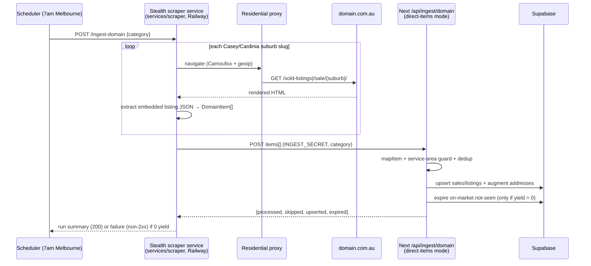
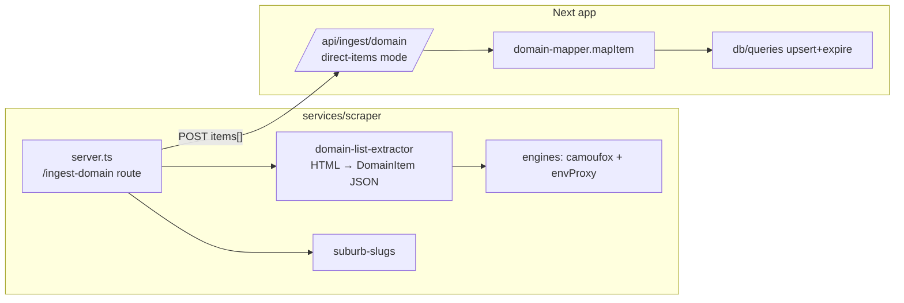

> **SUPERSEDED 2026-06-06 by plan 003 (resilient-data-feeds).** Live testing showed the
> stealth scraper still gets `Access Denied` against Domain without a residential proxy, and
> external research found Bright Data **Web Unlocker** handles Domain's PerimeterX more
> reliably with no fingerprint engineering, at trivial cost. Plan 003 adopts Web Unlocker as
> primary (stealth retained as a fallback backend) and adds a fallback source chain + feed
> monitoring. Use plan 003.

# fix: Replace proxy-less Apify daily ingest with stealth-scraper + residential proxies

## Summary

The "Casey Cardinia Sold Daily" integration's HTTP 502 is **not a code bug** — `POST /api/ingest/domain` deliberately returns 502 after the Domain batch Apify actor (`0EXe0hsmDKWLI3JF9`, `fatihtahta/domain-com-au-scraper`) exits `SUCCEEDED` with **0 items** for `MAX_RUN_ATTEMPTS` (4) consecutive runs. Live diagnosis on 2026-06-05 confirmed all three recent daily datasets (`biMD5slx6U1kPsoFa`, `ileuvN1RH5QrCVuN9`, `yU5nTK8dP9mYK0Lg0`) have `itemCount = 0`: Domain's anti-bot is persistently blocking the actor, which "manages its own proxies internally and exposes NO proxy field" (`src/lib/ingest/domain-run.ts`), so the in-app retrigger loop cannot recover it.

This plan makes the daily Casey/Cardinia **sold + on-market** ingest yield data again by **fully replacing** the proxy-less Apify batch actor with the already-deployed stealth scraper service (`services/scraper`, Camoufox/Patchright/Playwright behind residential proxies). The scraper service gains a daily batch job that loops the Casey/Cardinia suburb set, fetches each Domain search/sold-listings page through a hardened browser + residential proxy, extracts structured listing items, and pushes them to a new direct-items mode on `/api/ingest/domain` — which keeps all dedup/upsert/expiry logic (and `mapItem`) exactly as-is.

**Decisions carried in from scoping:** (1) full replacement of the Apify batch actor for the daily run, not a fallback; (2) a residential proxy provider must be **provisioned** as an explicit prerequisite; (3) the per-suburb scrape loop runs **inside the long-running scraper service** (no serverless timeout), not in the Next route.

---

## Problem Frame

- **Observed:** Daily 7am-Melbourne schedule emits "Endpoint responded with HTTP status code 502" for task "Casey Cardinia Sold Daily".
- **Mechanism (confirmed):** Actor returns 0 items → webhook blocked-run guard (`processed === 0`) re-triggers up to 4 times → all empty → endpoint returns 502 by design so the schedule alert fires, leaving existing data untouched (no false expiry).
- **Root cause:** Persistent Domain anti-bot blocking of a proxy-less batch actor. The actor exposes no proxy field, so the problem is unfixable in-place.
- **Consequence:** `property_sales` / `property_listings` stop receiving daily deltas; data goes stale silently apart from the 502 alert.
- **Why the 502 is the symptom, not the disease:** the ingest route, retrigger loop, and alerting all worked correctly. The fix must restore *scrape yield*, which means changing the fetch backend, not the route.

---

## Requirements

- **R1** — The daily sold + on-market ingest produces non-zero listing yield for the Casey/Cardinia suburb set under normal conditions, sourced through the stealth scraper + residential proxies.
- **R2** — All persistence semantics are preserved unchanged: dedup via existing UNIQUE keys, address-universe augmentation, `last_seen_at` bump, and `active=false` expiry for on-market rows no longer seen. `mapItem` and the table schemas are untouched.
- **R3** — The proxy-less Apify batch actor (`0EXe0hsmDKWLI3JF9`) and its in-app retrigger loop are retired from the daily sold/on-market path.
- **R4** — A genuine "scraped 0 items / blocked" outcome still surfaces a failure alert and **never** triggers on-market expiry (preserve the existing safety guarantee).
- **R5** — The service-area guard holds: nothing outside Casey/Cardinia is persisted, even if a Domain page surfaces a neighbouring locality.
- **R6** — The change is operationally observable: each daily run reports per-category processed/skipped/upserted counts and which suburbs (if any) yielded zero.

**Out of scope:** the weekly `rent` path (separate cadence — can adopt the same mechanism in follow-up), the on-demand per-property proposal crawl (`/api/proposal`), the rentals backfill, and any DB schema/migration change.

---

## High-Level Technical Design

New daily flow (replaces the Apify scheduler → actor → webhook chain):

Component relationships:

**Framing:** directional design for reviewer validation, not implementation specification. The exact embedded-JSON path on Domain search pages is execution-time discovery (see U2).

---

## Key Technical Decisions

- **KTD1 — Full replacement, not fallback.** The daily sold/on-market source becomes stealth-only. The Apify batch actor returns 0 reliably under current blocking, so keeping it as primary adds cost and latency for no yield. The retrigger machinery in `src/lib/ingest/domain-run.ts` is retired for this path.
- **KTD2 — Scrape loop lives in the scraper service.** ~29 suburbs × 2 categories ≈ 58 hardened-browser page loads per day, each potentially tens of seconds — well beyond Next's `maxDuration=300`. The long-running Railway service already exists for exactly this kind of work and launches a fresh browser per request for IP/fingerprint isolation.
- **KTD3 — Keep all persistence logic in the Next route; push raw items.** The scraper extracts Domain's native listing JSON into the **existing `DomainItem` shape** that `mapItem` already consumes, then POSTs `items[]` to `/api/ingest/domain`. DB write logic, dedup keys, address augmentation, and expiry stay single-homed and unchanged (satisfies R2). The route gains a "direct items" input mode alongside (then instead of) the Apify-dataset mode.
- **KTD4 — Extract embedded JSON, not DOM scraping.** Domain search/sold-listings pages embed structured listing data in a page-level JSON blob (e.g. a `__NEXT_DATA__`/state script). Parsing that JSON is far more robust than DOM-card scraping and maps cleanly onto `DomainItem` (`location`, `pricing`, `listing.tags`, `property`, `contacts`). The exact key path is verified live during U2.
- **KTD5 — Reuse existing proxy plumbing.** The engines already read `STEALTH_PROXY_SERVER/USERNAME/PASSWORD` via `envProxy()` and align fingerprint geo to the proxy IP (`geoip: true`). No engine code change is needed for proxies — only provisioning + env (U1).
- **KTD6 — Preserve the zero-yield safety guarantee (R4).** A run that extracts 0 items must report failure to the scheduler **and** must not cause the ingest route to expire live on-market rows. The route already gates expiry on yield; the direct-items mode must keep that gate.

---

## Scope Boundaries

### In scope
- Daily **sold** and **on-market** Casey/Cardinia ingest via stealth + residential proxies.
- New scraper-service batch endpoint + Domain list extractor + suburb-slug source.
- Direct-items input mode on `/api/ingest/domain`.
- Daily scheduling of the scraper batch job; retirement of the Apify daily schedule/actor/retrigger path.
- Run observability + zero-yield alerting.

### Deferred to Follow-Up Work
- Apply the same stealth mechanism to the **weekly rent** path.
- Remove now-dead Apify retrigger code paths once the new path is proven in production for a few cycles (keep them dormant first as a rollback lever).
- Per-suburb adaptive concurrency / backoff tuning if proxy bandwidth or Domain rate-limits demand it.

### Outside this change
- DB schema / migrations, `mapItem` parse rules, proposal/on-demand crawl, rentals backfill.

---

## Implementation Units

### U1. Provision a residential proxy provider and configure scraper env

**Goal:** A working residential proxy is attached to the stealth scraper so Domain stops blocking it. (Prerequisite for all scrape-yield units.)

**Requirements:** R1, R5 (geoip alignment via proxy)

**Dependencies:** none

**Files:**
- `services/scraper/README.md` (document the proxy env contract)
- `services/scraper/.env.local.example` or equivalent (add `STEALTH_PROXY_*` placeholders if an example file exists)
- Railway service env (ops, not a repo file): `STEALTH_PROXY_SERVER`, `STEALTH_PROXY_USERNAME`, `STEALTH_PROXY_PASSWORD`

**Approach:**
- Select an AU-capable residential/ISP proxy provider (rotating residential recommended for anti-bot resilience). Capture endpoint, auth, and any session/sticky options.
- Set `STEALTH_PROXY_SERVER/USERNAME/PASSWORD` on the Railway scraper service — `envProxy()` in `services/scraper/src/engines/camoufox.ts` already consumes these and `geoip: true` aligns fingerprint geo to the proxy IP.
- No engine code change required.

**Patterns to follow:** existing `envProxy()` contract in `services/scraper/src/engines/camoufox.ts`.

**Test scenarios:**
- Manual: hit the deployed scraper `/scrape` with a `domain.com.au/sold-listings/<suburb>/` URL and confirm `status: success` with non-empty HTML (proxy IP visible in logs, no anti-bot interstitial in the returned HTML).
- Manual: confirm a Domain page that previously returned a block/challenge now returns listing content.
- `Test expectation: none (automated)` — provisioning + env is ops config; validation is manual smoke against the live service.

**Verification:** A live `/scrape` against a Casey/Cardinia Domain sold-listings URL returns real listing HTML through the proxy.

---

### U2. Domain search/sold-listings page → `DomainItem[]` extractor (scraper service)

**Goal:** A pure function that turns one Domain search/sold-listings page's HTML into an array of items matching the `DomainItem` shape that `mapItem` already consumes.

**Requirements:** R1, R2 (shape parity with `mapItem`)

**Dependencies:** none (pure parser; can be built against saved HTML fixtures before U1 lands)

**Files:**
- `services/scraper/src/domain/list-extractor.ts` (new)
- `services/scraper/src/domain/__tests__/list-extractor.test.ts` (new)
- `services/scraper/src/domain/fixtures/` (saved Domain sold + on-market HTML samples)

**Approach:**
- Locate the page-level embedded JSON (likely a `__NEXT_DATA__`/state `<script>` blob) containing the search result listings. **Exact key path is execution-time discovery** — capture a live Casey/Cardinia page during U1 smoke and pin the path; record it in code comments.
- Map each listing node into the existing `DomainItem` shape: `location.{display_address,suburb,state,postcode,latitude,longitude}`, `pricing.display_price`, `listing.tags.tag_text` (sold date / status), `property.{property_type,land_size,bedrooms,bathrooms,parking,image_urls}`, `contacts.{agency.name, agent_names|agents[]}`, and top-level `url`.
- The extractor is **pure** (HTML string in, `DomainItem[]` out) — no network, mirroring the discipline in `src/lib/ingest/domain-mapper.ts`.
- Mirror the `DomainItem` type from `src/lib/ingest/domain-mapper.ts` so the two stay aligned (note the cross-service duplication in a comment).

**Patterns to follow:** the pure-function, fixture-tested style of `src/lib/ingest/domain-mapper.ts`.

**Execution note:** Build extractor test-first against saved HTML fixtures — the parse rules are the risk surface and fixtures make them verifiable without the live site.

**Test scenarios:**
- Happy path (sold): a saved sold-listings fixture yields N items, each with `display_address`, a parseable `display_price`, and `listing.tags.tag_text` containing a sale date — assert exact item count and spot-check one item's fields.
- Happy path (on-market): a saved `/sale/` fixture yields items with `display_price` ranges and status text.
- Field fidelity: lat/lng, bedrooms/bathrooms/parking, land_size, agency + agent name, first image URL, and listing `url` are extracted when present in the fixture.
- Edge — missing optionals: a listing node lacking price / agent / image still extracts (downstream `mapItem` decides skip vs keep; e.g. sold needs a price).
- Edge — empty/blocked page: HTML with no embedded listing JSON (or an anti-bot interstitial) returns `[]` and does not throw. `Covers R4` (0-yield must be representable as empty, not an exception).
- Edge — schema drift: when the expected JSON key path is absent, the extractor returns `[]` and logs a distinctive marker so a Domain markup change is diagnosable.

**Verification:** Running the extractor over the committed fixtures produces item arrays whose shape `mapItem` accepts without modification.

---

### U3. Suburb-slug source in the scraper service

**Goal:** The Casey/Cardinia suburb-slug list and category→URL builder live where the loop runs.

**Requirements:** R1, R5

**Dependencies:** none

**Files:**
- `services/scraper/src/domain/suburb-slugs.ts` (new — slugs + `urlFor(category, slug)`)

**Approach:**
- Port `SUBURB_SLUGS` and the `CATEGORY_RUN.urlFor` builders (`/sold-listings/{slug}/`, `/sale/{slug}/`) from `src/lib/ingest/domain-run.ts` into the scraper service.
- Add a comment in **both** files noting they must stay in sync until `domain-run.ts` is fully retired (U6).

**Patterns to follow:** `SUBURB_SLUGS` / `CATEGORY_RUN` in `src/lib/ingest/domain-run.ts`.

**Test scenarios:**
- Assert the slug list length and a few known entries (e.g. `berwick-vic-3806`, `pakenham-vic-3810`).
- `urlFor('sold', slug)` and `urlFor('on-market', slug)` produce the correct Domain paths.

**Verification:** Slug count and sample URLs match the current `domain-run.ts` definitions.

---

### U4. `/ingest-domain` batch endpoint in the scraper service

**Goal:** A long-running endpoint that loops the suburb set for a category, fetches each Domain page via the stealth engine + proxy, extracts items, and pushes them to the Next ingest route.

**Requirements:** R1, R4, R5, R6

**Dependencies:** U1, U2, U3

**Files:**
- `services/scraper/src/server.ts` (add the `POST /ingest-domain` route; reuse existing Bearer auth + SSRF allow-list)
- `services/scraper/src/domain/batch-ingest.ts` (new — loop + accumulate + push)

**Approach:**
- `POST /ingest-domain { category }` (auth: existing `STEALTH_SCRAPER_SECRET` Bearer hook).
- For each slug: build URL (U3), fetch HTML via the default engine (Camoufox + `envProxy()`), run the extractor (U2), accumulate `DomainItem[]`. Per-page failures are logged and skipped, not fatal (keep partial yield).
- Sequential or low-concurrency loop to respect proxy bandwidth; total runtime is unbounded by serverless limits (KTD2).
- POST the accumulated `items[]` to `${INGEST_PUBLIC_ORIGIN}/api/ingest/domain?category=<category>` with the `INGEST_SECRET` token (direct-items mode, U5).
- Return a run summary `{ category, suburbsScraped, zeroYieldSuburbs[], itemsExtracted, ingest: <route response> }`. If `itemsExtracted === 0`, respond non-2xx so the scheduler's failure alert fires (R4) — and do **not** push an empty batch that could trigger expiry.

**Patterns to follow:** the auth hook, SSRF `isUrlAllowed`, and error-shaping in `services/scraper/src/server.ts`.

**Test scenarios:**
- Happy path: a stubbed engine returning fixture HTML for each slug accumulates the expected total item count and issues one push with all items.
- Partial failure: one slug's fetch throws → that suburb is recorded in `zeroYieldSuburbs`, the run still pushes the rest, and reports a partial success.
- Total zero-yield: every slug returns `[]` → endpoint returns non-2xx, performs **no** push to the ingest route (R4), and names the zero-yield suburbs.
- Auth: request without the correct Bearer is rejected 401 (existing hook).
- Integration: with a stubbed ingest route, the pushed payload carries the right `category` and the `DomainItem[]` shape the route expects.

**Verification:** Invoking `/ingest-domain` against fixture-backed engines pushes a correctly shaped batch and returns an accurate run summary; zero-yield returns non-2xx with no push.

---

### U5. Direct-items input mode on `/api/ingest/domain`

**Goal:** The ingest route accepts a pushed `items[]` payload (mapped + upserted + expired exactly like the Apify-dataset path) in addition to / instead of the Apify `datasetId` flow.

**Requirements:** R2, R4, R6

**Dependencies:** none (can land in parallel with scraper-side units; U4 depends on it being deployed)

**Files:**
- `src/app/api/ingest/domain/route.ts` (add direct-items branch)
- `src/app/api/ingest/domain/__tests__/route.test.ts` (new or extend, if a test harness exists for routes)

**Approach:**
- Accept a request whose JSON body is `{ items: DomainItem[] }` (or `items` at top level) when no `datasetId` is supplied — route through the **same** `mapItem` → service-area guard → accumulate → upsert → address-augment → expiry pipeline already in the route.
- Preserve the auth check (`INGEST_SECRET`/`CRON_SECRET`) and the `category` validation.
- **Critically preserve R4:** if the mapped `processed === 0`, do not expire on-market rows; return a non-2xx blocked/empty response (reuse the existing zero-yield branch semantics, minus the Apify retrigger).
- Keep the Apify-dataset branch intact for now (rollback lever) — selection is: `datasetId` present → dataset paging; else `items` present → direct mode.

**Patterns to follow:** the existing accumulate/upsert/expire block and the `processed === 0` guard in `src/app/api/ingest/domain/route.ts`.

**Test scenarios:**
- Happy path (sold): POST `{ items: [...] }` with `category=sold` → upserts to `property_sales`, augments addresses, no expiry (sold is append-only); response reports `processed/upserted`.
- Happy path (on-market): direct items with `category=on-market` → upserts `property_listings`, bumps `last_seen_at`, expires not-seen rows in the scraped suburbs. `Covers R2`.
- Zero-yield guard: `{ items: [] }` (or all items outside service area) → `processed === 0` → **no expiry**, non-2xx response. `Covers R4`.
- Service-area: items in a neighbouring non-Casey/Cardinia suburb are skipped (counted in `skipped`), never persisted. `Covers R5`.
- Auth: wrong/missing token → 401. Invalid `category` → 400.
- Dedup idempotency: posting the same sold items twice does not create duplicate rows (existing UNIQUE-key behaviour holds through the direct path).

**Verification:** Direct-items POSTs produce identical DB outcomes to the equivalent Apify-dataset path, and the zero-yield case leaves on-market data untouched.

---

### U6. Schedule the daily batch and retire the Apify daily path

**Goal:** The scraper `/ingest-domain` runs daily at 7am Melbourne for sold + on-market; the Apify daily schedule/actor/retrigger is removed from this path.

**Requirements:** R1, R3, R4

**Dependencies:** U4, U5

**Files:**
- `services/scraper` scheduling config (Railway cron / scheduled job, or a small internal scheduler in the service) — capture the chosen mechanism in `services/scraper/README.md`
- `DAILY_SYNC_SETUP.md` (rewrite the Apify-schedule + webhook sections to describe the new stealth path)
- `INTEGRATIONS.md` (update the daily-ingest description and env-var table)
- `src/lib/ingest/domain-run.ts` (mark the retrigger path dormant/deprecated for the daily flow — keep code as a rollback lever per Deferred scope, but remove it from the live daily trigger)

**Approach:**
- Configure a daily 7am-Melbourne trigger that calls `POST /ingest-domain` for `category=sold` and `category=on-market` (two invocations, or one that iterates both).
- Disable the Apify Console schedules for the daily sold/on-market tasks (ops step — document it).
- Update docs so the next maintainer sees the stealth path as steady-state.
- Confirm the scheduler treats the endpoint's non-2xx (zero-yield) as a failure alert (R4).

**Patterns to follow:** existing schedule semantics documented in `DAILY_SYNC_SETUP.md` (timezone, cadence, failure-alert-on-non-2xx).

**Test scenarios:**
- `Test expectation: none — scheduling/ops + docs change`; validated by the next live daily run producing non-zero yield and by a forced zero-yield run firing the alert.
- Doc check: `DAILY_SYNC_SETUP.md` and `INTEGRATIONS.md` no longer instruct setting up the Apify webhook for the daily sold/on-market path.

**Verification:** A live (or manually triggered) daily run lands fresh sold + on-market rows via the stealth path, and the Apify daily schedule is disabled.

---

### U7. Run observability and zero-yield alerting

**Goal:** Each daily run emits a legible summary, and a genuine 0-yield/blocked outcome is distinguishable from a code failure in alerts.

**Requirements:** R4, R6

**Dependencies:** U4, U6

**Files:**
- `services/scraper/src/domain/batch-ingest.ts` (structured run-summary logging)
- `services/scraper/src/server.ts` (ensure the `/ingest-domain` response body carries the summary)

**Approach:**
- Log/return per-category `{ suburbsScraped, zeroYieldSuburbs[], itemsExtracted, upserted, expired }`.
- Make the failure response message explicitly say "blocked / 0 items via stealth proxy — check proxy health" so the alert is actionable (contrast with the old generic 502).
- Optional: a low-yield warning threshold (e.g. < X% of suburbs returned items) logged even on overall success.

**Patterns to follow:** the structured response object already returned by `src/app/api/ingest/domain/route.ts`.

**Test scenarios:**
- Summary shape: a fixture-backed run returns all summary fields with correct counts.
- Zero-yield message: a total-block run's response/log contains the actionable proxy-health wording. `Covers R4`.
- Partial-yield: `zeroYieldSuburbs` lists exactly the suburbs that returned no items.

**Verification:** A simulated block produces an actionable, proxy-pointing alert; a healthy run produces an accurate per-suburb summary.

---

## Risks & Dependencies

- **Proxy quality / cost (highest risk).** Anti-bot resilience depends entirely on residential proxy quality; a weak provider reproduces the 0-item problem with added cost. Mitigation: U1 smoke test before building the loop; choose rotating residential with AU geo; monitor yield in U7.
- **Domain markup / embedded-JSON drift.** The extractor (U2) depends on Domain's page JSON structure. Mitigation: fixture tests + a distinctive "schema drift" log marker; extractor returns `[]` rather than throwing so drift surfaces as a yield alert, not a crash.
- **Runtime / proxy bandwidth.** ~58 hardened-browser loads/day; per-request fresh browser is heavy. Mitigation: sequential/low-concurrency loop in the long-running service (no serverless limit); blocked images/media/fonts already reduce bandwidth (`BLOCKED_RESOURCE_TYPES`).
- **Expiry safety regression.** The direct-items mode must keep the `processed === 0` → no-expiry guard. Mitigation: explicit R4 test scenarios in U5; keep the guard logic shared with the existing path.
- **Cross-service slug drift.** `SUBURB_SLUGS` temporarily exists in two places (U3). Mitigation: sync comment in both files; converge when `domain-run.ts` is retired (Deferred scope).
- **Rollback lever.** Keep the Apify-dataset branch and retrigger code dormant (not deleted) until the stealth path proves stable across several daily cycles.

---

## Sources & Research

- Live Apify diagnosis (2026-06-05): runs `kmvQu6q6CeieifZ8P` (sold), `kmlmxPBueh1jacJ5h` (on-market) both `SUCCEEDED` with dataset `itemCount = 0`; prior dataset `yU5nTK8dP9mYK0Lg0` also 0. Confirms persistent Domain block, not a code fault.
- `src/app/api/ingest/domain/route.ts` — by-design 502 on `processed === 0` after `MAX_RUN_ATTEMPTS`; expiry-on-yield guard.
- `src/lib/ingest/domain-run.ts` — actor `0EXe0hsmDKWLI3JF9` "exposes NO proxy field"; `SUBURB_SLUGS`; retrigger webhook shape; caps with `limit` not `maxItems`.
- `services/scraper/src/server.ts`, `engines/camoufox.ts`, `engines/types.ts` — stealth service `/scrape` API, Bearer auth, SSRF allow-list (includes `domain.com.au`), and existing `envProxy()` proxy plumbing (`STEALTH_PROXY_*`, `geoip`).
- `src/lib/ingest/domain-mapper.ts` — the `DomainItem` shape and `mapItem` contract the extractor must satisfy.
- Memory: stealth backend deployed to Railway 2026-06-03 (all 3 engines live), "proxy creds still needed"; daily 7am-Melbourne Casey/Cardinia schedule.
