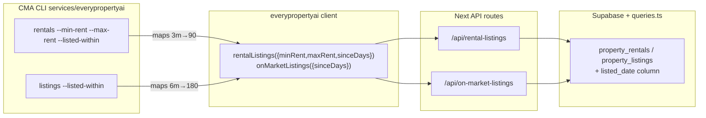
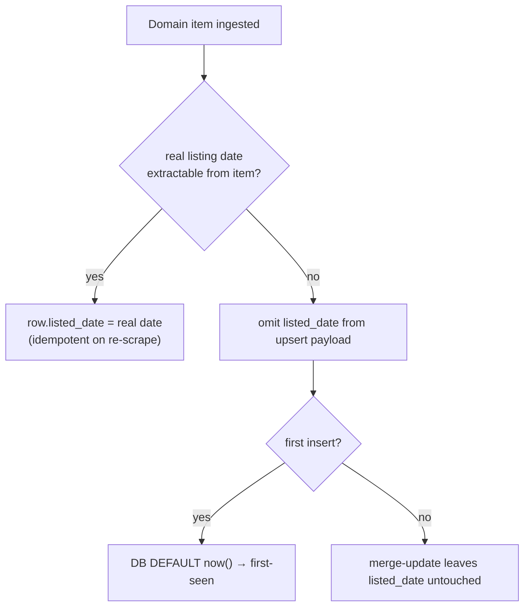

# feat: Listing date on rentals/listings + rent & listed-within CMA filters

## Summary

Give every ingested rental (and, for parity, every on-market sale listing) an explicit **listing date**, so reports and the CMA tooling can answer "rentals listed in the last 1 / 3 / 6 / 12 / 24 months". Today `property_rentals` only carries `created_at` (DB insert time) and `last_seen_at` (last scrape) — there is no listing-date concept, and `/api/rental-listings` exposes neither a date filter nor a rent filter. Meanwhile `/api/sold-sales` already has the exact pattern we want (`sinceDays` default 730 + `minPrice`/`maxPrice`, surfaced through the CMA CLI as `--since-days` / `--min` / `--max`), and `/api/on-market-listings` already has a `sinceDays` "just-listed" window (keyed off `created_at`).

Per the resolved scoping forks: the listing date is the **scraped Domain listing date when available, falling back to first-seen** (the row's insert timestamp); the change covers **both `property_rentals` and `property_listings`**; and the filter is exposed by **mirroring the existing `sinceDays` convention** (the CMA CLI translates friendly `1m|3m|6m|12m|2y` flags into days), with new `minRent`/`maxRent` weekly-rent filters on the rentals path.

`property_rentals` is currently empty (rent scrape gated on Apify/proxy), so there is **no backfill risk** for rentals; the listings backfill is the only existing-data consideration.

---

## Problem Frame

- **Want:** "rental reports or queries that specify a last 3 mths / 6 mths etc filter", and a CMA CLI/API that finds rentals filtered by **rent per week** and by **listed in last 1m / 3m / 6m / 12m / 2yr**.
- **Today:** rentals have no listing date; `/api/rental-listings` returns all active rows for a suburb/radius with no rent or date narrowing; the CMA CLI `rentals` command exposes only suburb/geo/limit. The only time columns are `created_at` (insert) and `last_seen_at` (scrape recency) — neither is a listing-date concept the user can reason about.
- **Gap vs. precedent:** sold-sales and on-market-listings already solved the date-window shape; rentals never received it, and no table stores a semantically-clean listing date.
- **Consequence:** the user cannot scope rental comparables to a recency window or a rent band — the core inputs to a rental CMA.

---

## Requirements

- **R1** — Every rental and on-market listing row carries a `listed_date`: the scraped Domain listing date when extractable, otherwise the row's first-seen timestamp. The value is stable across re-scrapes (never silently reset to "today" on each daily run).
- **R2** — `/api/rental-listings` accepts a `sinceDays` window (filter on `listed_date`) and `minRent`/`maxRent` (filter on `weekly_rent`), in both suburb and lat/lng modes.
- **R3** — `/api/on-market-listings`'s existing `sinceDays` window filters on `listed_date` (with `created_at` fallback) rather than raw `created_at`, keeping the two on-market tables symmetric.
- **R4** — The everypropertyAI client and CMA CLI expose these filters: rentals gain `--min-rent` / `--max-rent` and a `--listed-within 1m|3m|6m|12m|2y` flag (mapped to `sinceDays`); listings gain the same `--listed-within`. The CLI flag→days mapping is: `1m→30, 3m→90, 6m→180, 12m→365, 2y→730`.
- **R5** — Returned rental/listing payloads include the `listedDate` so consumers can display/sort on it.
- **R6** — All existing rental/listing query behaviour (active-only, suburb alias resolution, service-area, dedup) is preserved.

**Out of scope:** sold-sales (already has `sale_date` + `sinceDays`), the rent scraper itself (gated on Apify/proxy — see the separate stealth-ingest plan), and any new report format/CLI command beyond the existing `rentals`/`listings` commands.

---

## High-Level Technical Design

Filter plumbing flows through four layers, mirroring the established sold-sales path:

`listed_date` population (ingest), designed so re-scrapes never reset it:

The "omit when unknown" rule is the crux: `upsertRows` does a merge-update that only writes columns present in the payload, so leaving `listed_date` out preserves the earliest first-seen value across daily re-scrapes (R1). Directional design for reviewer validation.

---

## Key Technical Decisions

- **KTD1 — Dedicated `listed_date` column, not `created_at` reuse.** `created_at` is an insert-implementation timestamp; a named `listed_date` is the concept reports filter on and can hold a real Domain date. Added to both `property_rentals` and `property_listings`.
- **KTD2 — Real-date-or-first-seen via payload omission.** When the mapper extracts a real listing date, it sets `listed_date`; when it can't, it **omits the column** so the DB `DEFAULT now()` fills it on first insert and the merge-update leaves it untouched on every subsequent scrape. This yields "real date if known, stable first-seen otherwise" without a separate backfill pass or COALESCE gymnastics. The exact Domain source field for the real date is **execution-time discovery** (see U2).
- **KTD3 — Mirror `sinceDays`, translate in the CLI.** The API stays consistent with sold-sales/on-market (`sinceDays` integer); the CLI owns the friendly `1m|3m|6m|12m|2y` vocabulary and maps to days. One filter convention across all three feeds; the user-facing wording lives at the CLI edge where it belongs.
- **KTD4 — Push rent + date filters into the DB query where suburb mode allows.** The current suburb-mode path fetches `limit` rows then filters in-route, which can drop matches beyond the cap. For rentals, apply `weekly_rent` and `listed_date` predicates in the Supabase query (before `limit`) for correctness; keep the in-route geo/window filter for lat/lng mode (consistent with on-market). Document the asymmetry.
- **KTD5 — Listings `sinceDays` switches to `listed_date` with `created_at` fallback.** Preserves current "just-listed" behaviour for rows lacking a `listed_date` (existing data) while making new rows date-accurate (R3).

---

## Scope Boundaries

### In scope
- `listed_date` on `property_rentals` + `property_listings` (migration + index).
- Ingest mapper change to populate it (real-or-omit).
- `/api/rental-listings`: `sinceDays` + `minRent`/`maxRent`.
- `/api/on-market-listings`: `sinceDays` re-keyed to `listed_date`.
- everypropertyAI client + types + CMA CLI flags.

### Deferred to Follow-Up Work
- Backfilling `listed_date` for any future bulk-imported historical rows beyond the DB default (rentals empty today; listings get the default on next scrape).
- A dedicated rental-report output format / new CLI subcommand, if later desired.
- Applying listed-within to sold-sales (already served by `sale_date`).

### Outside this change
- The rent scrape pipeline (Apify/proxy-gated), DB write/dedup semantics, sold-sales filters.

---

## Implementation Units

### U1. Migration 006 — `listed_date` on rentals + listings

**Goal:** Both on-market tables gain a `listed_date TIMESTAMPTZ DEFAULT now()` column and a supporting index.

**Requirements:** R1, R6

**Dependencies:** none

**Files:**
- `src/lib/db/migrations/006_listed_date.sql` (new)

**Approach:**
- `ALTER TABLE property_rentals ADD COLUMN IF NOT EXISTS listed_date TIMESTAMPTZ NOT NULL DEFAULT now();` and the same for `property_listings`. Idempotent, additive — matches the style of `005_property_sales_beds_baths.sql` and `002_listing_lifecycle.sql`.
- Add `idx_property_rentals_listed_date (suburb, state, listed_date)` and the listings equivalent to support suburb + recency filtering.
- Existing listings rows get `now()` as their `listed_date` default on migration; new scrapes refine it (real date) or keep first-seen. Note this in a comment (existing listings' `listed_date` ≈ migration date until re-scraped, which is acceptable and self-corrects for real-dated items).

**Patterns to follow:** `src/lib/db/migrations/005_property_sales_beds_baths.sql`, `002_listing_lifecycle.sql`.

**Test scenarios:** `Test expectation: none — idempotent schema migration`; verified by running it twice in the Supabase SQL editor with no error and confirming the column + indexes exist.

**Verification:** Both tables show `listed_date` with a `now()` default and the new indexes; re-running the migration is a no-op.

---

### U2. Ingest mapper — populate `listed_date` (real-or-omit)

**Goal:** The Domain ingest sets `listed_date` to a real scraped listing date when available, and omits it otherwise so the DB default / earliest value stands.

**Requirements:** R1

**Dependencies:** U1

**Files:**
- `src/lib/ingest/domain-mapper.ts` (extend `mapItem` for `on-market` + `rent`)
- `src/lib/db/queries.ts` (add `listed_date?: string` to `PropertyListingRecord` and `PropertyRentalRecord`)
- `src/lib/ingest/__tests__/domain-mapper.test.ts` (new or extend, if a mapper test file exists; otherwise create)
- `scripts/ingest-domain-apify.mjs` (keep the manual loader's mapping in sync — it mirrors `domain-mapper`)

**Approach:**
- Add a `parseListedDate(item)` helper that reads the real listing date from the Domain item — **exact source field is execution-time discovery** (candidates: a date in `listing.tags.tag_text`, a `dateListed`/`firstListed` field if present in the item, or `raw_data`). Pin it against a live/fixture rental + listing item during implementation.
- In `mapItem`, for `on-market` and `rent`: if a real date is parsed, set `listed_date` on the row; if not, **do not include the key** (so `upsertRows`' merge-update leaves the DB-defaulted first-seen value intact — KTD2).
- `sold` is unchanged (it uses `sale_date`).

**Patterns to follow:** existing `parseSaleDate` / field-mapping discipline in `src/lib/ingest/domain-mapper.ts`; the pure-function, fixture-tested style there.

**Execution note:** Add the parser test-first against saved rental + listing fixtures — the real-vs-omit branch is the correctness risk.

**Test scenarios:**
- Real date present: a fixture item with an extractable listing date → mapped row's `listed_date` equals that date (rentals and listings).
- Real date absent: a fixture item with no date field → mapped row has **no** `listed_date` key (assert the property is absent, not null), so the DB default applies. `Covers R1`.
- Idempotency intent: re-mapping the same real-dated item yields the same `listed_date` (so a re-scrape upsert is a no-op on the column).
- Sold untouched: a `sold` item still maps `sale_date` and gains no `listed_date`.
- Parser robustness: malformed/partial date string → treated as absent (omit), never throws.

**Verification:** Mapped rental/listing rows carry a real `listed_date` when the fixture supplies one and omit the field otherwise; the manual loader produces identical mappings.

---

### U3. `/api/rental-listings` — rent + listed-within filters

**Goal:** The rentals route accepts `sinceDays` (on `listed_date`) and `minRent`/`maxRent` (on `weekly_rent`) in both suburb and geo modes, and returns `listedDate`.

**Requirements:** R2, R5, R6

**Dependencies:** U1, U2

**Files:**
- `src/app/api/rental-listings/route.ts`
- `src/lib/db/queries.ts` (`getRentalsForSuburb` gains `sinceDays`/`minRent`/`maxRent` predicates)
- `src/app/api/rental-listings/__tests__/route.test.ts` (new or extend, if route tests exist)

**Approach:**
- Parse `sinceDays`, `minRent`, `maxRent` query params (mirror sold-sales parsing).
- Suburb mode: push `listed_date >= since`, `weekly_rent >= minRent`, `weekly_rent <= maxRent` into the Supabase query in `getRentalsForSuburb` (before `limit`) — KTD4. Use `listed_date` with a `created_at` fallback for rows predating the column.
- Geo mode: apply the same predicates as in-route filters over the bounding-box rows (mirror the on-market `withinWindow` approach), then radius-filter and cap.
- Add `listedDate` to `RentalListingResult` and the mapped response (R5).
- Preserve active-only, alias resolution, CORS, and error shape (R6).

**Patterns to follow:** the `withinWindow`/`sinceMs` filter and param parsing in `src/app/api/on-market-listings/route.ts`; the price-filter predicates in `src/app/api/sold-sales/route.ts`.

**Test scenarios:**
- Happy path — rent band: `minRent=400&maxRent=600` returns only rows with `weekly_rent` in [400,600]; rows outside are excluded.
- Happy path — listed-within: `sinceDays=90` returns only rows whose `listed_date` is within 90 days; older rows excluded.
- Combined: rent band + `sinceDays` together apply as AND.
- Geo mode parity: the same filters apply in lat/lng+radius mode and respect the radius.
- Boundary: a row with `weekly_rent` exactly at `minRent`/`maxRent` is included; a null `weekly_rent` is excluded when a rent filter is set.
- Fallback: a row with null `listed_date` (pre-column) is matched via `created_at` under `sinceDays`.
- No filters: omitting all three returns current behaviour (all active suburb/geo rows up to limit). `Covers R6`.
- Response shape: each result includes `listedDate`. `Covers R5`.
- Suburb-mode correctness: with `limit` smaller than the match set, filtering happens before the cap (a matching row beyond the first `limit` unfiltered rows is still returned). `Covers R2 / KTD4`.

**Verification:** Querying with rent and date filters returns precisely the matching active rentals in both modes, with `listedDate` present.

---

### U4. `/api/on-market-listings` — re-key `sinceDays` to `listed_date`

**Goal:** The existing listings "just-listed" window filters on `listed_date` (fallback `created_at`) for symmetry and date accuracy.

**Requirements:** R3, R5

**Dependencies:** U1, U2

**Files:**
- `src/app/api/on-market-listings/route.ts`
- `src/lib/db/queries.ts` (if `getListingsForSuburb` should also push the window into the query — optional, mirror U3)

**Approach:**
- Change `withinWindow` to read `r.listed_date ?? r.created_at` instead of `r.created_at` only.
- Add `listedDate` to the response result type (it already returns `createdAt`/`lastSeenAt`).
- No new params — `sinceDays` already exists here.

**Patterns to follow:** the current `withinWindow`/`sinceMs` block in the same file.

**Test scenarios:**
- Row with a real `listed_date` within the window but `created_at` outside it → included (date accuracy over insert time). `Covers R3`.
- Row with null `listed_date` → falls back to `created_at` for the window (no regression).
- Response includes `listedDate`. `Covers R5`.

**Verification:** `sinceDays` on on-market listings reflects `listed_date` when present and `created_at` otherwise; payload carries `listedDate`.

---

### U5. everypropertyAI client + types — new params and field

**Goal:** The client exposes the rental rent/date filters and the `listedDate` field, plus `sinceDays` parity on on-market.

**Requirements:** R4, R5

**Dependencies:** U3, U4

**Files:**
- `services/everypropertyai/src/client.ts` (`rentalListings` gains `minRent`/`maxRent`/`sinceDays`; `onMarketListings` gains `sinceDays`)
- `services/everypropertyai/src/types.ts` (`RentalListing` + `OnMarketListing` gain `listedDate: string | null`)

**Approach:**
- Extend the `rentalListings` param object with `minRent`, `maxRent`, `sinceDays` (all optional), passed straight through as query params (the `request` helper already serialises query objects).
- Add `sinceDays` to `onMarketListings` params.
- Add `listedDate` to the two result interfaces.

**Patterns to follow:** the existing `soldSales` param shape (`minPrice`/`maxPrice`/`sinceDays`) in the same client file.

**Test scenarios:**
- `Test expectation: none — thin typed pass-through`; covered transitively by U3/U4 route tests and the U6 CLI smoke. If the package has client unit tests, assert that `rentalListings({minRent,maxRent,sinceDays})` issues the expected query string.

**Verification:** `client.rentalListings({ minRent, maxRent, sinceDays })` and `client.onMarketListings({ sinceDays })` type-check and forward the params; result types expose `listedDate`.

---

### U6. CMA CLI — `--min-rent` / `--max-rent` / `--listed-within`

**Goal:** The CLI `rentals` command gains rent and listed-within filters; `listings` gains listed-within. Friendly buckets map to `sinceDays`.

**Requirements:** R4

**Dependencies:** U5

**Files:**
- `services/everypropertyai/src/cli.ts` (`rentals` + `listings` commands)
- `services/everypropertyai/README.md` and/or `services/everypropertyai/CMA_INTEGRATION_PROMPT.md` (document the new flags)
- `INTEGRATIONS.md` (note the rental filter capability)

**Approach:**
- Add a small `listedWithinToDays('1m'|'3m'|'6m'|'12m'|'2y')` map → `30/90/180/365/730` (KTD3). Reject unknown values with a clear CLI error.
- `rentals` command: add `--min-rent <n>`, `--max-rent <n>`, `--listed-within <bucket>`; pass `minRent`/`maxRent`/`sinceDays` to `client.rentalListings`.
- `listings` command: add `--listed-within <bucket>` → `sinceDays`.
- Keep existing flags and output unchanged.

**Patterns to follow:** the `sold` command's `--min`/`--max`/`--since-days` wiring in `services/everypropertyai/src/cli.ts`.

**Test scenarios:**
- Bucket mapping: `--listed-within 3m` results in `sinceDays=90` on the outgoing request (assert the mapping function).
- Invalid bucket: `--listed-within 4m` exits with a clear error, not a silent pass-through.
- Rent flags: `--min-rent 450 --max-rent 650` forward as `minRent`/`maxRent`.
- Smoke (manual, against the live API): `rentals --suburb Berwick --listed-within 6m --min-rent 400 --max-rent 600` returns a filtered, non-erroring result set once rental data exists.

**Verification:** The CLI translates friendly buckets to days and forwards rent filters; help text documents the new options.

---

## Risks & Dependencies

- **Real listing-date source is unverified (U2).** Domain items may not carry a reliable listing date; the real-or-omit design degrades gracefully to first-seen, so the risk is "less precise dates", not breakage. Mitigation: fixture-test both branches; pin the field during implementation.
- **`upsertRows` merge semantics are load-bearing.** The "omit to preserve" approach depends on PostgREST updating only provided columns. Mitigation: an explicit idempotency test (U2) and a re-scrape check that `listed_date` doesn't advance.
- **Suburb-mode filter-before-limit change (KTD4).** Pushing predicates into the query changes which rows return when the match set exceeds `limit` — an improvement, but a behaviour change. Mitigation: the U3 correctness scenario documents the intended semantics.
- **Existing listings get migration-date `listed_date`.** Until re-scraped, pre-existing `property_listings` rows carry the migration timestamp as `listed_date`; `listed_date`-with-`created_at`-fallback and the next daily scrape self-correct real-dated items. Rentals are empty so unaffected.
- **CLI ↔ manual loader drift.** `scripts/ingest-domain-apify.mjs` mirrors the mapper; U2 must update both.

---

## Sources & Research

- `src/lib/db/migrations/001_listings_rentals.sql`, `002_listing_lifecycle.sql`, `005_property_sales_beds_baths.sql` — table shapes; `property_rentals`/`property_listings` have `created_at` + `last_seen_at`, no listing date; idempotent-migration style.
- `src/app/api/sold-sales/route.ts` — the `sinceDays` (default 730) + `minPrice`/`maxPrice` precedent being mirrored.
- `src/app/api/on-market-listings/route.ts` — existing `sinceDays` "just-listed" window keyed off `created_at` (re-keyed in U4).
- `src/app/api/rental-listings/route.ts` — current no-filter rentals route (extended in U3).
- `src/lib/db/queries.ts` — `upsertRows` merge-update semantics (basis for KTD2), `getRentalsForSuburb`/`getListingsForSuburb`, `PropertyRentalRecord`/`PropertyListingRecord`.
- `src/lib/ingest/domain-mapper.ts` — `mapItem` + `parseSaleDate`; the on-market/rent mapping extended in U2.
- `services/everypropertyai/src/client.ts`, `cli.ts`, `types.ts` — the CMA CLI/client; `soldSales` param pattern reused for rentals.
- Memory: `property_rentals` empty (rent scrape gated) → no rentals backfill; rentals path is the CMA's rent-comparables input.
