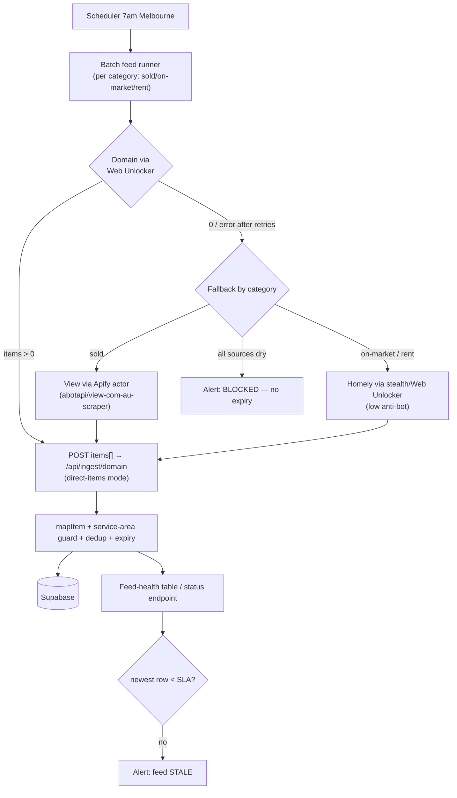
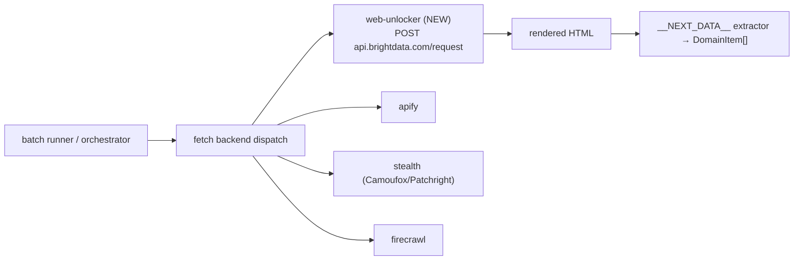
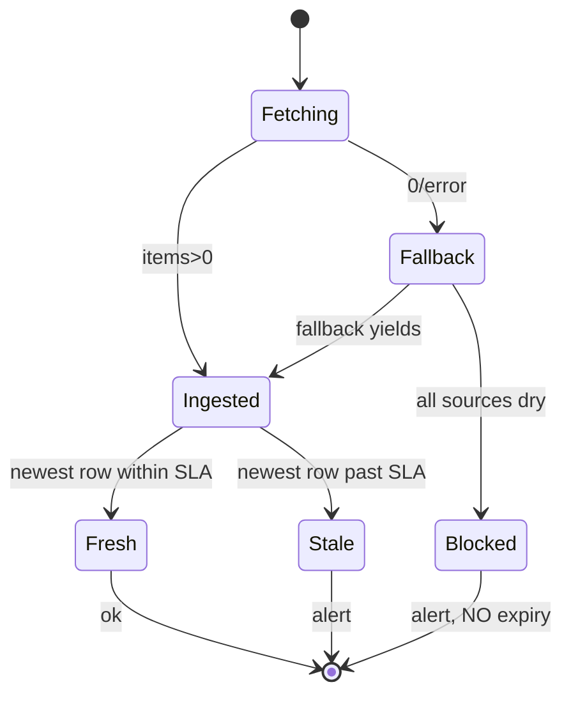

# feat: Resilient Casey/Cardinia data feeds (Web Unlocker primary + fallback + monitoring)

## Summary

The daily Casey/Cardinia data feeds (sold + on-market + rent) are dead: the proxy-less Domain Apify batch actor (`0EXe0hsmDKWLI3JF9`) returns **0 items** because Domain's anti-bot (PerimeterX/HUMAN) blocks it, and the deployed stealth scraper gets **`Access Denied`** against Domain without a residential proxy (both confirmed live, 2026-06-06). This plan makes the feeds **reliably flow and loudly fail** by:

1. Fetching Domain pages through **Bright Data Web Unlocker** (managed anti-bot — confirmed to handle PerimeterX; ~$1.50/1k ≈ $1–10/day at this scale), parsing the page's embedded `__NEXT_DATA__` JSON into listing items.
2. Adding a **documented fallback source chain** so a single portal block doesn't zero the feed: Domain primary → View (its existing Apify actor, DataDome-bypassing) for sold → Homely (low anti-bot) for listings/rent.
3. Adding **feed-freshness monitoring + alerting** that distinguishes "blocked / 0 items" from "broken", tracks per-suburb yield, and alerts when any feed has no fresh data within an SLA window.

This **supersedes plan 001** (which proposed a raw stealth-scraper + self-managed residential proxies): research and live testing show Web Unlocker is both more reliable against PerimeterX and removes the fingerprint-engineering burden, at trivial cost for this volume. The stealth scraper service remains as a secondary fetch backend.

Decisions carried from scoping: **Web Unlocker primary**; this plan **supersedes/absorbs 001**; feed coverage is **sold + on-market + rent**, with **Homely/View evaluated and wired as fallback sources** (not as the primary).

---

## Problem Frame

- **Observed:** "Casey Cardinia Sold Daily" emits HTTP 502; all recent daily datasets have `itemCount = 0`.
- **Root cause (confirmed live):** Domain blocks the proxy-less Apify actor (no proxy field to tune), and blocks the stealth scraper without a residential proxy (`Access Denied`, 322 bytes, both playwright + patchright engines).
- **Deeper problem:** the daily batch feed is a **single point of failure** — one source, one backend, no freshness monitoring. When it silently returns nothing, the only signal is a generic 502; there is no "this feed is N days stale" alert and no fallback source.
- **Consequence:** `property_sales`/`property_listings`/`property_rentals` go stale; the CMA, proposals, and the new rental filters (plan 002) have nothing fresh to serve.

---

## Requirements

- **R1** — The daily sold + on-market + rent feeds produce non-zero yield for the Casey/Cardinia suburb set under normal conditions, via Web Unlocker against Domain.
- **R2** — All persistence semantics are preserved unchanged: dedup via existing UNIQUE keys, address augmentation, `last_seen_at` bump + `active=false` expiry for on-market rows, append-only sold. `mapItem` and the tables are untouched (incl. plan 002's `listed_date`).
- **R3** — A single source/backend failure does not zero a feed: a documented, automatic **fallback chain** attempts a secondary source before giving up.
- **R4** — A genuine 0-yield/blocked outcome **never** expires live listings and **always** raises an actionable alert that says *which feed*, *blocked vs broken*, and *which suburbs* yielded nothing.
- **R5** — **Feed freshness is monitored**: an alert fires when any feed's newest row is older than its SLA window (e.g. sold/on-market > 36h, rent > 8d).
- **R6** — The service-area guard holds (Casey/Cardinia only), across every source.
- **R7** — The proxy-less Apify batch actor + its in-app retrigger loop are retired from the daily path.

---

## High-Level Technical Design

Daily feed with fallback chain and monitoring (replaces the single blocked-actor → webhook path):

Fetch-backend abstraction (Web Unlocker becomes a first-class backend alongside the existing ones):

State machine for a single feed run (drives R4/R5 alerting):

---

## Key Technical Decisions

- **KTD1 — Bright Data Web Unlocker as the primary Domain fetch (supersedes 001's raw residential approach).** Independent testing confirms it handles PerimeterX; it's a single authenticated HTTP POST returning rendered HTML (no browser/fingerprint engineering on our side), at ~$1.50/1k ≈ $1–10/day for ~58 pages/day. Raw residential proxies alone (001) still require TLS-fingerprint + behavioural warmup against PerimeterX and were unproven. The stealth service stays as a *secondary* backend, not the primary.
- **KTD2 — Extract the page's embedded `__NEXT_DATA__` JSON, not the DOM.** Domain search/sold-listings/sale/rent pages embed listing data in `<script id="__NEXT_DATA__">`; Web Unlocker returns the full rendered HTML so we parse that script tag → the existing `DomainItem` shape `mapItem` consumes. Robust and well-documented.
- **KTD3 — Source strategy: Domain primary, fallbacks by category.** Per research: **Domain** (Web Unlocker) is the primary for all three feeds (best VIC coverage, clean JSON). **View** via its already-wired Apify actor (`abotapi/view-com-au-scraper`, DataDome-bypassing) is the **sold** fallback (CoreLogic-backed VIC sold). **Homely** (low anti-bot, cheap) is the **on-market/rent** fallback (free-to-list → broad listings, but thin sold — so not a sold fallback). **REA/Kasada is out** (hardest, most failure-prone even via Web Unlocker).
- **KTD4 — Batch runner lives in the long-running scraper service.** Web Unlocker calls are HTTP (no browser) but run 3–8s each; ~58 pages/category × 3 categories well exceeds Next's `maxDuration=300`. The existing Railway scraper service is the right host; it POSTs accumulated items to the ingest route.
- **KTD5 — Direct-items ingest mode + preserve the zero-yield guard.** `/api/ingest/domain` gains a pushed-`items[]` mode (the dataset-paging path stays as a rollback lever). The `processed === 0` → no-expiry + alert guard is preserved and extended to the fallback chain (only declare BLOCKED when *all* sources are dry).
- **KTD6 — Freshness monitoring as data, not just run-exit codes.** Persist a per-feed health record (last run, source used, yield, newest-row timestamp) and expose it via the existing `/api/admin/crawl-status` dashboard; a scheduled freshness check alerts when newest-row age exceeds the per-feed SLA — catching silent staleness that a single failed run wouldn't.

---

## Scope Boundaries

### In scope
- Web Unlocker fetch backend + Domain `__NEXT_DATA__` extractor.
- Direct-items ingest mode.
- Batch feed runner (sold + on-market + rent) with retry + fallback chain.
- Feed-freshness monitoring + blocked/broken/stale alerting.
- Scheduling + retirement of the blocked Apify batch actor and its retrigger loop.

### Deferred to Follow-Up Work
- A full first-class **Homely batch extractor** if the fallback proves load-bearing (initial wiring is a thin adapter; a hardened Homely source is follow-up).
- Backfilling beds/baths + `listed_date` real dates on existing rows via a one-off Web Unlocker re-scrape (separate, once the feed is healthy).
- Extending Web Unlocker as a backend to the on-demand proposal orchestrator (it slots in, but that path already works).

### Outside this change
- DB schema/migrations for the listing tables, `mapItem` parse rules, REA as a source, the proposal/on-demand crawl behaviour.

---

## Implementation Units

### U1. Bright Data Web Unlocker fetch backend

**Goal:** A configured client that fetches a URL via Web Unlocker and returns rendered HTML, usable by the batch runner (and registrable as an orchestrator backend).

**Requirements:** R1

**Dependencies:** none (needs the Web Unlocker zone + token provisioned — operational prerequisite)

**Files:**
- `src/lib/webunlocker/client.ts` (new)
- `src/lib/webunlocker/__tests__/client.test.ts` (new)
- `.env.local.example` (add `BRIGHTDATA_WEB_UNLOCKER_TOKEN`, `BRIGHTDATA_WEB_UNLOCKER_ZONE`)
- `INTEGRATIONS.md` (document the new env vars)

**Approach:**
- POST to `https://api.brightdata.com/request` with `{ zone, url, format: 'raw' }` and `Authorization: Bearer <token>`; return `{ status, html }`. Fail-soft (never throw) mirroring `scrapeWithStealth` / `scrapeWithApify` — return a `failed` result on any error so a caller can fall back.
- `isWebUnlockerConfigured()` mirrors `isStealthConfigured()`.
- Bounded retry with backoff for transient 4xx/5xx (Web Unlocker is occasionally flaky under load); cap attempts.

**Patterns to follow:** `src/lib/stealth/client.ts` (`scrapeWithStealth`, `isStealthConfigured`, fail-soft `CrawlResult`); `src/lib/apify/client.ts`.

**Test scenarios:**
- Happy path: a mocked 200 with HTML body → `{ status: 'success', html }`.
- Transient failure then success: first call 503, retry succeeds → returns success after backoff (assert retry count).
- Hard failure: repeated 4xx → `failed` result, never throws.
- Unconfigured: token/zone unset → `failed` with a clear "not configured" message, no network call.

**Verification:** A live call against a Casey/Cardinia Domain sold-listings URL returns real listing HTML (containing `__NEXT_DATA__`) rather than `Access Denied`.

---

### U2. Domain `__NEXT_DATA__` listing extractor

**Goal:** A pure function turning a Domain search/sold-listings/sale/rent page's HTML into `DomainItem[]` matching the shape `mapItem` consumes.

**Requirements:** R1, R2

**Dependencies:** none (pure; build against saved fixtures)

**Files:**
- `src/lib/ingest/domain-page-extractor.ts` (new)
- `src/lib/ingest/__tests__/domain-page-extractor.test.ts` (new)
- `src/lib/ingest/fixtures/` (saved Domain sold + sale + rent page HTML)

**Approach:**
- Parse `<script id="__NEXT_DATA__" type="application/json">`, `JSON.parse`, walk to the listing-results array. **Exact key path is execution-time discovery** — pin it against a live page captured via U1; record it in comments.
- Map each node to the `DomainItem` shape (`location`, `pricing`, `listing.tags`, `property`, `contacts`, `url`, and the date fields plan 002's `parseListedDate` probes). Pure function (HTML in, `DomainItem[]` out), mirroring `src/lib/ingest/domain-mapper.ts`.

**Patterns to follow:** the pure, fixture-tested style of `src/lib/ingest/domain-mapper.ts`.

**Execution note:** Build test-first against saved fixtures — the parse path is the main risk surface.

**Test scenarios:**
- Happy path (sold): a sold fixture yields N items with address + parseable price + sale-date tag; assert exact count + spot-check a row.
- Happy path (sale + rent): fixtures yield items with display price / weekly rent.
- Field fidelity: lat/lng, beds/baths/parking, land size, agency + agent, first image, listing URL extracted when present.
- Edge — empty/blocked page: HTML without the `__NEXT_DATA__` listing array → `[]`, no throw, with a distinctive "schema drift" log marker. `Covers R4`.
- Edge — schema drift: expected key path absent → `[]` + marker (so a Domain markup change is diagnosable, not a crash).

**Verification:** Extractor output over committed fixtures is accepted by `mapItem` unmodified.

---

### U3. Direct-items mode on `/api/ingest/domain`

**Goal:** The ingest route accepts a pushed `{ items: DomainItem[] }` payload, routed through the same map → service-area guard → upsert → expiry pipeline as the Apify-dataset path.

**Requirements:** R2, R4, R6

**Dependencies:** none (parallel with U1/U2; U4 depends on it deployed)

**Files:**
- `src/app/api/ingest/domain/route.ts`
- `src/app/api/ingest/domain/__tests__/route.test.ts` (new/extend if route harness exists)

**Approach:**
- When the body carries `items` and no `datasetId`, run the existing accumulate → `mapItem` → `isServiceAreaSuburb` guard → upsert → address-augment → expiry pipeline. Preserve auth (`INGEST_SECRET`) + `category` validation.
- Preserve R4: `processed === 0` → no expiry, non-2xx blocked response (reuse the existing zero-yield branch, minus the Apify retrigger — fallback now lives in the runner, U4).
- Keep the dataset-paging branch intact (rollback lever).

**Patterns to follow:** the accumulate/upsert/expire block + `processed === 0` guard in `src/app/api/ingest/domain/route.ts`.

**Test scenarios:**
- Happy path (sold/on-market/rent): direct items upsert to the right table; on-market bumps `last_seen_at` + expires not-seen; sold append-only. `Covers R2`.
- Zero-yield guard: `{ items: [] }` or all-out-of-area → `processed === 0` → no expiry, non-2xx. `Covers R4`.
- Service-area: neighbouring-suburb items skipped, never persisted. `Covers R6`.
- Auth/validation: wrong token → 401; bad `category` → 400.
- Idempotency: posting the same sold items twice creates no duplicates.

**Verification:** Direct-items POSTs produce DB outcomes identical to the dataset path; zero-yield leaves on-market data untouched.

---

### U4. Batch feed runner with retry + fallback chain (scraper service)

**Goal:** A long-running job that, per category, fetches the Casey/Cardinia suburb set via Web Unlocker→Domain, extracts items, and on dry/blocked results falls back by category, then pushes the result to the ingest route.

**Requirements:** R1, R3, R4, R6

**Dependencies:** U1, U2, U3

**Files:**
- `services/scraper/src/feeds/domain-batch.ts` (new — loop + retry + fallback + push)
- `services/scraper/src/feeds/suburb-slugs.ts` (new — Casey/Cardinia slugs + per-category URL builders, ported from `src/lib/ingest/domain-run.ts`)
- `services/scraper/src/server.ts` (add `POST /run-feed { category }`)
- `services/scraper/src/feeds/__tests__/domain-batch.test.ts` (new)

**Approach:**
- `POST /run-feed { category }` (existing Bearer auth). For each suburb slug: build the Domain URL, fetch via Web Unlocker (U1), extract (U2), accumulate; per-page failures logged + skipped (keep partial yield).
- **Fallback chain (KTD3):** if total items === 0 after the Domain pass, invoke the category fallback — `sold` → View Apify actor (`abotapi/view-com-au-scraper`); `on-market`/`rent` → Homely (thin adapter via stealth/Web Unlocker). Map fallback output into `DomainItem` shape.
- POST accumulated `items[]` to `${INGEST_PUBLIC_ORIGIN}/api/ingest/domain?category=<c>` with `INGEST_SECRET`. If still 0 after all sources, respond non-2xx (BLOCKED) and **do not push** (no expiry). Return a run summary `{ source_used, suburbsScraped, zeroYieldSuburbs[], itemsExtracted, ingest }`.

**Patterns to follow:** the auth hook + error-shaping in `services/scraper/src/server.ts`; the source/fallback dispatch in `src/lib/firecrawl/orchestrator.ts`; slug/URL builders in `src/lib/ingest/domain-run.ts`.

**Test scenarios:**
- Happy path: stubbed Web Unlocker returning fixture HTML per slug accumulates the expected total and pushes once.
- Partial failure: one slug errors → recorded in `zeroYieldSuburbs`, rest still pushed.
- Fallback fires: Domain yields 0 for `sold` → View actor invoked, its items pushed, `source_used: 'view'`.
- All dry: every source returns 0 → non-2xx, **no push** (R4), names zero-yield suburbs.
- Service area: out-of-area items dropped before push. `Covers R6`.

**Verification:** Against fixture-backed sources, the runner pushes a correctly-shaped batch and reports accurate source/summary; an all-dry run returns non-2xx with no push.

---

### U5. Feed health record + freshness/blocked/broken alerting

**Goal:** Persist per-feed health and alert on blocked, broken, or stale feeds — beyond a single run's exit code.

**Requirements:** R4, R5

**Dependencies:** U3, U4

**Files:**
- `src/lib/db/migrations/007_feed_health.sql` (new — `feed_health` table: category, last_run_at, source_used, items, newest_row_at, status)
- `src/app/api/ingest/domain/route.ts` (write a `feed_health` row on each ingest)
- `src/app/api/admin/crawl-status/route.ts` (surface feed-health + per-feed staleness)
- `src/app/api/cron/feed-freshness/route.ts` (new — scheduled SLA check that alerts when newest-row age exceeds the per-feed window)
- `src/app/api/cron/feed-freshness/__tests__/route.test.ts` (new)

**Approach:**
- On each ingest, upsert a `feed_health` row: `{ category, last_run_at, source_used, items, newest_row_at, status: ok|blocked|stale }`.
- `feed-freshness` cron: for each feed, compare `max(created_at)` (and `last_seen_at`) to the SLA (sold/on-market 36h, rent 8d) → emit an alert (reuse the schedule's non-2xx notification, or a webhook) naming the feed + age. Distinguish blocked (last run 0 items) from broken (last run errored) from stale (no recent run at all).
- Extend `/api/admin/crawl-status` to show each feed's freshness + last source used.

**Patterns to follow:** the parallel-query dashboard in `src/app/api/admin/crawl-status/route.ts`; the migration style of `src/lib/db/migrations/00N_*.sql`.

**Test scenarios:**
- Fresh feed: newest row within SLA → `ok`, no alert.
- Stale feed: newest row past SLA → alert naming the feed + age. `Covers R5`.
- Blocked vs broken: last run 0 items → `blocked` alert; last run errored → `broken` alert; both distinct from `stale`. `Covers R4`.
- Status endpoint: returns a per-feed freshness summary.
- Migration: idempotent, additive (re-runnable).

**Verification:** A simulated stale/blocked feed produces a distinct, actionable alert; the dashboard shows per-feed freshness and last source.

---

### U6. Schedule the daily runner + retire the blocked Apify path

**Goal:** The scraper `/run-feed` runs daily (sold + on-market) + weekly (rent) at the Melbourne cadence; the proxy-less Apify batch actor + retrigger loop are retired from the daily path.

**Requirements:** R1, R5, R7

**Dependencies:** U4, U5

**Files:**
- `services/scraper` scheduling config (Railway cron/scheduled job) — documented in `services/scraper/README.md`
- `DAILY_SYNC_SETUP.md` (rewrite the Apify-schedule/webhook sections for the Web-Unlocker path)
- `INTEGRATIONS.md` (update the feed description + env table)
- `src/lib/ingest/domain-run.ts` (retire the retrigger path from the live daily flow; keep dormant as a rollback lever)

**Approach:**
- Daily 7am-Melbourne trigger → `POST /run-feed` for `sold` + `on-market`; weekly for `rent`. Also schedule the `feed-freshness` check (U5).
- Disable the Apify Console daily schedules (ops step — document it).
- Update docs so the next maintainer sees Web Unlocker + fallback as steady-state.

**Patterns to follow:** schedule semantics in `DAILY_SYNC_SETUP.md` (timezone, cadence, failure-alert-on-non-2xx).

**Test scenarios:** `Test expectation: none — scheduling/ops + docs`; validated by a live daily run landing fresh rows and a forced 0-yield run firing the blocked alert.

**Verification:** A live/triggered run lands fresh sold + on-market via Web Unlocker; the Apify daily schedule is disabled; freshness check is scheduled.

---

## Alternative Approaches Considered

- **Raw self-managed residential proxies + stealth browser (plan 001).** Cheaper per-GB but unproven against PerimeterX, requires ongoing TLS-fingerprint/behaviour engineering, and live testing showed plain stealth still gets `Access Denied`. Web Unlocker wins on reliability-per-effort at this volume. Stealth retained as a fallback backend.
- **Switch primary source to View or Homely.** View (DataDome) is *harder* than Domain and its data benefit is redundant with Domain; Homely has thin sold data. Neither is a better *primary* — both are better as **fallbacks** (KTD3).
- **Keep Apify, just swap actors.** Fastest possible patch, but leaves the single-source/single-backend fragility and no freshness monitoring — exactly the reliability gap this plan exists to close. The View Apify actor is retained *as a fallback*, not the primary.
- **ScrapFly ASP instead of Web Unlocker.** Comparable managed-anti-bot API (claims strong DataDome/PerimeterX bypass). Viable alternative to Web Unlocker; chosen against only because you're already provisioning Bright Data. Noted as a drop-in swap behind the U1 backend abstraction if Web Unlocker underperforms on Domain.

---

## Risks & Dependencies

- **Web Unlocker is an operational prerequisite (highest dependency).** Needs a Bright Data Web Unlocker zone + token. Until provisioned, U1's live verification can't run; everything downstream is gated. Mitigation: U1 is fail-soft and the fallback chain + monitoring still function.
- **Domain markup / `__NEXT_DATA__` drift.** Extractor depends on Domain's embedded JSON. Mitigation: fixture tests + schema-drift marker; extractor returns `[]` (→ fallback/alert) rather than crashing.
- **Web Unlocker still failing on Domain.** Independent tests show ~88% success and PerimeterX handled, but not guaranteed. Mitigation: retry/backoff (U1) + the View/Homely fallback chain (U4); ScrapFly noted as a swap-in.
- **Legal/ToS.** Domain's ToS prohibits scraping (REA has litigated). Out of technical scope, but flagged: this is data acquisition the business already does — no new exposure beyond the existing pipeline.
- **Fallback data-shape divergence.** View/Homely items differ from Domain's; their adapters must map into `DomainItem`. Mitigation: per-source adapter + service-area guard before push; Homely full build deferred if the thin adapter underperforms.
- **Cross-service slug drift.** `SUBURB_SLUGS` temporarily lives in both `src/lib/ingest/domain-run.ts` and the scraper service. Mitigation: sync comment; converge when `domain-run.ts` retires.

---

## Operational / Rollout Notes

- **Migrations to run in Supabase:** `007_feed_health.sql` (this plan). (Plus already-applied 005/006.)
- **New env (scraper service + Next):** `BRIGHTDATA_WEB_UNLOCKER_TOKEN`, `BRIGHTDATA_WEB_UNLOCKER_ZONE`, `INGEST_PUBLIC_ORIGIN`.
- **Rollback levers:** the Apify dataset-paging ingest branch and the `domain-run.ts` retrigger stay dormant, not deleted, until Web Unlocker proves stable across several daily cycles.
- **Cutover:** land U1–U5, verify a manual `/run-feed sold` lands rows, then U6 disables the Apify schedule.

---

## Sources & Research

- Live diagnosis 2026-06-06: Apify daily datasets `itemCount=0`; stealth scraper returns `Access Denied` (322 bytes, playwright + patchright) against Domain with no proxy — proxies/anti-bot handling are mandatory.
- External research (portal + Web Unlocker landscape): Domain = PerimeterX/HUMAN (HIGH), `__NEXT_DATA__` extractable; **Homely** = no commercial anti-bot (LOW), Next.js, *thin sold* data; **View** = DataDome (HIGH), strong VIC sold, Apify actor exists; **REA** = Kasada (VERY HIGH, avoid). **Web Unlocker**: API POST returning rendered HTML, handles PerimeterX (~88% independent pass), ~$1.50/1k PAYG (≈ $1–10/day here), stateless (handle pagination app-side), 3–8s latency. Sources incl. Scrapfly Domain/PerimeterX/DataDome guides, The Web Scraping Club Web Unlocker test, Bright Data product/pricing pages, DataDome View case study, Domain ToS / REA-v-Domain litigation.
- Codebase: `src/lib/firecrawl/orchestrator.ts` (existing multi-source/multi-backend dispatch + fallback for on-demand crawls — the pattern this plan brings to the batch feed); source configs `src/lib/firecrawl/sources/{domain,homely,view,realestate}.ts` (View Apify actor `abotapi/view-com-au-scraper` already wired); `src/lib/stealth/client.ts` + `src/lib/apify/client.ts` (fail-soft backend pattern for U1); `src/app/api/ingest/domain/route.ts` (ingest + zero-yield guard); `src/lib/ingest/domain-run.ts` (`SUBURB_SLUGS`, retrigger to retire); `src/app/api/admin/crawl-status/route.ts` (dashboard to extend).
- Supersedes plan 001 (stealth + self-managed residential proxies). Consumes/benefits plan 002 (`listed_date` + rental filters). Memory: [[stealth-scraper-backend]], [[daily-scrape-schedule]], [[crawl-empty-profiles]].
