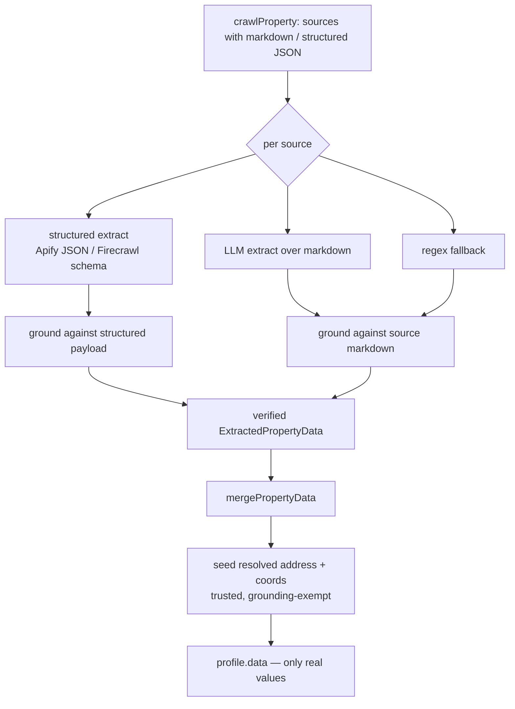

# fix: Guarantee only real, source-verified property data (no hallucination/mock)

## Summary

The PropertyIQ property pipeline returns LLM-extracted fields that can be **fabricated**. With the MiniMax key now live, a fresh lookup for `24 Gloucester Avenue, Berwick` returned a complete-looking `saleHistory` entry (`agentName: "Jane Doe"`, `agency: "Ray White Berwick"`, `price: 1250000`, `daysOnMarket: 45`) that is almost certainly invented from a thin/generic page — despite the extraction prompt already instructing the model not to fabricate. The downstream consumer (findAI) maps this into property records, so fabricated values become "real" records.

This plan makes the extraction → merge boundary trust-by-verification: **prefer the scrapers' own structured fields as the source of truth, treat the LLM as a fallback, and accept a value only when it can be located in the actual scraped source content.** Anything unverifiable is dropped (omitted), so consumers get a partial-but-real profile rather than plausible fiction. The API response shape is unchanged.

---

## Problem Frame

- **Root cause:** the free-form LLM extractor (`extractPropertyData` → `callLLM`) emits scalar/array fields with no check that the value exists in the source markdown. Prompt-level "do not fabricate" is not honoured under thin input. There is no grounding step between extraction and merge.
- **Aggravating factor:** the structured data the scrapers already return is discarded. The Firecrawl native extract (`scrapeAndExtract`) does a second, bot-blocked fetch and usually fails, and the Apify actors' structured JSON is reduced to markdown upstream — so the pipeline leans on the most hallucination-prone path (free LLM over markdown) as the primary extractor.
- **Not the cause:** no mock/seed/fixture property data leaks from code (verified — only the agency list, a cache comment, and a sign-in placeholder match mock-like patterns). The hallucination source is exclusively the LLM.
- **Trust requirement:** every field in `profile.data` must be traceable to real scraped content. Unverifiable → omit.

---

## Requirements

- **R1.** No field in the returned `profile.data` may contain an LLM-invented value. Every retained value must be locatable in the scraped source content for at least one contributing source.
- **R2.** Prefer structured scraper output (Apify actor JSON, Firecrawl schema JSON) over free-form LLM extraction when both are available for the same field.
- **R3.** When a value cannot be verified against source content, omit the field silently (consistent with the existing "omit if absent" contract). Never null, never guess.
- **R4.** The `/api/property` response shape is unchanged — no new provenance fields exposed to consumers.
- **R5.** Address and coordinates remain seeded from the caller-resolved `StructuredAddress` + geocode (already implemented this session) — that is a trusted, non-LLM source and is exempt from content-grounding.
- **R6.** The guarantee must hold on the regex fallback path too (it does not fabricate today, but saleHistory/price parsing must stay source-anchored).

---

## Key Technical Decisions

- **KTD1 — Grounding validation as a post-extraction gate.** Add a verification step that runs over each `ExtractedPropertyData` before merge: for every scalar/array value, confirm the value (or a normalised form of it) appears in that source's raw scraped text. Drop values that fail. This is deterministic and model-independent — it is the actual guarantee, not the prompt. *(Rationale: prompt hardening demonstrably failed; grounding is the only thing that makes fabrication impossible to surface.)*
- **KTD2 — Source-priority: structured before free-LLM.** Where a source provides structured fields (Apify actor JSON, Firecrawl schema JSON), treat those as trusted and prefer them; only fall through to LLM/regex extraction for fields the structured data did not provide. Structured scraper fields are still grounded per KTD1 against their own payload as a cheap consistency check, but they are not subject to markdown-substring matching. *(Rationale: the scrapers already return real, parsed values; re-deriving them with an LLM only adds hallucination surface.)*
- **KTD3 — Field-type-aware verification.** Verification differs by field: numbers (price, beds, baths, land, year) must match a number present in the source (allowing format variants like `1,250,000` / `$1.25m`); strings (agentName, agency, displayAddress) must appear as a substring (case-insensitive, whitespace-normalised); dates must match a date present in the source in any common AU format; enums (propertyType, listingStatus) must be supported by a keyword in the source. Each `saleHistory`/`rentalHistory` entry is verified element-by-element and dropped whole if its core (price+date) is unverifiable. *(Rationale: a single substring rule would both over-reject numbers and under-reject fabricated prose.)*
- **KTD4 — Carry raw source text to the verifier.** Verification needs the source content each extraction came from. The merge currently receives only `ExtractedPropertyData`. The grounding step must run where both the extraction and its originating `CrawlResult.markdown`/structured payload are still in scope (the per-source extraction step in the fetch pipeline), not inside the merger. *(Rationale: the merger is source-agnostic and should stay that way; grounding is a per-source concern.)*
- **KTD5 — Prompt hardening is supplementary, not the guarantee.** Tighten the extraction prompt to reduce wasted fabrication, but it is explicitly not relied upon for R1. *(Rationale: keeps the model from spending tokens on values that will be dropped anyway; never the safety mechanism.)*
- **KTD6 — Keep address/coords exempt.** The seeded address block comes from the resolved `StructuredAddress` + Mapbox geocode, both trusted non-LLM sources; the grounding gate skips `data.address`, `data.latitude`, `data.longitude`. *(Rationale: these are already authoritative; grounding them against portal markdown would wrongly drop correct coordinates.)*

---

## High-Level Technical Design

Grounding sits between per-source extraction and merge. Each source's extracted fields are validated against that same source's raw content; only verified fields survive into the merge.



Verification decision per field (directional):

```text
verifyField(value, fieldType, sourceText):
  number → normalise digits; PASS if any numeric token in sourceText equals value
           (try raw, comma-stripped, $/m/k expansions)
  string → PASS if normalise(value) is a substring of normalise(sourceText)
  date   → PASS if value matches any date token in sourceText (ISO + common AU formats)
  enum   → PASS if a keyword mapping to value appears in sourceText
  array  → verify each element; keep entry only if its core fields PASS
  else   → drop
```

---

## Implementation Units

### U1. Source-grounding verifier

**Goal:** A pure, well-tested function that, given an extraction's fields and the raw source text it came from, returns only the fields whose values are provably present in that source.

**Requirements:** R1, R3, R6, KTD1, KTD3.

**Dependencies:** none.

**Files:**
- `src/lib/extraction/grounding.ts` (new)
- `src/lib/extraction/grounding.test.ts` (new)

**Approach:** Field-type-aware matching per KTD3. Normalisation helpers for numbers (strip `$`, `,`; expand `m`/`k`/`million`), strings (lowercase, collapse whitespace, strip punctuation), and dates (parse ISO + `12 Mar 2021` / `March 2021` / `2021` to comparable tokens). Operates on a plain field map so it is reusable across LLM, regex, and structured inputs. Exposes a per-field allowlist of which keys are subject to which verification type; unknown keys are dropped by default (fail-closed). Address/coords keys are not passed in (handled by caller exemption, KTD6).

**Patterns to follow:** mirror the normalisation style already in `src/lib/extraction/extractor.ts` (number/price parsing) and `src/lib/utils/address.ts` (string normalisation). Keep it dependency-free like the existing extractor helpers.

**Test scenarios:**
- Number present verbatim (`landArea: 211` with `211 m²` in source) → kept.
- Number present in formatted form (`price: 1250000` with `$1,250,000` in source) → kept.
- Number absent from source (`price: 1250000`, source has no such figure) → dropped.
- String present (`agency: "Ray White Berwick"` appears in source) → kept.
- Fabricated string (`agentName: "Jane Doe"` not in source) → dropped.
- Case/whitespace variance (`agency: "ray white  berwick"` vs source `Ray White Berwick`) → kept.
- Date variants: `2022-05-15` matches source `15 May 2022` / `May 2022` → kept; absent date → dropped.
- Enum `propertyType: "house"` with `house` in source → kept; with no supporting keyword → dropped.
- `saleHistory` entry with verifiable price+date kept; sibling entry with fabricated price dropped; partially-verifiable entry (real date, fabricated agent) keeps entry, drops the agent sub-field.
- Unknown/unlisted field key → dropped (fail-closed).
- Empty source text → all content fields dropped.

**Verification:** unit tests pass; given the real `24 Gloucester` markdown fixture, the fabricated `Jane Doe`/`1250000` saleHistory is dropped while genuinely-present fields survive.

---

### U2. Apply grounding in the fetch pipeline (with address/coords exemption)

**Goal:** Run U1 over each source's extraction using that source's raw content, before merge, so only verified per-source fields reach `mergePropertyData`.

**Requirements:** R1, R3, R5, R6, KTD4, KTD6.

**Dependencies:** U1.

**Files:**
- `src/lib/jobs/fetch-profile.ts` (modify — the per-source extraction step where `CrawlResult` and `ExtractedPropertyData` are both in scope)
- `src/lib/jobs/fetch-profile.test.ts` (new or extend)

**Approach:** At the point each `ExtractedPropertyData` is produced, pass its raw source text (`CrawlResult.markdown`, or the structured payload stringified for the structured path) into the U1 verifier and replace the extraction's fields with the verified subset. Merge then runs on already-grounded extractions. The resolved-address seeding step (added this session) runs after merge and is untouched — it is the trusted, grounding-exempt source for `address`/`lat`/`lng` (KTD6). Ensure the `empty`/`crawlEmpty` computation still reflects post-grounding data so a profile that grounds down to nothing is treated as empty and not cached.

**Patterns to follow:** the existing per-source `Promise.all` extraction map in `fetch-profile.ts`; keep grounding inside that map so each source is verified against its own content.

**Test scenarios:**
- Two sources where source A genuinely contains beds/baths and source B contains a fabricated price → merged profile keeps A's beds/baths, drops B's price.
- A source whose every content field is fabricated → contributes nothing; if all sources do, profile is empty and not cached.
- Address/coords still present after grounding even though portal markdown lacks coordinates (exemption holds). *(Covers R5.)*
- Structured (Apify/Firecrawl) source path: fields verified against the structured payload, not markdown, and retained.
- Regression: a known-good residential address still returns real beds/baths/saleHistory end-to-end.

**Verification:** live repro of `24 Gloucester Avenue, Berwick` no longer returns the fabricated saleHistory; a known property with a real sale still returns it.

---

### U3. Source-priority — prefer structured scraper fields over free LLM

**Goal:** Use the scrapers' structured output as the trusted primary for fields they provide; fall through to LLM/regex only for the gaps.

**Requirements:** R2, KTD2.

**Dependencies:** U1, U2.

**Files:**
- `src/lib/jobs/fetch-profile.ts` (modify — extraction selection per source)
- `src/lib/firecrawl/client.ts` (modify if needed — ensure structured fields are surfaced with stable keys for grounding)
- `src/lib/jobs/fetch-profile.test.ts` (extend)

**Approach:** Where a source yields structured JSON (Firecrawl schema extract that succeeds, or an Apify actor payload available to this path), retain those fields first and only invoke the LLM/regex extractor for fields still missing. Structured fields pass through U1 grounding against their own payload (cheap consistency check) but are not markdown-substring matched. Do not change the crawl/anti-bot layer or add sources (out of scope).

**Approach note:** confirm at implementation time whether Apify actor structured JSON is reachable on the on-demand profile path or only markdown is (the orchestrator currently reduces some sources to markdown). If only markdown is available on this path, this unit reduces to "prefer a successful Firecrawl structured extract over LLM" — record the finding rather than forcing a larger orchestrator change here.

**Test scenarios:**
- Source provides structured beds/baths/price → those are used; LLM is only asked for the remaining fields (or not called if none remain).
- Structured extract missing saleHistory but markdown has a real one → LLM/regex fills saleHistory, grounded per U1.
- Structured field that fails its own-payload consistency check → dropped (fail-closed).
- Regression: a source that only yields markdown still works via the existing LLM/regex path.

**Verification:** for a source with structured output, the response fields match the structured payload and the LLM call is reduced or skipped.

---

### U4. Harden the extraction prompt (supplementary)

**Goal:** Reduce wasted fabrication by tightening the instruction, explicitly subordinate to U1.

**Requirements:** R1 (supporting), KTD5.

**Dependencies:** none (independent; lands anytime).

**Files:**
- `src/lib/extraction/prompts.ts` (modify)

**Approach:** Strengthen the existing "do not fabricate" rule: instruct that any value not copied verbatim from the provided content will be discarded downstream, that placeholder names (e.g. "Jane Doe"), round-number guesses, and inferred agents/agencies must be omitted, and that it is always correct to return fewer fields. Keep it concise; this does not change behaviour guarantees.

**Test scenarios:** `Test expectation: none -- prompt-only text change; the guarantee is enforced and tested by U1/U2, not by the prompt.`

**Verification:** prompt reads clearly; no code path depends on it for correctness.

---

## Scope Boundaries

**In scope:** the extraction → grounding → merge trust boundary in `src/lib/extraction/` and `src/lib/jobs/fetch-profile.ts`; preferring structured scraper fields; the supplementary prompt change.

**Out of scope (true non-goals):** the crawl/anti-bot layer (Apify/Firecrawl/stealth backends); adding new data sources; changing the set of fields the profile can contain; exposing provenance/confidence to consumers (explicitly declined — response shape unchanged, R4).

### Deferred to Follow-Up Work
- Optional per-field provenance/confidence in the API (declined now; revisit if findAI later wants trust-gating).
- Clearing/invalidating legacy cached profiles written before grounding existed (separate cache-hygiene task; a full request already bypasses fast partials, but legacy full entries persist).
- Fixing the `dev` script port (3002 vs 3007) — unrelated footgun noted this session.

---

## System-Wide Impact

- **findAI (consumer):** will receive fewer fields on thin-source properties, but every returned value is real. This is the intended trade (R3). No response-shape change (R4), so no consumer code change required.
- **Cache:** grounded (smaller, real) profiles get cached going forward. Legacy cached profiles may still contain pre-grounding values until evicted/overwritten — see Deferred.
- **CMA / proposal / vendor-report composites:** these read `profile.data` via the shared client; they benefit automatically and need no change.

---

## Risks & Mitigations

- **Over-rejection (dropping real values that are present but formatted oddly).** Mitigation: KTD3 format-variant normalisation for numbers/dates; unit tests cover comma/`$`/`m` and AU date variants. Tune normalisation, never loosen to substring-of-digits that would re-admit fabrication.
- **Structured payload not reachable on the on-demand path.** Mitigation: U3's approach note — degrade to "prefer successful Firecrawl structured extract" and record the finding rather than forcing an orchestrator change.
- **Grounding makes more profiles empty (thin/bot-walled pages now yield nothing instead of fiction).** This is correct behaviour, but increases empty results. Mitigation: empty profiles are already not cached (retryable); surfaced honestly to the consumer.

---

## Execution Notes

- U1 is pure logic — **start test-first** with the fabricated-`Jane Doe` case and the real-value cases as the spec.
- Capture a real `24 Gloucester Avenue, Berwick` source-markdown fixture during U2 so the end-to-end "fabrication dropped, real kept" assertion is reproducible offline.
