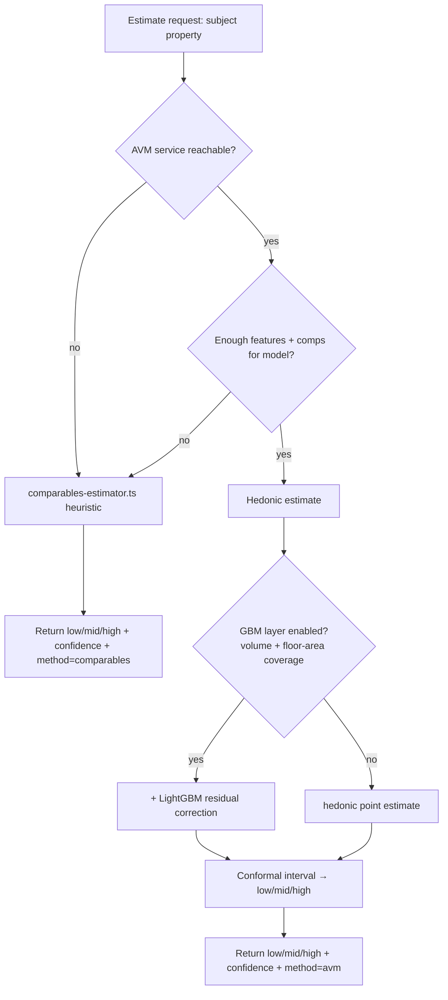

# feat: Statistical AVM — accurate, market-indexed, feature-driven price estimates

## Summary

Today's price estimate is a heuristic **weighted-median over comparable sales** (`src/lib/estimation/comparables-estimator.ts`): comps are scored by distance/type/beds/baths/land/recency, combined into a weighted median, with a dispersion-derived low/mid/high band. It works, but it is feature-thin (beds/baths proxy for size; **no internal floor area, no condition, no land-value isolation**), time-naive (an 18-month-old sale counts almost like today's), and cannot learn feature interactions.

This plan moves PropertyIQ to a **staged statistical Automated Valuation Model (AVM)** that is more accurate, more timely, and genuinely feature-driven — without falling into the well-documented thin-data ML trap. Three threads run together:

1. **Data foundation** — persist the rich attributes we already *extract but drop* (features, year built, per-field confidence), capture the #1 missing predictor (**internal floor area**), and fold in free Victorian external data (cadastral land/parcel, planning overlays, SEIFA, school zones, transport proximity).
2. **Market-time indexing** — build a suburb/SA2 hedonic price index from our own sold history and index every comp to "today", so estimates track current conditions.
3. **The model** — a Python AVM service: a regularised **hedonic baseline** (safe and accurate at our 5–50k-row scale) with a **gradient-boosted residual layer** gated on data volume, plus **conformal-prediction confidence intervals** and a rigorous **temporal + spatial backtesting harness**. The existing comparables engine becomes the fallback when the model can't estimate.

Research is explicit that at our data volume, **gradient-boosting only beats regularised regression above ~20k rows and only with heavy regularisation**; spatial/temporal leakage makes naive ML look accurate while failing in production. The staging below is the direct consequence.

This is a **multi-milestone roadmap**, sequenced so each phase ships standalone value: the data and indexing phases improve even the *current* heuristic before the model exists.

---

## Problem Frame

**Where accuracy leaks today:**
- **Size is proxied, not measured.** Internal floor area explains ~40% of price variance after location; we have only beds/baths, which are noisy proxies (a 5-bed/200m² vs 5-bed/500m² value very differently). Floor area is **absent from Domain's `__NEXT_DATA__`** and from every free AU source — the single biggest gap.
- **Rich data is extracted then discarded.** The per-property enrichment pipeline (`src/lib/extraction/*`) already pulls features, year built, and per-field confidence, but `property_sales` / `property_listings` don't persist them — so the estimator can't use them.
- **Time is flattened.** Recency is a soft exponential weight; there is no market index, so a comp from a different price regime is treated as roughly current.
- **No land-value isolation, no condition, no locational fixed effects** beyond raw distance.
- **The method can't learn interactions.** A weighted median cannot express "large land matters in Cardinia fringe but not dense Berwick" — a tree/hedonic model can.

**Constraints that shape the solution:**
- **Thin, single-region data** (~5–50k sold rows, Casey/Cardinia only) → regularised hedonic first; GBM only when justified. Pure ML on this volume overfits and extrapolates badly.
- **Stack mismatch** — the app is TypeScript/Next.js with zero ML tooling; the model belongs in Python (XGBoost/LightGBM/MAPIE ecosystem).
- **Licensing reality** — the best external data (floor area, authoritative sales) is paid (CoreLogic/PriceFinder/LANDATA); free Victorian open data (Vicmap, SEIFA, overlays) is the high-ROI starting point.

---

## Requirements

- **R1** — Persist the property attributes already extracted but currently dropped (features, year built, building/floor area, per-field confidence) on sold and listing records.
- **R2** — Capture **internal floor area (m²)** for as many properties as possible from available listing sources, stored per property.
- **R3** — Enrich properties with free Victorian external signals: cadastral land area / parcel (Vicmap), planning zone + overlays (BMO/flood/heritage), SEIFA socioeconomic score, school-zone membership, and distance to nearest train station.
- **R4** — Index any comparable/sale older than a recency threshold to current market value via a local (suburb/SA2) price index built from our sold history, with an external-index fallback where local data is thin.
- **R5** — Produce a point estimate from a **regularised hedonic model** trained on the assembled feature set, with the existing comparables engine as fallback when the model declines (insufficient features/comps).
- **R6** — Add a **gradient-boosted residual layer** that activates only when training volume and floor-area coverage cross defined thresholds; otherwise the hedonic estimate stands.
- **R7** — Express uncertainty as a calibrated per-property interval (conformal prediction), validated so ≥~68% of held-out sales fall within the stated band.
- **R8** — A backtesting harness reports **MdAPE, PPE10, PPE20** under **temporal hold-out + spatial cross-validation** (not random split), gating any model promotion.
- **R9** — The public estimate API response **shape is unchanged** (low/mid/high + confidence); only the values and an internal `method`/provenance field change. Downstream consumers (CMA, comparables, vendor-report) keep working.
- **R10** — The estimate path degrades safely: if the AVM service is unavailable, the TS API falls back to the current comparables estimator with no consumer-visible breakage.

---

## Key Technical Decisions

- **Staged model, hedonic-first (R5, R6).** Start with regularised hedonic regression (Ridge/Lasso or a GAM with spatial terms) plus a spatial-lag feature (rolling median of recent nearby sales — the single highest-importance engineered feature in the literature). Add a **LightGBM residual-correction stage only above ~20k training rows AND >~60% floor-area coverage**, with `max_depth 4–6`, `min_child_samples ≥30`, and early stopping. Rationale: at 5–50k thin-region rows, GBM-first overfits and extrapolates to absurd values for rare configurations; regularised hedonic is interpretable, auditable, and competitive at this scale. (See Alternatives.)
- **Python AVM sidecar service, not in-TS (R5, R9, R10).** The model lives in a separate Python service (training scripts + a thin inference API) deployed alongside the app on Railway; the TS estimate route calls it over internal HTTP and falls back to the comparables engine on any error. Rationale: the gradient-boosting/conformal ecosystem is Python-only; embedding scoring in TS would mean reimplementing or ONNX-exporting with ongoing friction. Keeps ML iteration independent of the web app.
- **Floor area from listing-supplied floor plans (R2).** No free authoritative AU source exists; agent-uploaded floor plans on listing pages are the most accessible (~50–70% house coverage in SE-Melbourne outer suburbs). Capture at ingest/enrichment time and persist; treat as a high-value-but-sparse feature the model handles via missingness, never a hard requirement. Paid bulk attribute feeds (CoreLogic/PriceFinder) are the comprehensive alternative — deferred (licensing).
- **Local hedonic time index, external fallback (R4).** Build a suburb/SA2 time-dummy index from our own sold history (smoother and less revision-prone than repeat-sales at thin volume); fall back to an external suburb index where local counts are too low. Apply as `adjusted = sale_price × (index_now / index_at_sale)`.
- **Conformal prediction for confidence (R7).** Use conformal intervals (MAPIE), calibrated per suburb/SA2 cluster, rather than a hand-tuned dispersion formula. Spatially-weighted conformal is the current best practice for AVMs spanning high- and low-turnover geographies (Berwick vs rural Cardinia) in one model.
- **Temporal + spatial validation is the promotion gate (R8).** Never random-split property sales. Train on older sales, test on the most recent window, and use spatial leave-one-suburb-out / radius-exclusion folds. A model that looks like 7% MdAPE on a random split is routinely ~14% under spatial hold-out — this gate is non-negotiable before any model replaces the heuristic in production.
- **Additive schema + provenance, not destructive (R1, R9).** New columns are nullable additions; a `method` field records which engine produced each estimate. No existing column or response field is removed, preserving every downstream consumer.

---

## High-Level Technical Design

### System shape (target)

```
                         ┌─────────────────────────────────────────┐
   Daily feed ──────────►│  Supabase  property_sales / _listings    │
   (sharded scrape)      │  + new cols: building_area_sqm,          │
                         │    year_built, features, field_conf,     │
   Enrichment ──────────►│    parcel/overlay/seifa/school/station   │
   (Vicmap, SEIFA,       └───────────────┬──────────────────────────┘
    school, station)                     │
                                         │ training-dataset builder
                                         ▼
                         ┌─────────────────────────────────────────┐
                         │  Python AVM service                      │
   suburb time index ───►│   • hedonic baseline (Ridge/GAM)         │
   (built from sales)    │   • LightGBM residual layer (gated)      │
                         │   • conformal intervals (MAPIE)          │
                         │   • backtest harness (temporal+spatial)  │
                         └───────────────┬──────────────────────────┘
                                         │ internal HTTP (estimate)
                                         ▼
   TS estimate API  ──────────►  AVM service  ──fallback──►  comparables-estimator.ts
   (unchanged response shape: low/mid/high + confidence + method)
```

### Estimate request flow (with fallback)



### Model staging gate

```
records < 20k  OR  floor-area coverage < 60%   →  hedonic baseline only
records ≥ 20k  AND floor-area coverage ≥ 60%    →  hedonic + LightGBM residual
ALWAYS                                           →  promote to prod only if
                                                    spatial-CV MdAPE improves on heuristic
```

---

## Output Structure

New Python service (greenfield directory; exact layout may adjust during build):

```
services/avm/
├── pyproject.toml              # deps: lightgbm, scikit-learn, mapie, pandas, fastapi/uvicorn
├── README.md
├── avm/
│   ├── features.py             # training-dataset builder: pull rows, assemble feature matrix
│   ├── time_index.py           # suburb/SA2 hedonic time-dummy index
│   ├── models/
│   │   ├── hedonic.py          # regularised baseline (Ridge/GAM + spatial lag)
│   │   └── gbm.py              # LightGBM residual layer (gated)
│   ├── conformal.py            # MAPIE intervals, per-cluster calibration
│   ├── backtest.py             # temporal + spatial CV; MdAPE/PPE10/PPE20; FSD calibration
│   └── serve.py                # inference API: subject → low/mid/high + confidence
└── tests/
    ├── test_features.py
    ├── test_time_index.py
    ├── test_backtest.py
    └── test_serve.py
```

---

## Implementation Units

### Phase A — Data Foundation

#### U1. Persist extracted-but-dropped attributes (features, year built, floor area, field confidence)

**Goal:** Stop discarding rich attributes the enrichment pipeline already produces; make them queryable for model training.

**Requirements:** R1

**Dependencies:** none

**Files:**
- `src/lib/db/migrations/008_avm_attributes.sql` (new) — add nullable `building_area_sqm`, `year_built`, `features` (JSONB), `field_confidence` (JSONB) to `property_sales` and `property_listings`
- `src/lib/ingest/domain-mapper.ts`, `src/lib/extraction/merger.ts` (modify) — carry the fields through to the persisted row
- `src/lib/db/queries.ts` (modify) — include new columns in upsert column lists
- `src/types/property.ts` (modify) — extend row types
- `src/lib/db/__tests__/queries.test.ts` (new/modify)

**Approach:** Additive migration only (R9). Map the already-extracted `MergedPropertyProfile` fields (`features[]`, `year_built`, `building_area`, per-field confidence) into the upsert payload. Preserve existing `on_conflict` keys. Where a source lacks a field, write NULL — the model handles missingness.

**Patterns to follow:** existing migration files in `src/lib/db/migrations/` (esp. `005`, `007`); the existing upsert column-list pattern in `queries.ts`; merger field-confidence output.

**Test scenarios:**
- Happy path: a merged profile with features + year_built + building_area upserts and reads back with those columns populated.
- Edge: a profile missing building_area writes NULL, not 0 or empty string; row still upserts.
- Edge: features as an empty array vs null — choose one representation and assert it consistently.
- Idempotency: re-upserting the same record does not duplicate or wipe previously-populated attribute columns (merge semantics).
- Integration: ingest → merge → upsert path persists the new columns end-to-end (no mock at the DB boundary).

**Verification:** New columns exist and populate from a real enrichment run; a query can filter/aggregate on `building_area_sqm` and `year_built`; existing consumers unaffected.

---

#### U2. Capture internal floor area from listing sources

**Goal:** Populate `building_area_sqm` (the #1 predictor) for as many properties as possible from listing-supplied floor plans / attributes.

**Requirements:** R2

**Dependencies:** U1

**Files:**
- `src/lib/ingest/domain-page-extractor.ts` (modify) — capture floor area where exposed on the page beyond `__NEXT_DATA__`
- `src/lib/extraction/prompts.ts`, `src/lib/extraction/schemas.ts` (modify) — ensure floor area is requested and validated from richer sources (REA/Homely) the crawler already visits
- `src/lib/extraction/grounding.ts` (verify) — floor area must survive grounding (present verbatim in source)
- `src/lib/extraction/__tests__/floor-area.test.ts` (new)

**Approach:** Floor area is sparse and source-dependent. Extend extraction to pull it from the listing sources that expose it (agent floor plans, attribute blocks), keep it grounded to avoid hallucinated areas, and persist via U1's column. Track coverage as a metric (what % of sold rows have it) — this gates U6→U7.

**Execution note:** Characterization-first — capture current extractor output on a sample of fixtures before changing prompts, so coverage/accuracy change is measurable.

**Patterns to follow:** existing extraction schema + grounding flow in `src/lib/extraction/`; the `__NEXT_DATA__` fixture tests in `src/lib/ingest/__tests__/`.

**Test scenarios:**
- Happy path: a listing fixture containing "Floor area 212 m²" yields `building_area_sqm = 212`.
- Edge: page lists land area but not floor area → floor area stays NULL, land area unaffected (no cross-contamination).
- Edge: ambiguous units (sq / m² / squares) parse correctly or are rejected, not silently mis-scaled.
- Error/grounding: an LLM-proposed floor area NOT present in source markdown is dropped by grounding (no hallucinated size persists).
- Coverage metric: a batch run reports floor-area coverage % across processed rows.

**Verification:** Floor-area coverage measurably rises on a representative batch; spot-checked values match the source listings; grounding rejects unsupported values.

---

#### U3. Enrich with free Victorian external signals

**Goal:** Add high-ROI free external features: cadastral land/parcel (Vicmap), planning zone + overlays (BMO/flood/heritage), SEIFA score, school-zone membership, distance to nearest train station.

**Requirements:** R3

**Dependencies:** U1

**Files:**
- `src/lib/enrichment/vicmap.ts` (new) — parcel/land area + planning overlays by lat/lng or parcel
- `src/lib/enrichment/seifa.ts` (new) — SA1/SA2 SEIFA score lookup
- `src/lib/enrichment/school-zones.ts` (new) — point-in-polygon school catchment membership
- `src/lib/enrichment/transport.ts` (new) — distance to nearest train station
- `src/lib/db/migrations/009_external_features.sql` (new) — persist enrichment outputs (or a related `property_features` table keyed by address_slug)
- `src/lib/enrichment/__tests__/*.test.ts` (new)

**Approach:** Each source is an independent enrichment producing a small set of columns/rows keyed by `address_slug` or lat/lng. Prefer batch/offline enrichment (these are slow-changing) over per-request lookups. Cache static reference data (overlay polygons, SEIFA tables, station coordinates) locally rather than hitting external services per property. Free/CC-licensed sources only in this unit; paid feeds are deferred.

**Patterns to follow:** existing `src/lib/enrichment/geocoding.ts` (Mapbox) as the enrichment-module template; G-NAF address-keying convention.

**Test scenarios:**
- Happy path (per source): a known Berwick lat/lng resolves to its parcel land area, GRZ zone, correct SEIFA decile, in-zone school, and a plausible station distance.
- Edge: a property outside any overlay returns null overlay flags (not an error).
- Edge: point exactly on a zone boundary resolves deterministically.
- Error: external/reference lookup failure for one source does not block the others or fail the row.
- Integration: enrichment writes all sources for a batch of addresses and they read back joined to the property.

**Verification:** A sample of Casey/Cardinia properties shows populated parcel/overlay/SEIFA/school/station features; coverage and obvious-correctness spot-checks pass.

---

### Phase B — Market-Time Indexing

#### U4. Suburb/SA2 hedonic price index + comp time-adjustment

**Goal:** Build a local price index from sold history and index older comps/sales to current market value.

**Requirements:** R4

**Dependencies:** U1 (richer attributes improve the hedonic control set; index can bootstrap on existing columns)

**Files:**
- `services/avm/avm/time_index.py` (new) — time-dummy hedonic index per suburb/SA2, quarterly
- `src/lib/estimation/time-adjust.ts` (new) — apply the index multiplier within the existing comparables path
- `src/lib/estimation/comparables-estimator.ts` (modify) — adjust comp prices to "today" before combining
- `services/avm/tests/test_time_index.py`, `src/lib/estimation/__tests__/time-adjust.test.ts` (new)

**Approach:** Fit a hedonic regression with quarterly time dummies at suburb (fallback SA2/LGA) level; the dummy coefficients are the index. Export the index as a small table/artifact the TS path can read. Apply `adjusted = price × index_now / index_at_sale` to any comp older than ~3 months; for sales >18 months, fall back to a coarser geography. Where local counts are too thin, fall back to an external suburb index (deferred integration — leave a clean seam). This unit improves even the current heuristic before the full model exists.

**Patterns to follow:** the existing recency-weighting in `comparables-estimator.ts` (this refines, not replaces, it); existing suburb-keyed query helpers in `queries.ts`.

**Test scenarios:**
- Happy path: a sale 12 months ago in a rising suburb is adjusted upward by the index ratio; a flat suburb leaves it ~unchanged.
- Edge: a comp <3 months old is not adjusted (within threshold).
- Edge: a suburb with too few sales falls back to the coarser geography index rather than producing a wild multiplier.
- Edge: index undefined for a future/zero date is handled (no divide-by-zero / no negative multiplier).
- Backtest: indexing reduces error on a temporal hold-out of recent sales vs no indexing (measured in U8).

**Verification:** The index table builds from sold history; adjusted comp prices move in the expected direction and magnitude; heuristic estimate error on recent sales improves with indexing on.

---

### Phase C — AVM Model Service

#### U5. Python AVM service scaffold + training-dataset builder

**Goal:** Stand up the Python service skeleton and a reproducible training-dataset builder that assembles the feature matrix from Supabase.

**Requirements:** R5 (foundation), R8 (foundation)

**Dependencies:** U1, U3 (features to assemble); U4 (time index as a feature/adjustment)

**Files:**
- `services/avm/pyproject.toml`, `services/avm/README.md` (new)
- `services/avm/avm/features.py` (new) — pull sold rows + enrichment, assemble feature matrix, handle missingness, encode categoricals
- `services/avm/avm/serve.py` (new, stub) — inference API skeleton returning a placeholder until U6
- `services/avm/tests/test_features.py` (new)
- deployment config for the service (Railway) — sibling to the existing app

**Approach:** Establish the service boundary and dependency set. The dataset builder is the contract the models consume: subject + comps features, time-adjusted target, train/test split metadata (temporal + spatial fold keys). No model yet — this unit is the data spine and the deployable skeleton.

**Test scenarios:**
- Happy path: builder produces a feature matrix with expected columns and row count from a fixture DB extract.
- Edge: rows missing floor area / external features are retained with explicit missing indicators, not dropped.
- Edge: categorical encoding is stable across runs (same categories → same encoding).
- Data hygiene: target uses time-adjusted price (U4), not raw sale price.
- Service health: the skeleton serve endpoint responds and validates input shape.

**Verification:** `features.py` deterministically builds a training matrix; the service boots and answers a health/echo check; fold keys for temporal + spatial split are present.

---

#### U6. Regularised hedonic baseline model

**Goal:** Train and serve a regularised hedonic estimate as the primary model, with the comparables engine as fallback.

**Requirements:** R5

**Dependencies:** U5

**Files:**
- `services/avm/avm/models/hedonic.py` (new) — Ridge/Lasso or GAM with location + spatial-lag feature
- `services/avm/avm/serve.py` (modify) — serve hedonic point estimate
- `services/avm/tests/test_hedonic.py` (new)

**Approach:** Fit a regularised linear/additive model on the U5 matrix with a spatial-lag feature (rolling median of recent nearby sales) and location controls (suburb fixed effects or lat/lng smooth). Interpretable coefficients aid auditing. Persist the fitted model artifact; serve point estimates. Decline (signal fallback) when the subject lacks the minimum feature/comp support.

**Execution note:** Start with a failing test asserting the serve contract (subject in → numeric estimate + method tag out) before wiring the model.

**Test scenarios:**
- Happy path: a well-specified subject in a dense suburb returns a plausible estimate within a sane range of recent comps.
- Edge: a subject with missing floor area still estimates (model trained with missingness), with appropriately lower confidence.
- Edge/extrapolation: a configuration far outside training range (e.g. 6-bed where only 2–3 traded) does not return an absurd value — clamp or decline to fallback.
- Error: insufficient features/comps → model declines and the TS path falls back (verified in U10).
- Backtest hook: model integrates with U8's harness and reports MdAPE/PPE under spatial CV.

**Verification:** Hedonic model trains and serves; spatial-CV error is computed; obvious-sanity checks on sample suburbs hold; extrapolation guard works.

---

#### U7. Gradient-boosted residual layer (gated)

**Goal:** Add a LightGBM residual-correction stage that activates only when data volume + floor-area coverage justify it, improving on the hedonic baseline.

**Requirements:** R6

**Dependencies:** U6, U8 (the gate is defined by backtest results)

**Files:**
- `services/avm/avm/models/gbm.py` (new) — LightGBM on hedonic residuals, regularised, early stopping
- `services/avm/avm/serve.py` (modify) — apply residual correction when the gate is open
- `services/avm/tests/test_gbm.py` (new)

**Approach:** Model the hedonic residuals with LightGBM (`max_depth 4–6`, `min_child_samples ≥30`, early stopping on a temporal hold-out). Enable only when training rows ≥ ~20k AND floor-area coverage ≥ ~60%; otherwise the hedonic estimate passes through unchanged. Promote to prod only if spatial-CV MdAPE/PPE improves on the hedonic baseline (U8 gate).

**Execution note:** Characterization-first against U6 outputs — capture hedonic-only error, then prove the residual layer reduces it under spatial CV before enabling.

**Test scenarios:**
- Gate closed: with <20k rows or <60% floor-area coverage, serve returns the hedonic estimate unchanged (residual layer dormant).
- Gate open + improvement: with sufficient data, residual layer lowers spatial-CV MdAPE vs hedonic-only.
- Overfit guard: training without early stopping is rejected/flagged; regularisation params enforced.
- Edge: residual correction never flips an estimate to negative or wildly beyond comp range.
- Leakage: spatial-CV folds exclude near-neighbour comps from training (no optimistic leakage).

**Verification:** Gate logic behaves on both sides of the threshold; when open, the ensemble beats hedonic-only under spatial CV; overfit guards enforced.

---

### Phase D — Confidence & Validation

#### U8. Backtesting harness: temporal + spatial validation

**Goal:** A harness that validates any model under temporal hold-out + spatial cross-validation and reports MdAPE/PPE10/PPE20 — the promotion gate.

**Requirements:** R8

**Dependencies:** U5 (dataset + fold keys); used by U6, U7

**Files:**
- `services/avm/avm/backtest.py` (new)
- `services/avm/tests/test_backtest.py` (new)

**Approach:** Implement time-split (train on older, test on most-recent window) and spatial folds (leave-one-suburb-out / radius exclusion). Report MdAPE, PPE10, PPE20, R². Provide a single command that scores a model and prints the gate verdict vs the current heuristic and vs the prior model. This is the objective arbiter for every promotion decision.

**Test scenarios:**
- Correctness: on a synthetic dataset with known error, MdAPE/PPE10/PPE20 compute to expected values.
- Temporal integrity: the harness refuses/flags a random shuffle split (must be time-ordered).
- Spatial integrity: folds exclude same-suburb / within-radius comps from the training side.
- Comparison: harness reports model-vs-heuristic and model-vs-prior deltas.
- Edge: a suburb with too few test sales is reported (not silently dropped) so coverage is honest.

**Verification:** Metrics match hand-computed values on a fixture; the heuristic baseline scores through the same harness; gate verdicts are reproducible.

---

#### U9. Conformal-prediction confidence intervals

**Goal:** Replace the hand-tuned dispersion band with calibrated conformal-prediction intervals, validated for coverage.

**Requirements:** R7

**Dependencies:** U6 (point model), U8 (validation)

**Files:**
- `services/avm/avm/conformal.py` (new) — MAPIE intervals, per suburb/SA2 cluster calibration
- `services/avm/avm/serve.py` (modify) — emit low/mid/high from the conformal interval
- `services/avm/tests/test_conformal.py` (new)

**Approach:** Wrap the point model with conformal prediction (MAPIE), calibrated within suburb/SA2 clusters so high- and low-turnover areas get appropriately different bands. Map the interval to the existing low/mid/high + confidence shape. Validate coverage: ≥~68% of held-out sales fall within the stated band; widen if under-covering.

**Test scenarios:**
- Happy path: a dense-suburb subject gets a tighter band than a sparse rural one.
- Calibration: on held-out sales, empirical coverage ≈ the targeted level (within tolerance); under-coverage flagged.
- Edge: a cluster with too few calibration points falls back to a broader pooled band rather than a falsely tight one.
- Mapping: interval → low/mid/high is monotonic (low ≤ mid ≤ high) always.

**Verification:** Reported bands are calibrated (coverage check passes) and vary sensibly by area; low/mid/high mapping is always ordered.

---

### Phase E — Integration

#### U10. Wire TS estimate API to the AVM service with safe fallback

**Goal:** Route the estimate path through the AVM service while preserving the response shape and falling back to the comparables engine on any failure.

**Requirements:** R9, R10

**Dependencies:** U6 (servable model); U9 (intervals). Can integrate against hedonic-only before U7.

**Files:**
- `src/lib/estimation/avm-client.ts` (new) — call the AVM service, map response
- `src/app/api/comparable-sales/route.ts` and/or the estimate route (modify) — try AVM, fall back to `comparables-estimator.ts`
- `src/types/property.ts` (modify) — add internal `method`/provenance field (additive)
- `src/lib/estimation/__tests__/avm-client.test.ts` (new)

**Approach:** Thin client with a short timeout. On success, return the AVM low/mid/high + confidence + `method='avm'`; on timeout/error/decline, fall back to the existing heuristic with `method='comparables'`. Response shape (the fields consumers read) is unchanged (R9). No consumer (CMA, comparables, vendor-report) needs changes.

**Execution note:** Start with a failing integration test asserting fallback: AVM unreachable → response still returns a valid heuristic estimate with `method='comparables'`.

**Test scenarios:**
- Happy path: AVM reachable → response carries AVM values + `method='avm'`, same field shape as today.
- Fallback (service down): AVM unreachable/timeout → heuristic estimate returned, `method='comparables'`, no error surfaced to consumer.
- Fallback (model declines): AVM returns "insufficient support" → heuristic used.
- Contract: response JSON keys are byte-identical to current shape except the added `method` field (R9).
- Integration: a real request through the route returns a valid estimate with both the service up and stubbed-down.

**Verification:** Estimates flow through the AVM when available and silently fall back when not; existing consumers render unchanged; `method` provenance is visible internally.

---

## Scope Boundaries

**In scope:** persisting dropped attributes; floor-area capture; free Victorian external enrichment; local market-time index; Python AVM service (hedonic baseline, gated GBM, conformal intervals, backtest harness); safe TS integration with unchanged response shape.

**Out of scope (true non-goals):**
- Changing the public estimate API response shape or any consumer (CMA/comparables/vendor-report) UI.
- Expanding geographic coverage beyond Casey/Cardinia.
- Image-based condition scoring from listing photos (a known PropTrack-style lever) — powerful but a separate ML track.

### Deferred to Follow-Up Work
- **Paid data feeds** (CoreLogic/PriceFinder/LANDATA) for comprehensive floor area + authoritative sales + external suburb index — licensing decision required; leave clean integration seams (U2, U4).
- **External suburb price-index provider** as the U4 fallback when local data is thin — wire the seam now, integrate later.
- **Photo/condition ML** and satellite/aerial attributes (roof, footprint) — separate model track.
- **Automated model retraining/CI** (scheduled retrain + auto-backtest-gate + promotion) — operationalise after the first model proves out.
- **MLS-grade cadastral spatial DB** (PostGIS parcel boundaries/easements) if land-value isolation needs more than point-in-polygon.

---

## Risks & Dependencies

- **Thin-data overfitting (highest risk).** Mitigated by hedonic-first, regularisation, GBM gating, and mandatory spatial+temporal validation (U8). The discipline gate is the control; do not promote a model on a random-split score.
- **Floor-area coverage may stay low.** If listing sources expose floor area for <~50% of stock, the GBM gate (U7) stays closed and accuracy gains are capped. Mitigation: the hedonic model still improves on the heuristic via external features + indexing; paid feeds are the deferred escalation.
- **Stack/ops complexity of a second service.** A Python sidecar adds deployment surface. Mitigated by keeping it stateless (reads Supabase, returns JSON), the TS fallback (R10) making it non-critical-path, and Railway co-deployment.
- **External-source brittleness/licensing.** Free Vicmap/SEIFA/school data can change format or access. Mitigated by caching static reference data locally and isolating each source (U3) so one failure doesn't cascade.
- **Spatial/temporal leakage in validation.** The most common way small-region AVMs report fake accuracy. Mitigated by U8 enforcing fold integrity (refuses random splits, excludes near-neighbour comps).
- **Data volume floor.** If sold rows stay well under ~20k even after backfill, the GBM layer never activates by design — acceptable; the hedonic + indexed-comp system is still a clear improvement.

---

## Success Metrics

- **Primary:** spatial-CV **MdAPE** and **PPE10/PPE20** of the AVM beat the current heuristic through the same harness (U8). Target trajectory toward lender-grade (PPE10 ≥ 60%, PPE20 ≥ 80%, MdAPE < 8%) as data/features mature.
- **Confidence calibration:** empirical coverage of the stated band ≈ target (≥~68%) on held-out sales (U9).
- **Coverage:** floor-area populated for a rising share of sold rows (U2); external features populated for the Casey/Cardinia set (U3).
- **Timeliness:** indexing reduces error on recent-sale hold-out vs un-indexed comps (U4).

---

## Alternatives Considered

- **GBM-first (XGBoost/LightGBM as the primary model).** Rejected for now: at 5–50k thin-region rows it overfits and extrapolates badly, and the research crossover shows it only reliably beats regularised regression above ~20k rows with heavy regularisation. Adopted instead as a *gated residual layer* (U7) once data justifies it.
- **Keep improving the heuristic only (no model).** Lower risk but hits a ceiling — a weighted median can't learn feature interactions or isolate land value. The data + indexing phases (A, B) capture much of the near-term gain, but the model is required for "most accurate in market".
- **Embed scoring in TypeScript (ONNX-export the model).** Rejected: ongoing friction reimplementing the gradient-boosting/conformal toolchain; a Python sidecar with a TS fallback is simpler and keeps ML iteration independent.
- **Repeat-sales index instead of hedonic time index (U4).** Rejected at our granularity: too few repeat pairs per suburb/quarter → unstable; hedonic time-dummy is smoother on thin data.

---

## Sources & Research

External research was load-bearing (shaped the staged-model KTD, the validation gate, the confidence approach, and the data-source priorities):
- ML AVM method comparison at varying data volumes (XGBoost vs GAM vs OLS; the small-data crossover) — PMC9294847; boosted-tree feature-importance + data-volume needs — PMC8568682; GBM loss/overfitting/stopping — *Journal of Property Research* 2022.
- Spatially-weighted conformal prediction for AVM calibration — arXiv 2312.06531; granular AU house-price distributions — arXiv 2404.05178.
- AU AVM accuracy references — CoreLogic/Cotality (~90% within 15%), PropTrack (image-based condition scoring; ~5–10% typical); FSD + PPE10/PPE20 calibration standards.
- Victorian data sources — VGV property sales stats, LANDATA PSD (licensed), Vicmap Property (CC, parcel/land), Vicmap Planning overlays (BMO/flood/zone), G-NAF, ABS SEIFA, findmyschool.vic.gov.au; floor-area gap (no free authoritative AU source; agent floor plans most accessible).

Codebase grounding (current state this plan builds on):
- Estimator: `src/lib/estimation/comparables-estimator.ts`, `src/app/api/comparable-sales/route.ts` (weighted-median, distance/type/beds/baths/land/recency weights, MAD-derived band, ≥3-comp floor).
- Schema: `src/lib/db/migrations/*.sql` (`land_area_sqm` added in 005; no `building_area_sqm`/`year_built`/`features`), `src/lib/db/queries.ts`.
- Extraction/enrichment already producing features/year-built/confidence: `src/lib/extraction/{extractor,merger,prompts,schemas,grounding}.ts`, `src/lib/jobs/fetch-profile.ts`, `src/lib/enrichment/geocoding.ts`.
