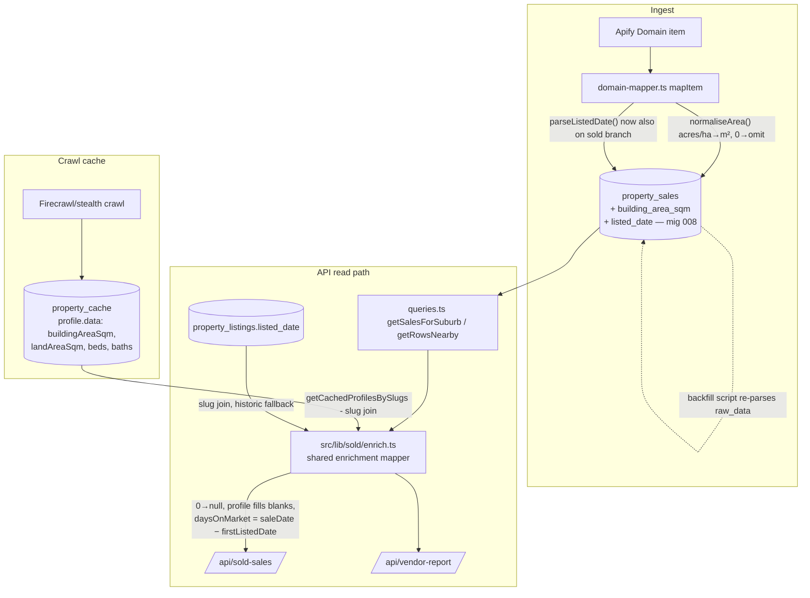

# feat: Enrich /api/sold-sales with building area, normalised land area, beds/baths/cars backfill, and listing date

**Target root:** `propertyiq/` (all paths below are relative to it)

## Summary

The downstream GEA CMA generator estimates sale prices from $/m² rates of sold comparables, but `/api/sold-sales` returns no `buildingAreaSqm`, returns 0 for some land areas, populates beds/baths/cars on only ~25% of rows, and carries no listing-date signal. This plan adds those fields additively: a profile-fills-blanks merge from the crawl cache (`property_cache`) at the API layer, a new nullable `building_area_sqm` and `listed_date` on `property_sales`, ingest-time unit normalisation, a raw-data backfill, and a coverage-stats script that reports per-field and per-suburb population.

---

## Requirements

**Response fields (additive only — no renames, no envelope change)**

- R1. Each `/api/sold-sales` row includes `buildingAreaSqm` (float, m²), sourced from the sold record where present, otherwise from the cached property profile for the same `address_slug`; `null` when neither has it.
- R2. `landAreaSqm` values of 0 are treated as missing: the API returns `null` or a profile-backfilled value, never 0-as-data. Source values in acres/hectares are normalised to m² at ingest; raw imperial values are never returned.
- R3. `bedrooms`, `bathrooms`, `carSpaces` are backfilled from the cached property profile where the sold record is blank (profile fills blanks only — it never overrides a non-null sold-record value).
- R4. Each row includes `firstListedDate` (ISO date, nullable) and `daysOnMarket` (int, nullable, derived as `saleDate − firstListedDate` only when both exist and the difference is ≥ 0).
- R5. No value is ever fabricated, estimated, or defaulted — a field with no source data is `null`.

**Parity and pipeline**

- R6. The same field additions apply to `/api/vendor-report` sold rows via a shared mapper, so the two endpoints cannot drift. (`/api/sold-sales` itself is the bulk feed the CMA daily sync consumes — there is no separate sync endpoint.)
- R7. The sold ingest branch captures Domain's listed date into a new nullable `property_sales.listed_date` going forward; historic rows are covered by an `address_slug` join to `property_listings.listed_date` at the API layer.
- R8. A backfill pass over `property_sales.raw_data` recovers land area (with unit normalisation) and listed date where the original Apify item had them but the column is null/0.

**Reporting**

- R9. A coverage script reports, across the current sold dataset: % populated for `buildingAreaSqm`, `landAreaSqm` (non-zero), `bedrooms`/`bathrooms`/`carSpaces`, and `firstListedDate`/`daysOnMarket`, plus the suburbs with the thinnest `buildingAreaSqm` coverage (where CMA estimates remain land-rate-only). These numbers are the completion deliverable.

---

## Key Technical Decisions

- **Merge at the API layer via `address_slug`, profile fills blanks only.** `property_sales.address_slug` is populated at ingest and `property_cache` is keyed by the same slug; `getCachedProfilesBySlugs()` (`src/lib/db/queries.ts:552`) already bulk-fetches profiles. This matches the user's constraint and the existing precedent in `src/app/api/street-details/route.ts:128-131` (COALESCE `data.landAreaSqm ?? data.landArea ?? …`). Sold-record values always win; profile only fills nulls.
- **One shared sold-row enrichment mapper.** `sold-sales` and `vendor-report` currently duplicate the DB→JSON mapping inline. Extract it to `src/lib/sold/enrich.ts` so the enrichment logic exists once (R6) and is unit-testable without route plumbing.
- **`building_area_sqm` and `listed_date` become real columns on `property_sales` (migration 008), but the API does not wait for them.** Ingest writes them going forward; the API-layer profile merge and listings join cover historic rows immediately. Follows the migration 005/006 pattern: `ALTER TABLE … ADD COLUMN IF NOT EXISTS`, nullable, no default, omit-when-unknown for batched upserts.
- **Zero-as-missing is enforced at both read and write.** The read path treats `land_area_sqm <= 0` as null before merging (so a 0 can be profile-backfilled); the ingest mapper stops writing 0/negative areas. Mirrors the existing `sale_price <= 0` sanitisation in `src/app/api/sold-sales/route.ts:100`.
- **Unit normalisation is new, deterministic code at ingest.** No acre/hectare handling exists in the repo today. Domain's `land_size` carries a `land_unit`-style hint in the raw item where non-metric; the normaliser converts acres (×4046.8564224) and hectares (×10000) to m² and otherwise passes m² through. Values with an unrecognised explicit unit are dropped (R5: never guess).
- **`daysOnMarket` is derived at the API layer, not stored.** `sale_history.days_on_market` exists but is keyed to a different table and unpopulated for these rows; deriving from `firstListedDate` keeps a single source of truth and honours the user's "or firstListedDate" framing. Negative derivations (listed after sale — cross-listing noise) return null for `daysOnMarket` while still returning `firstListedDate`.
- **Profile values pass the existing grounding rules.** Per `docs/plans/2026-06-09-001-fix-no-hallucinated-property-data-plan.md`, profile fields are already grounded at extraction time; the merge reads `profile.data` values only (with the `landAreaSqm ?? landArea` / `buildingAreaSqm ?? buildingArea` key fallback) and never synthesises.

---

## High-Level Technical Design

The diagram is directional guidance, not implementation specification — the prose and per-unit fields are authoritative.

---

## Implementation Units

### U1. Area normalisation and zero-as-missing helpers

- **Goal:** A pure, tested module that converts source land/building area values to m² (acres, hectares, m² pass-through) and maps 0/negative/unparseable values to null.
- **Requirements:** R2, R5
- **Dependencies:** none
- **Files:** `src/lib/utils/area.ts` (new), `src/lib/utils/__tests__/area.test.ts` (new)
- **Approach:** Single entry point like `normaliseAreaSqm(value, unitHint?) → number | null`. Unit detection order: explicit unit hint from the raw item; embedded unit token in a string value (e.g. `"2.5 ac"`, `"1.2ha"`, `"650m²"`); otherwise assume m² (current Domain behaviour). Unrecognised explicit units return null rather than guessing. Round to 1 decimal place to match `NUMERIC(10,2)` comfortably.
- **Patterns to follow:** `src/lib/ingest/__tests__/domain-mapper.test.ts` for pure-function test style.
- **Test scenarios:**
  - Plain number 650 → 650 (assumed m²).
  - `"2 ac"` / unit hint `acres` → 8093.7 (±0.1).
  - `"1.5 ha"` → 15000.
  - 0, negative, `NaN`, empty string, `null` → null.
  - Unrecognised explicit unit (`"3 perch"`) → null, never converted.
  - String with thousands separator `"1,012 m²"` parses to 1012.
- **Verification:** All scenarios pass under `npx vitest`; module has no imports from DB or route layers.

### U2. Migration 008 + sold-ingest capture of building area and listed date

- **Goal:** `property_sales` gains nullable `building_area_sqm` and `listed_date`; the ingest mapper writes them (and normalised land area) for new sold rows.
- **Requirements:** R2, R7, R5
- **Dependencies:** U1
- **Files:** `src/lib/db/migrations/008_property_sales_building_area_listed_date.sql` (new), `src/lib/db/schema.sql`, `src/lib/ingest/domain-mapper.ts`, `src/lib/db/queries.ts` (`PropertySaleRecord` interface at queries.ts:810), `src/lib/ingest/__tests__/domain-mapper.test.ts`
- **Approach:** `ALTER TABLE property_sales ADD COLUMN IF NOT EXISTS building_area_sqm NUMERIC(10,2); ADD COLUMN IF NOT EXISTS listed_date TIMESTAMPTZ;` — nullable, no default, commented rationale, exactly the 005/006 shape (006's comment explains the supabase-js batched-upsert defaultToNull constraint; preserve omit-when-unknown semantics in the mapper). In `mapItem()`: route `land_size` through `normaliseAreaSqm`; map building area from the raw item where Domain provides it; apply the existing `parseListedDate()` to the sold branch (it currently runs only for on-market/rent categories). Fields absent from the source are omitted, not nulled, in upsert payloads.
- **Test scenarios:**
  - Sold item with `dateListed` → mapped record carries `listed_date`; sold item without → field omitted.
  - `land_size: 0` → `land_area_sqm` omitted (not 0).
  - Item with building area in source → `building_area_sqm` set; absent → omitted.
  - Existing mapped fields (sale_price, sale_date, beds/baths) unchanged for a representative fixture (regression).
- **Verification:** Migration applies idempotently against Supabase (run twice, no error); a fresh sold ingest writes the new columns; existing daily-sync upserts continue to succeed.

### U3. Shared sold-row enrichment mapper

- **Goal:** One module that takes a page of `property_sales` rows and returns enriched JSON rows: zero-as-missing land area, profile-fills-blanks merge (building area, land area, beds/baths/cars), `firstListedDate` (own `listed_date` → `property_listings.listed_date` slug-join fallback), and derived `daysOnMarket`.
- **Requirements:** R1, R2, R3, R4, R5
- **Dependencies:** U1, U2
- **Files:** `src/lib/sold/enrich.ts` (new), `src/lib/sold/__tests__/enrich.test.ts` (new), `src/lib/db/queries.ts` (add a bulk `listed_date`-by-slug lookup against `property_listings`)
- **Approach:** Split into a pure merge function (rows + profile map + listings-date map in, enriched rows out) and a thin data-fetching wrapper that batches the two lookups (`getCachedProfilesBySlugs` for profiles; new bulk slug query for listings dates) in parallel for the page of results. Profile key fallback per street-details precedent: `data.buildingAreaSqm ?? data.buildingArea`, `data.landAreaSqm ?? data.landArea`. Rows with null `address_slug` skip enrichment silently (still returned, fields null). Precedence per field: sold record (post zero-as-missing) → profile → null; `firstListedDate`: own `listed_date` → listings join → null. The listings lookup returns slug → **all** candidate `listed_date` values (an address can have multiple campaigns); campaign selection happens in the pure merge function, which picks the latest `listed_date` that is ≤ `sale_date` and returns null from the join when every candidate post-dates the sale (implements the cross-campaign mitigation in Risks). The join reads the raw `listed_date` column only — no `created_at` COALESCE, since first-seen dates would approximate rather than record a listing date (R5).
- **Patterns to follow:** `src/app/api/street-details/route.ts:128-131` (profile COALESCE), plan `docs/plans/2026-06-10-004-fix-empty-property-profile-plan.md` (single pure mapping function owns column→field translation).
- **Test scenarios (pure merge function):**
  - Sold row with `land_area_sqm: 0` and profile `landAreaSqm: 612` → `landAreaSqm: 612`.
  - Sold row with `land_area_sqm: 700` and conflicting profile value → 700 (sold wins).
  - `buildingAreaSqm` null on row, present in profile under legacy key `buildingArea` → merged.
  - Beds present on row (3), profile says 4 → 3 (profile never overrides).
  - Beds null on row, profile has 4 → 4; profile also missing → null.
  - Row with null `address_slug` → returned with new fields null, no throw.
  - `firstListedDate` from own `listed_date` when present; from listings map when not; null when neither.
  - Multiple campaigns for the same slug (one listed before the sale, one after) → the preceding campaign's date is selected; all candidates post-dating the sale → join contributes null.
  - `daysOnMarket`: listed 2026-04-01, sold 2026-05-01 → 30; listed after sale → `daysOnMarket` null but `firstListedDate` still returned; either date missing → both-derived field null.
  - No fabrication: a row with no sources for any field returns all new fields as null.
  - Existing fields pass through byte-identical (envelope regression).
- **Verification:** Tests pass; wrapper issues exactly two batched lookups per page (no per-row queries).

### U4. Wire enrichment into /api/sold-sales and /api/vendor-report

- **Goal:** Both endpoints return the new fields additively via the U3 mapper; existing fields and envelope unchanged.
- **Requirements:** R1–R6
- **Dependencies:** U3
- **Files:** `src/app/api/sold-sales/route.ts`, `src/app/api/vendor-report/route.ts`
- **Approach:** Replace each route's inline sold-row `.map()` (sold-sales route.ts:105-124; vendor-report's `NearbySold` mapping ~146-160) with the shared mapper. Keep all existing JSON field names and any route-specific extras (vendor-report distance fields) intact. Filters, auth (middleware-based), and pagination untouched.
- **Test scenarios:**
  - Response for a known suburb contains every pre-existing field name with unchanged values plus the four new keys (`buildingAreaSqm`, `firstListedDate`, `daysOnMarket` new; `landAreaSqm` now null-instead-of-0). Exercise as a mapper-level contract test if route tests stay impractical (only one route test exists today).
  - vendor-report sold rows carry the same new keys as sold-sales for the same property.
- **Verification:** Manual smoke against prod-shape data: a CMA-key request to `/api/sold-sales?suburb=…` shows new fields; the `services/everypropertyai` MCP/CLI consumer and recruitAI calls continue to work unchanged (additive check). Note one deliberate semantic change to an existing field: `landAreaSqm` previously-0 rows now return null (or a profile value) — the consumer smoke check must include at least one previously-0 row, since downstream arithmetic/truthiness on that field will see nulls where it saw zeros.

### U5. Backfill script over property_sales.raw_data

- **Goal:** Historic sold rows get `land_area_sqm` (normalised, where currently null/0), `building_area_sqm`, and `listed_date` recovered from the stored raw Apify item where the source had them.
- **Requirements:** R2, R7, R8, R5
- **Dependencies:** U1, U2
- **Files:** `scripts/backfill-sold-areas-dates.mjs` (new)
- **Approach:** Standalone Node script following the `scripts/ingest-legacy-backfill.mjs` pattern (service-role Supabase client from env). Page through `property_sales`, re-extract from `raw_data` using the same parsing/normalisation as the U1/U2 ingest path (import or duplicate the pure logic), update only rows where the target column is null/0 and the parsed value is non-null. Dry-run flag printing counts before writing; idempotent on re-run.
- **Test scenarios:** Test expectation: none — script body; its parsing/normalisation logic is the U1/U2 tested code. Verify behaviour via dry-run counts instead.
- **Verification:** Dry run reports plausible candidate counts; live run's updated-row counts match; spot-check 5 updated rows against their `raw_data`.

### U6. Coverage report script

- **Goal:** The completion numbers: per-field population % across the sold dataset and the thinnest-coverage suburbs for `buildingAreaSqm`.
- **Requirements:** R9
- **Dependencies:** U3 (must measure post-merge coverage, not just column coverage), U5
- **Files:** `scripts/report-sold-coverage.mjs` (new)
- **Approach:** Pull sold rows plus the same two enrichment lookups, run rows through the U3 pure merge function, and report: total rows; % non-null for each of `buildingAreaSqm`, `landAreaSqm`, `bedrooms`, `bathrooms`, `carSpaces`, `firstListedDate`, `daysOnMarket`; column-only vs post-merge % side by side (shows what the profile merge contributes); per-suburb `buildingAreaSqm` coverage sorted ascending (thinnest first); and the `address_slug`-null rate (rows the merge can never reach).
- **Test scenarios:** Test expectation: none — reporting script composed of the U3-tested merge function and counting.
- **Verification:** Script output includes every field listed in R9 and a thinnest-suburbs ranking; numbers are internally consistent (post-merge ≥ column-only for every field).

---

## Scope Boundaries

**In scope:** the two sold endpoints, sold ingest branch, migration 008, backfill and coverage scripts.

**Deferred to follow-up work**

- Enriching `/api/comparable-sales` with the same fields (third sold-row consumer; per scope decision it keeps its current shape for now and can adopt the U3 mapper later).
- Improving `address_slug` coverage where `parseAddress` failed at ingest (raises the merge ceiling; measured by U6 but not fixed here).
- Triggering crawls to fill `property_cache` for sold addresses with no profile (would raise `buildingAreaSqm` coverage but is a crawl-pipeline workstream, not an API change).
- Exposing the new fields in `services/everypropertyai` typed client/CLI output and updating `DATA_HANDOVER.md`/`INTEGRATIONS.md` consumer docs (additive, non-blocking for the CMA which consumes raw JSON).

**Non-goals:** estimating or imputing any value (explicitly forbidden); renaming or removing existing fields; changing the response envelope, filters, or auth.

---

## Risks & Dependencies

- **`buildingAreaSqm` coverage may stay low.** It depends almost entirely on `property_cache` depth for sold addresses (Domain sold items rarely carry building area). The U6 report makes this honest; raising it is the deferred crawl workstream. Set expectations: the deliverable is accurate coverage numbers, not a coverage target.
- **Cross-property listing-date mismatch.** The `property_listings` slug join can match a *different campaign* than the one that sold (e.g. an older or newer listing of the same address). Mitigation: when joining, prefer the listing whose `listed_date` precedes `sale_date` and is closest to it; if every candidate post-dates the sale, return null for `daysOnMarket` (R4's ≥ 0 guard).
- **Unit-hint assumptions.** The normaliser's unit detection must be validated against real `raw_data` samples early in U1/U5 (acreage properties in Cardinia are the likely imperial cases); if Domain never emits unit hints, the acre/ha paths become dead-but-safe code and 0-as-missing is the main win.
- **Per-request latency on sold-sales** gains two batched lookups per page. Both are single `.in()` queries on primary-key/indexed columns; `property_listings.address_slug` is already indexed (`idx_property_listings_slug`, `src/lib/db/schema.sql`), so no index work is needed in migration 008.
- **Prod migration dependency:** U2's migration must be applied to the live Supabase before deploy of ingest changes (same operational flow as migrations 005/006).
