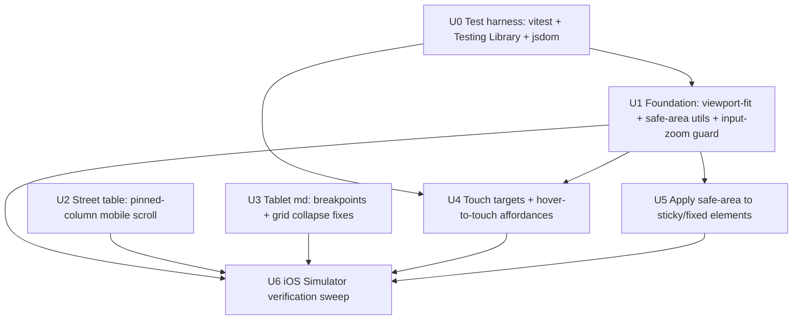

> **Status note (2026-06-23):** U0–U5 implemented and merged in commit `cbc0aa7`
> ("fix: optimise PropertyIQ for iPad and iPhone", PR #9); all 200 unit tests green.
> The small U3 my-properties `md:` grid gap was closed on 2026-06-23. U6 was run as a
> partial automated iOS Simulator sweep — see **U6 Verification Results** at the foot of
> this document for what passed and the manual-only checks that remain.

# fix: Optimise PropertyIQ for iPad and iPhone

## Summary

PropertyIQ (Next.js 15 + Tailwind v4) is **partially** responsive — Tailwind responsive
utilities appear across ~21 files and the shared `Button.tsx` is solid — but a file-anchored
audit found concrete gaps that degrade the experience on iPhone and iPad: a data table that
forces 2× horizontal scroll on mobile, no `md:` (iPad-portrait) breakpoint anywhere, fixed
multi-column grids that don't collapse on phones, hover-only controls invisible to touch,
sub-16px inputs that trigger iOS auto-zoom, and zero safe-area handling for notch/Dynamic
Island devices.

This plan audits the real route set (home, property detail, my-properties, street, sign-in)
and delivers prioritised fix units that make the existing UI render and behave correctly on
Apple mobile and tablet — portrait and landscape. It is **not** a redesign or a feature change.

---

## Problem Frame

The site was built desktop-first. Only `sm:` (640px) and `lg:` (1024px) breakpoints are used,
so iPad portrait (768px) is treated like a large phone, and several layouts only work on wide
viewports. Touch and Apple-hardware concerns (44px targets, hover affordances, safe areas,
input zoom) were not addressed. The result is usable-but-rough on the exact devices agents use
in the field (iPhone, iPad).

**Devices / breakpoints targeted:**

| Device class            | Width range (CSS px) | Tailwind breakpoint | Notes |
|-------------------------|----------------------|---------------------|-------|
| iPhone SE / mini        | 375                  | base (no prefix)    | tightest target; no horizontal scroll allowed |
| iPhone Pro / Max        | 390–430              | base                | safe-area: notch/Dynamic Island + home indicator |
| iPad portrait (mid)     | 768–1023             | `md:`               | currently unhandled — jumps from phone to desktop |
| iPad landscape / Pro    | 1024+                | `lg:`               | mostly works today |

> **Note:** `md:` tuning only reaches iPads reporting 768–1023px portrait widths (iPad mini/10.9"/Air/11" Pro). The **12.9"/13" iPad Pro reports ~1024px in portrait**, so it lands on the `lg:` (desktop) layout and never exercises the new `md:` tuning — intentional, but it must be on the U6 device matrix so the large-iPad-portrait case is actually checked.

---

## Requirements

- **R1** — No *unintended* horizontal scroll at 375px: page-level layouts and grids reflow rather than overflow. The one deliberate exception is the street results view — genuinely tabular cross-property comparison data — which keeps a horizontally-scrollable table with a pinned address column (see U2), since stacking would destroy its compare/sort purpose.
- **R2** — `md:` breakpoint introduced so iPad portrait (768px) gets a tuned layout, portrait and landscape.
- **R3** — All interactive controls meet the DESIGN.md standard of ≥44–48px touch targets.
- **R4** — Every hover-revealed action has a tap/focus-visible equivalent (no touch-invisible controls).
- **R5** — Text inputs render at ≥16px effective size so iOS does not auto-zoom on focus.
- **R6** — Sticky headers, the lightbox modal, and other fixed elements respect iPhone safe-area insets.
- **R7** — Fixes verified on real iOS Simulator devices (iPhone + iPad, both orientations), not just devtools emulation.

**Success criteria:** A reviewer running the app in the iOS Simulator on an iPhone and an iPad
(portrait + landscape) sees every route render without horizontal scroll, with legible inputs,
tappable controls, and no content hidden under the notch.

---

## Key Technical Decisions

- **Fix in place with Tailwind utilities; no redesign.** The codebase already uses Tailwind
  responsive prefixes and CSS custom properties in `src/app/globals.css` (`@theme`). Extend that
  system (add `md:` variants, safe-area utilities) rather than introducing a new layout framework.
- **Safe areas via a small CSS utility layer, not per-component magic numbers.** Add
  `viewport-fit=cover` through a Next 15 `viewport` export, then expose reusable safe-area
  padding utilities in `globals.css` (driven by `env(safe-area-inset-*)`). Components opt in with
  a class instead of hardcoding `env()` everywhere — keeps the inset logic in one place.
- **iOS input zoom solved at the source (16px), not by disabling zoom.** Bump input/select/textarea
  font-size to ≥16px (`text-base`) rather than setting `maximum-scale=1` — disabling user zoom is an
  accessibility regression. A global `-webkit-text-size-adjust: 100%` in `globals.css` backs this up.
- **Street table → pinned-column horizontal scroll on mobile, NOT a card reflow.** The street view
  is a 10-column *sortable cross-property comparison* (`COLUMNS`, `sortKey`/`sortDir`, click-to-sort).
  Its whole job is scanning one attribute down many properties and re-sorting — a stacked card list
  destroys that. So on mobile keep a horizontally-scrollable table with the **address column pinned**
  (`sticky left-0`) and optionally drop the lowest-value columns at the narrowest widths
  (column-priority hiding), rather than reflowing to cards. This is the recognised mobile pattern for
  genuinely tabular comparison data and is the deliberate exception to R1.
- **Verification is iOS Simulator-based; unit tests are behaviour-only.** Use the installed
  `ios-simulator-skill` to launch the dev server in Simulator and check each route on iPhone and iPad,
  both orientations — this is the real layout gate (manual, local/macOS-only). Automated tests are
  kept to *behavioural* assertions a DOM-only runner can actually prove (viewport `<head>` config;
  edit control reachable without hover). **Do not assert Tailwind class strings** (e.g. "has
  `sm:grid-cols-3`") — jsdom has no layout engine, so such a test only restates the source line, is
  tautological, and breaks on harmless refactors. Responsive layout itself is verified in U6.
- **A test harness must be stood up first (U0).** The repo currently has only bare `vitest` — no
  Testing Library, no jsdom/happy-dom, no `vitest.config`, and zero existing `*.test.tsx`. The two
  behavioural component tests this plan keeps require that infrastructure, so U0 bootstraps it before
  any unit that ships a component test.

---

## High-Level Technical Design

Dependency / layering of the work — foundation utilities first, then the surface fixes that
consume them, then verification:

---

## Implementation Units

### U0. Stand up the component test harness

**Goal:** Make behavioural component tests runnable — the repo has only bare `vitest` today, so the
two behavioural tests this plan keeps (U1 viewport, U4 edit affordance) cannot execute without it.

**Requirements:** enables R5/R4 verification (foundation)

**Dependencies:** none

**Files:**
- `package.json` (add `@testing-library/react`, `@testing-library/jest-dom`, `jsdom` dev deps)
- `vitest.config.ts` (set `environment: 'jsdom'`, register setup file) — note this file does not exist yet
- `src/test/setup.ts` (new — import `@testing-library/jest-dom`)

**Approach:**
- Add Testing Library + a DOM environment (jsdom or happy-dom) and a vitest config that wires the
  jsdom environment and a global setup file. Confirm `npx vitest run` still passes with one trivial
  smoke test before downstream units rely on it.
- Keep scope minimal: this is infrastructure only, not a testing-everything mandate. Only the two
  behavioural tests in U1/U4 depend on it.

**Patterns to follow:** none in-repo (first test infra); follow current Vitest 2 + Next 15 conventions.

**Test scenarios:**
- Happy path: a trivial `render(
ok
)` test passes under the new jsdom environment, proving
  the harness is wired (Testing Library import resolves, DOM globals exist).

**Verification:** `npx vitest run` executes a component-rendering test green; the existing non-DOM
tests still pass.

---

### U1. Foundation: viewport, safe-area utilities, and input-zoom guard

**Goal:** Establish the device-level primitives every other unit relies on — correct viewport,
reusable safe-area padding, and a global guard against iOS input auto-zoom.

**Requirements:** R5, R6 (foundation for R1–R4 verification context)

**Dependencies:** U0 (for the viewport component test)

**Files:**
- `src/app/layout.tsx` (add Next 15 `viewport` export)
- `src/app/globals.css` (safe-area utilities + `-webkit-text-size-adjust`)
- `src/app/__tests__/layout-viewport.test.tsx` (new — assert viewport config)

**Approach:**
- Add a Next 15 `export const viewport: Viewport` to `layout.tsx` with `width: 'device-width'`,
  `initialScale: 1`, and `viewportFit: 'cover'` (enables `env(safe-area-inset-*)`). Keep user
  scaling enabled (do not set `maximumScale`/`userScalable: false`).
- In `globals.css`, add safe-area utility classes (e.g. top/bottom/left/right inset padding helpers)
  built on `env(safe-area-inset-*)` so components opt in by class. Add `-webkit-text-size-adjust: 100%`
  to the base layer.
- Establish the convention that form controls use `text-base` (16px) minimum (enforced per-control in U4).

**Patterns to follow:** existing `@theme` token block and base styles in `src/app/globals.css`;
Next 15 metadata/viewport split (viewport must be its own export, not inside `metadata`).

**Test scenarios:**
- Happy path: rendered document `<head>` includes a viewport meta resolving to
  `width=device-width, initial-scale=1, viewport-fit=cover`.
- Edge: viewport export does not disable user scaling (no `user-scalable=no` / `maximum-scale=1`).
- Covers R5: `globals.css` includes `-webkit-text-size-adjust: 100%` in the base layer.

**Verification:** `<head>` shows `viewport-fit=cover`; a probe element using a safe-area utility
receives non-zero padding in the iOS Simulator on a notched device.

---

### U2. Street results table: pinned-column mobile scroll

**Goal:** Make the 10-column street comparison table usable on mobile **without losing its
compare/sort purpose** — keep it a scrollable table with the address column pinned, instead of
reflowing to cards (which would destroy cross-row scanning and sort).

**Requirements:** R1 (deliberate-exception clause), R2

**Dependencies:** none

**Files:**
- `src/app/street/page.tsx` (table around lines 413–500; sort state `sortKey`/`sortDir`; `COLUMNS`)
- (no `*.test.tsx` — behaviour here is layout/scroll, verified in U6, not by class-string assertions)

**Approach:**
- Keep the table + `overflow-x-auto` wrapper, but **pin the address column** with `sticky left-0`
  (plus a background and a subtle right divider so it reads as anchored) so the user always sees
  which property each row is while scrolling the comparison columns horizontally. Preserve the
  existing sort affordance and the `print:` behaviour.
- Optionally apply **column-priority hiding** at the narrowest widths (hide the lowest-value columns
  e.g. "last listed"/"listed $" below `sm:`, show all from `md:`+) to reduce scroll distance — only
  if it doesn't compromise the comparison job; otherwise keep all columns scrollable.
- Tune the `min-w` so the table is comfortable, not arbitrarily 840px, and ensure the pinned column
  doesn't overlap content on iOS Safari (test momentum scroll).
- **States:** confirm the mobile path renders the existing zero-results empty state, the loading/
  skeleton state, and the fetch-error state correctly (pinned column must not break them). If the
  current table only handles these at desktop width, extend them to the mobile layout.

**Patterns to follow:** existing `overflow-x-auto` wrapper already on the table; existing
loading/empty/error rendering in `street/page.tsx` (reuse, don't reinvent).

**Test scenarios:**
- Test expectation: none as a unit test (layout/scroll + sticky positioning are not provable in
  jsdom). Verified in U6 across devices. Empty/loading/error states are confirmed visually in U6's
  street-route checklist.

**Verification:** in the iOS Simulator at 375px, the street table scrolls horizontally with the
address column staying pinned and legible; sort still works; zero-results, loading, and error states
all render correctly on mobile; iPad portrait/landscape show the full table comfortably.

---

### U3. Tablet breakpoints and grid-collapse fixes

**Goal:** Introduce `md:` (iPad portrait) tuning and fix multi-column grids that don't collapse on phones.

**Requirements:** R1, R2

**Dependencies:** none

**Files:**
- `src/components/property/PropertyProfile.tsx` (market-data, demographics, statistics grids; risk-indicator grid ~line 1318)
- `src/app/my-properties/page.tsx` (cards grid ~line 287)
- `src/app/page.tsx` (trust-signals grid, if tuning helps)

**Approach:**
- Change the risk-indicator grid from fixed `grid-cols-3` to `grid-cols-1 sm:grid-cols-3` (or
  `grid-cols-3` only from `sm:`) so 375px phones don't get ~95px-wide cards.
- Add `md:` variants where layouts jump `sm:` → `lg:` (e.g. `sm:grid-cols-2 md:grid-cols-3
  lg:grid-cols-3`) so iPad portrait gets a tuned column count.
- Audit each grid/flex row touched by the audit for a base (mobile) single-column or wrapping state.

**Patterns to follow:** existing responsive grid declarations already present in `PropertyProfile.tsx`
and the skeleton/loading grids in `src/app/property/page.tsx`.

**Test scenarios:**
- Test expectation: none as unit tests — responsive column counts are layout behaviour jsdom cannot
  observe, and asserting the class strings would be tautological. Verified in U6 across devices.

**Verification:** in the iOS Simulator, PropertyProfile and my-properties show comfortable column
counts at iPhone (1 col where needed), iPad portrait (`md:`), and iPad landscape (`lg:`).

---

### U4. Touch targets and hover-to-touch affordances

**Goal:** Bring all interactive controls to ≥44–48px and give every hover-revealed action a
touch/focus-visible equivalent; fix sub-16px inputs.

**Requirements:** R3, R4, R5

**Dependencies:** U0 (for the EditableStat behavioural test)

**Files:**
- `src/components/property/PropertyProfile.tsx` (EditableStat component def ~line 138, pencil ~line 189; edit inputs; reused at ~lines 701/715/729/743)
- `src/app/my-properties/page.tsx` ("Stop tracking" button ~line 135)
- `src/components/auth/AuthButton.tsx` (chevron ~line 83; dropdown width `w-44` ~line 86)
- `src/components/search/AddressSearch.tsx` (md-size input font, helper text)
- `src/app/sign-in/page.tsx` (email input `text-sm`)
- `src/components/property/__tests__/EditableStat.test.tsx` (new — behavioural: control reachable without hover)

**Approach:**
- **Resolve the edit affordance to always-visible at reduced opacity** (not hover-only, and not
  focus-visible-only — most touch users never tab, so focus-only would stay invisible). Give it a
  ≥44px hit area by wrapping the small icon in a padded button. Apply the same always-visible-at-rest
  treatment consistently to the EditableStat pencil and the AuthButton chevron so affordances don't
  differ across the UI. **Note:** `EditableStat` is reused across four stat rows (~701/715/729/743) —
  confirm the always-visible pencil doesn't break the surrounding stat-grid spacing at each call site.
- Promote tiny controls: "Stop tracking" from `text-xs` to a properly sized button with a visible
  focus ring; constrain the AuthButton dropdown (`max-w-[90vw]`, **right-aligned to the button**) so
  it neither overflows 375px nor clips the screen edge, and confirm it dismisses on tap-outside
  (document-level listener, not a hover-out dependency).
- Set all text inputs/selects to `text-base` (16px): AddressSearch md variant, sign-in email,
  EditableStat input.
- **Landscape keyboard:** on iPhone landscape (~390×844 → ~390px tall, keyboard ~260px) focused
  inputs can be fully occluded. For the highest-risk inputs (sign-in email, AddressSearch) ensure the
  field scrolls into view on focus and the layout isn't fixed-height in landscape. Carry a U6
  checklist item for "iPhone landscape + keyboard open."

**Patterns to follow:** `src/components/ui/Button.tsx` (sizes already ≥44px, includes
`focus:ring-2`); reuse it for promoted buttons where practical.

**Test scenarios:**
- Happy path (behavioural, runnable in jsdom): the EditableStat edit control is present in the DOM at
  rest (not gated behind `:hover`), so it is reachable/tappable without a pointer hover. Assert via
  rendered output + accessible role, not via Tailwind class strings.
- Covers R5 (behavioural, optional): inputs expose a computed font-size ≥16px where assertable;
  otherwise defer to U6.
- Touch-target sizes, dropdown overflow, and landscape occlusion are layout concerns → verified in U6.

**Verification:** in the iOS Simulator, the edit affordance is visible and tappable without a mouse;
focusing an input does not zoom the page; the dropdown stays on-screen and dismisses on tap-outside;
landscape inputs scroll clear of the keyboard.

---

### U5. Apply safe-area insets to sticky and fixed elements

**Goal:** Stop the notch/Dynamic Island and home indicator from covering content in sticky headers
and the lightbox modal.

**Requirements:** R6

**Dependencies:** U1 (safe-area utilities must exist)

**Files:**
- `src/app/page.tsx`, `src/app/my-properties/page.tsx`, `src/app/sign-in/page.tsx`, `src/app/street/page.tsx` (sticky `header` elements)
- `src/components/property/PropertyProfile.tsx` (lightbox modal ~line 1549; close/nav controls ~lines 1573, 1596, 1625)

**Approach:**
- **First, enumerate the real target set:** grep the five routes + components for `sticky` and
  `fixed` (top *and* bottom) so the safe-area pass is exhaustive rather than relying on the audit's
  memory — safe-area is opt-in-by-class, so any missed `fixed`/`sticky` element silently regresses
  under the notch/home indicator. Include any bottom-anchored controls found (none beyond the lightbox
  are known today; confirm).
- Apply the U1 safe-area utility classes to sticky headers (top inset) and to the lightbox close
  button / nav arrows (top + side insets) so controls clear the notch and screen edges; apply bottom
  insets to any bottom-fixed element found.
- Where a header is `sticky top-0`, ensure its inner padding accounts for `env(safe-area-inset-top)`
  rather than changing `top`.
- (Hardening, deferred) a future lint rule flagging `fixed`/`sticky` elements without a safe-area
  class would make this guarantee durable — noted under Deferred, not built here.

**Patterns to follow:** the safe-area utility convention established in U1; existing sticky header
markup (`sticky top-0 z-40 border-b ...`).

**Test scenarios:**
- Happy path: each sticky header and the lightbox control cluster carries a safe-area utility class.
- Edge: on a non-notched device (zero insets) the utilities add no visible offset (no double padding).
- Test expectation: primarily visual — assert presence of safe-area classes in component tests; final confirmation is the U6 Simulator sweep.

**Verification:** on a notched iPhone in the Simulator, header logo/actions and the lightbox "X"
are fully visible and not under the Dynamic Island; home indicator doesn't overlap bottom controls.

---

### U6. iOS Simulator verification sweep

**Goal:** Confirm the whole route set renders and behaves correctly on real Apple device profiles.

**Requirements:** R1–R7

**Dependencies:** U1, U2, U3, U4, U5

**Files:**
- `docs/plans/2026-06-15-001-fix-ipad-iphone-responsive-plan.md` (record results / checklist)
- no production code changes (verification only)

**Approach:**
- Using the installed `ios-simulator-skill` (a plugin; requires Xcode Simulator, so this is a
  **manual, local/macOS-only gate** — not runnable in CI), launch the dev server (`npm run dev`,
  port 3002) and load each route (home, property detail, my-properties, street, sign-in).
- Device matrix: an **iPhone** profile (e.g. SE for the 375px floor + a notched Pro for safe-area),
  a **mid iPad** profile (768–1023px, to exercise the new `md:` layout), **and a 12.9"/13" iPad Pro**
  (which sits at ~1024px in portrait → `lg:`, the case the `md:` tuning never covers) — each in
  **portrait and landscape**.
- For each route confirm: no unintended horizontal scroll at 375px (street is the deliberate
  pinned-column exception); legible/tappable controls; inputs don't zoom on focus; safe areas
  respected (notch + home indicator); iPad portrait uses the new `md:` layout; street empty/loading/
  error states render on mobile; and an explicit **"iPhone landscape + keyboard open"** check that
  focused inputs aren't occluded.
- Capture screenshots for the record; log any residual issues as follow-up.

**Patterns to follow:** `ios-simulator-skill` scripts for build/launch and screenshot capture.

**Test scenarios:**
- Test expectation: none (manual/visual verification unit) — outcome is a pass/fail checklist per
  route × device × orientation plus screenshots. Note: U6 is the layout gate but is local-only; the
  U0/U1/U4 behavioural unit tests are the CI-runnable regression guard.

**Verification:** every route × {iPhone SE, iPhone Pro, mid iPad, 12.9" iPad Pro} × {portrait,
landscape} passes the checklist above, including the landscape-keyboard check.

---

## Scope Boundaries

**In scope:** responsive layout fixes, touch-target sizing, hover→touch affordances, input-zoom
fixes, safe-area handling, and iOS Simulator verification across the five existing routes.

### Deferred to Follow-Up Work
- Card-view redesign of other dense data displays beyond the street table, if any surface later.
- A reusable shared `<Header>`/nav component (headers are currently duplicated per page) — worth
  extracting, but a refactor beyond this responsiveness pass.
- A lint rule flagging any `fixed`/`sticky` element that lacks a safe-area utility class, to make the
  opt-in safe-area guarantee durable against future additions (U5 is opt-in-by-discipline today).
- `xl:` (≥1280px) large-desktop tuning — not an iPad/iPhone concern.
- Android/Chrome-mobile-specific tuning and PWA/installability work.

### Out of scope
- Visual redesign, new features, brand/palette changes, or content changes.
- Native iOS/iPados app work.

---

## System-Wide Impact

- **End users (agents on iPhone/iPad):** the primary beneficiaries — field usability improves.
- **Developers:** introduces a safe-area utility convention and a "16px inputs / `md:` tablet
  breakpoint" expectation that new components should follow (note in `DESIGN.md` if desired).
- **No API, data, or auth surface is touched** — this is presentation-layer only; downstream API
  consumers (CRM, CMA, vendor reports, recruitAI) are unaffected.

---

## Risks & Dependencies

- **Risk: table→card reflow hides columns users rely on.** Mitigation: the card shows every field
  the table does, just stacked; the table returns at `md:`+.
- **Risk: safe-area utilities double-pad on non-notched devices.** Mitigation: `env()` insets are
  0 on those devices; verify in U6 on a non-notched profile.
- **Hygiene blocker: `src/app/property 2/` is almost certainly an iCloud sync-conflict copy.** The
  repo lives under `com~apple~CloudDocs` (iCloud Drive) and `property 2/` is iCloud's exact
  conflict-rename pattern; its `page.tsx` *differs* from `property/page.tsx`. A divergent duplicate of
  a route page can ship in builds and skews audits (line-anchor drift). **Resolve, don't exclude:**
  diff it against `property/`, delete the conflict copy, and seriously consider moving the repo out of
  iCloud Drive before further edits to stop silent file conflicts. Treat as a pre-work cleanup.
- **Dependency:** `ios-simulator-skill` (installed as a plugin) and Xcode Simulator on a macOS dev
  machine for U6; U6 cannot run in CI.

---

## U6 Verification Results (2026-06-23)

Partial automated sweep via `ios-simulator-skill` (URL navigation + screenshot capture).
The dev server (`npm run dev`, port 3002) was loaded in booted simulators. Interactive
control (taps, rotation, sign-in) was **not** available in this environment — `idb` is not
installed and host `osascript` lacks assistive access — so the dynamic/authed/landscape
checks remain a human-at-simulator gate, as the plan anticipated ("manual, local/macOS-only").

**Passed (real iOS Simulator, portrait):**

| Device | Route | Result |
|--------|-------|--------|
| iPhone 16e (390px, notched) | home | safe-area header clears the status bar; trust-signals grid reflows; no page-level horizontal scroll (R1, R6) |
| iPhone 16e | street | address column **pinned** (`sticky left-0`) while comparison columns scroll horizontally inside the table — the deliberate R1 exception; sort affordance present; no page overflow (R1, R2, U2) |
| iPhone 16e | sign-in | full-width email input at 16px (no zoom risk), `Send magic link` button ≥44px, safe-area header (R3, R5, R6) |
| iPad Pro 11" (834px, `md:`) | street | **full comparison table fits with no horizontal scroll**; `Print report` shows its full label — tablet layout tuned vs the phone's pinned-scroll (R2) |
| iPad Pro 11" | home | 3-column trust-signals grid, full header, no overflow (R1, R2) |

**Remaining manual checks (require a human at the simulator — not runnable headlessly here):**
- Landscape orientation across all routes (rotation needs assistive access / `idb`) — R7 landscape; the U4 "iPhone landscape + keyboard open" occlusion check.
- Input-focus zoom confirmed dynamically (tap to focus) — R5 is verified statically/visually (16px) but not by live focus.
- Authed routes — `my-properties` (incl. the new U3 `md:` grid) and property detail — gated behind the magic-link email flow.
- 12.9"/13" iPad Pro portrait (~1024px → `lg:` fallback case).

Screenshots captured this run (not committed): iPhone home/street/sign-in, iPad street/home.

---

## Sources & Research

- File-anchored responsiveness audit of the five routes + `src/components/{auth,property,search,ui}`
  (this session): identified the street-table overflow, missing `md:` breakpoint, fixed
  `grid-cols-3` risk cards, hover-only edit pencil, sub-16px inputs, and absent safe-area handling.
- `DESIGN.md` — "Touch targets ≥ 44–48px" (the standard U4 enforces).
- `src/app/globals.css` `@theme` block — token/utility conventions to extend in U1.
- `src/components/ui/Button.tsx` — existing ≥44px, focus-ringed button to reuse in U4.
