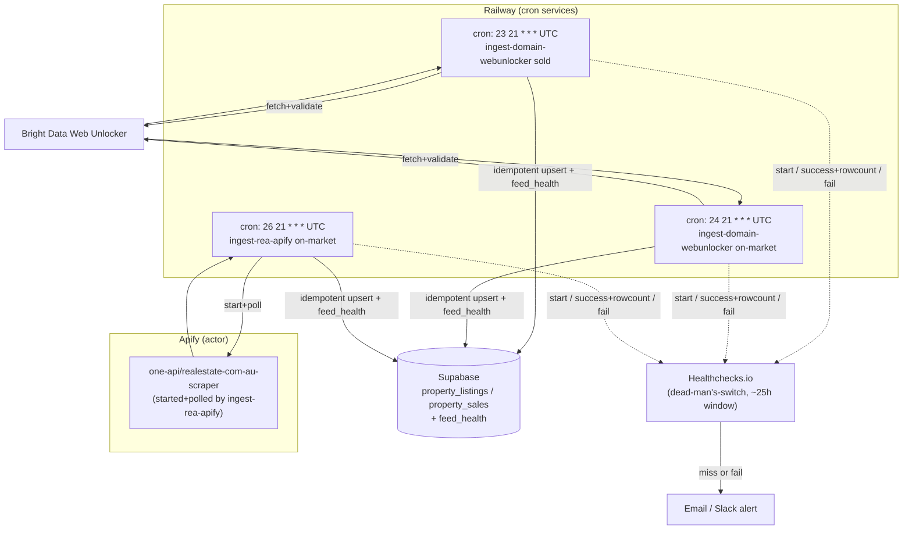
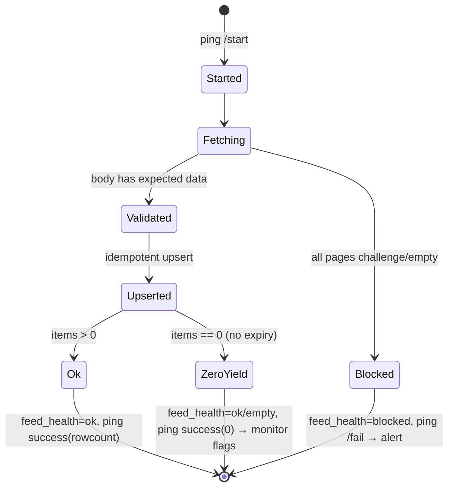

# fix: Re-host data-feed scheduling onto Railway + Apify with dead-man's-switch monitoring

## Summary

The two daily real-estate data feeds (Domain via Bright Data Web Unlocker, REA via the Apify `one-api/realestate-com-au-scraper` actor) run as GitHub Actions scheduled workflows on `cron: '0 21 * * *'`. They did not run this morning (2026-06-16): the run was **silently dropped**. This is GitHub's documented best-effort scheduling behaviour — top-of-the-hour crons are the worst slot, delayed 30–110 min and dropped under load. Because there is **no heartbeat or alerting**, a dropped run is invisible until someone notices stale data.

This plan **re-hosts** both feeds off GitHub Actions cron onto schedulers we already pay for — REA onto **Apify's native scheduler**, Domain onto a **Railway cron service** — and wraps both with a **Healthchecks.io dead-man's-switch** (start / success-with-row-count / failure pings) plus **`feed_health` instrumentation** so every run records *ran → succeeded → got-data*. It also closes a latent correctness gap: the scrapers must validate response bodies so an anti-bot challenge page returned as HTTP 200 is treated as failure, not silent success.

Settled decisions from prior plans are preserved unchanged: dedup keys, per-source isolation, the zero-yield "never expire live listings" guard, REA-sold deferral, and managed-unlocker-over-self-hosted-stealth. This plan does **not** change the scraping backends or add new sources.

---

## Problem Frame

**Observed:** As of 2026-06-16 08:37 AEST, no scheduled run fired for the `2026-06-15T21:00Z` slot for either feed. The REA feed (merged 2026-06-15, PR #10) has never run.

**Scheduled-run timing history (Domain, last 6 scheduled runs):**

| Slot fired | Conclusion | Delay vs 21:00Z |
|---|---|---|
| 06-14T22:07Z | success | +67 min |
| 06-13T22:02Z | success | +62 min |
| 06-12T22:23Z | cancelled | +83 min |
| 06-11T22:49Z | success | +109 min |
| 06-10T22:50Z | cancelled | +110 min |
| 06-09T22:23Z | cancelled | +83 min |

**Root causes:**

1. **Top-of-hour best-effort cron (primary).** `0 21 * * *` lands on minute `0`, the global thundering-herd. GitHub docs: scheduled events "can be delayed during periods of high loads … High load times include the start of every hour" and "if there is sufficient load, some queued jobs may be dropped." This morning's run was dropped.
2. **No failure detection (force-multiplier).** Nothing reports "the run did not happen." A dropped run, a 0-item run, and a blocked-source run are all equally invisible. The repo *has* a `feed_health` table (`migrations/007_feed_health.sql`) and a `feed-freshness` 503 check (`src/app/api/cron/feed-freshness/route.ts`), but the scheduled scripts never write `feed_health` and nothing schedules the freshness check.
3. **Anti-bot-page-as-200 risk (latent).** Web Unlocker can return a challenge page with HTTP 200; without body validation the script can treat empty/garbage as success — the same "404/429-as-success" class of bug previously hit (project memory: `crawl-empty-profiles`).

**Why re-host rather than just harden GitHub cron:** even off the top of the hour, GitHub cron stays best-effort. Apify's scheduler fires "in most cases within one second" and the REA scraper *already lives on Apify*; Railway cron co-locates the Domain job with Supabase and the existing `services/scraper` deployment, and the Domain script already exits cleanly on completion (the requirement for Railway cron). This removes the silent-drop failure mode at the source instead of monitoring around it.

---

## Requirements

- **R1.** Both feeds run on a daily schedule that is not subject to GitHub Actions best-effort top-of-hour drops. (Re-host: REA→Apify scheduler, Domain→Railway cron.)
- **R2.** A dropped or missed run raises a **loud** alert within a bounded window (≤ ~25h) rather than failing silently.
- **R3.** Each run records, durably, whether it *ran*, *succeeded*, and *got data* (row count), distinguishing missed / failed / zero-yield / blocked / ok.
- **R4.** Scrapers validate response bodies and treat anti-bot challenge pages / non-data responses as failures (retry, then mark blocked), never as silent success.
- **R5.** Preserve all settled behaviour: dedup keys (`property_sales` on `(raw_address,sale_date,sale_price,source)`, `property_listings` on `(raw_address,source)`), per-source isolation, zero-yield never expires live listings, REA-sold stays deferred.
- **R6.** The legacy GitHub Actions schedules are retired (cron removed) but remain manually runnable as a break-glass fallback (`workflow_dispatch` retained).
- **R7.** No change to the scraping backends, source list, or the Supabase target schema beyond `feed_health` instrumentation.

---

## Key Technical Decisions

**KTD1 — REA feed moves to Apify's native scheduler.**
The REA scraper is the Apify actor `one-api/realestate-com-au-scraper` started by `scripts/ingest-rea-apify.mjs`. Rather than have GitHub start the actor on a flaky cron, schedule the actor run natively in Apify (per-schedule timezone, off the top of the hour, e.g. `37 7 * * *` Melbourne). The ingest/upsert step still needs to run after the actor finishes — see KTD3 for where that lands. *Rationale:* fires within ~1s, already paid for, removes one GitHub dependency entirely. *(see research: Apify Schedules docs.)*

**KTD2 — Domain feed moves to a Railway cron service.**
Railway already hosts `services/scraper`. Add a Railway **cron** service that runs `node scripts/ingest-domain-webunlocker.mjs <category>` for both categories. Railway cron requires the start command to exit on completion — the Domain script already does. Schedule at an **odd minute** in UTC (e.g. `23 21 * * *`). *Rationale:* co-located with Supabase, no new vendor, exit-on-completion already satisfied. *Trade-off:* Railway cron is also "within a few minutes" and has no built-in alerting → must pair with the heartbeat (KTD4). *(see research: Railway cron docs.)*

**KTD3 — Split actor-run from ingest for REA, or keep a thin Railway-hosted REA runner.**
Apify's scheduler runs the *actor*, but the dataset→Supabase upsert in `scripts/ingest-rea-apify.mjs` is our code. Two viable shapes:
- **(a) Apify-schedules-actor + Railway-runs-ingest:** Apify schedule produces a fresh dataset; the Railway cron service (same one as Domain, staggered minutes) runs `ingest-rea-apify.mjs` in "consume latest dataset" mode shortly after. Cleanest separation, but introduces a timing coupling.
- **(b) Railway-runs-everything for REA too:** keep `ingest-rea-apify.mjs` as-is (it *starts* the actor and polls to completion), just trigger it from Railway cron instead of GitHub. No Apify-side schedule needed.
**Default: (b).** It is the smallest change (the script already orchestrates actor-start→poll→ingest end-to-end), keeps both feeds on one Railway scheduler, and avoids cross-system timing coupling. Option (a) / pure Apify-scheduling is deferred unless Railway cron proves insufficient. This makes KTD1 "REA leaves GitHub for Railway cron" in practice; native Apify scheduling stays an available lever. *Confirm at execution which mode the existing script supports without modification.*

**KTD4 — Healthchecks.io dead-man's-switch per feed, ~25h window, 3-point pings.**
Each feed gets a check. The runner pings `/start` at begin, `/{uuid}` on success **with the upserted row count in the body**, and `/{uuid}/fail` on failure. Window ~25h (not 24h) to absorb jitter. Silence → Healthchecks alerts (email/Slack). *Rationale:* this is the single highest-value fix — it makes a dropped run loud regardless of host. Healthchecks.io chosen over Cronitor/BetterStack: open-source, free tier 20 checks, cheapest at this scale. Row count in the success ping lets us alert on **zero-yield** runs, not just missed runs. *(see research: Healthchecks.io docs, BetterStack cron-monitoring comparison.)*

**KTD5 — Scheduled scripts write `feed_health` on every run.**
Instrument both `.mjs` scripts to upsert `feed_health` (`category`, `last_run_at`, `source_used`, `items`, `newest_row_at`, `status` ∈ ok|blocked|broken) using `src/app/api/ingest/domain/route.ts` as the template (the one existing writer). This makes the half-built monitoring layer real and gives the in-repo `feed-freshness` check accurate signal. *Rationale:* the table and consumers already exist; only the writer is missing.

**KTD6 — Body-validation gate in the fetch loop.**
In `scripts/ingest-domain-webunlocker.mjs`, after each Web Unlocker fetch, validate the body shape (presence of `__NEXT_DATA__` / expected listing JSON) before counting it a success; a challenge/empty page is a retryable failure, and all-pages-failing → `status=blocked` (never expire live listings). Mirror the validation intent in the REA path (empty/blocked dataset → blocked, not ok). *Rationale:* closes the anti-bot-page-as-200 silent-success hole (R4).

**KTD7 — Retire GitHub cron, keep `workflow_dispatch`.**
Remove the `schedule:` trigger from both workflow files but retain `workflow_dispatch` so the workflows remain a manual break-glass path. *Rationale:* avoids double-runs once Railway/Apify own the schedule, while preserving a known-good manual fallback.

---

## High-Level Technical Design

### Target scheduling + monitoring topology

### Per-run state machine (each feed run)

Diagrams are authoritative for topology and run-state; exact minutes/UUIDs are illustrative.

---

## Implementation Units

### U1. Add Healthchecks.io checks and a tiny ping helper

**Goal:** Create the two (or three) Healthchecks.io checks and a reusable ping helper the scripts call at start / success / fail.
**Requirements:** R2, R3.
**Dependencies:** none.
**Files:**
- `scripts/lib/healthcheck.mjs` (new) — `pingStart(uuid)`, `pingSuccess(uuid, body)`, `pingFail(uuid, body)`, all non-throwing (`|| true` semantics so a monitor outage never fails the scrape).
- `scripts/lib/healthcheck.test.mjs` (new) — unit tests for URL construction + failure-swallowing.
- `.env.example` / docs — add `HEALTHCHECK_DOMAIN_UUID`, `HEALTHCHECK_REA_UUID` (or a base URL + slugs).
**Approach:** Helper reads check UUIDs from env; success ping POSTs the run summary (items, duration) as body so it shows in the Healthchecks dashboard. Never throws — wrap fetch in try/catch and resolve.
**Patterns to follow:** existing fetch-with-builtins style in `scripts/ingest-*.mjs` (no external deps).
**Test scenarios:**
- Happy path: `pingSuccess` builds `https://hc-ping.com/<uuid>` and POSTs the body; resolves true.
- Start/fail: `pingStart` hits `/<uuid>/start`, `pingFail` hits `/<uuid>/fail`.
- Edge: missing/empty UUID env → helper no-ops and resolves (does not throw, does not block the run).
- Error path: underlying `fetch` rejects/timeouts → helper swallows and resolves (scrape must not fail because the monitor is down).
**Verification:** Running a script with a real test UUID shows start+success pings in the Healthchecks dashboard; with the UUID unset the script still completes.

### U2. Add `feed_health` write to the scheduled scripts

**Goal:** Both scheduled scripts upsert `feed_health` at end of run with status/items/source/newest-row.
**Requirements:** R3, R5.
**Dependencies:** none (can land parallel to U1).
**Files:**
- `scripts/lib/feed-health.mjs` (new) — `writeFeedHealth({ category, sourceUsed, items, newestRowAt, status })` PostgREST upsert to `feed_health` (on_conflict `category`, `Prefer: resolution=merge-duplicates`).
- `scripts/lib/feed-health.test.mjs` (new).
- `scripts/ingest-domain-webunlocker.mjs` (modify) — call `writeFeedHealth` per category at end.
- `scripts/ingest-rea-apify.mjs` (modify) — call `writeFeedHealth` for on-market.
**Approach:** Mirror the upsert shape already used by `src/app/api/ingest/domain/route.ts`. `status=ok` when items>0 and not blocked; `blocked` when the body-validation gate (U4) declared all sources dry; `broken` reserved for unexpected exceptions.
**Patterns to follow:** `src/app/api/ingest/domain/route.ts` (existing `feed_health` writer), the scripts' existing PostgREST upsert calls.
**Test scenarios:**
- Happy path: items>0 → upsert with `status=ok`, correct `items`, `newest_row_at` = max sale/listed date.
- Zero-yield: items==0, not blocked → `status=ok` (or `empty`) with items=0; does NOT mark blocked.
- Blocked: validation gate flagged all pages dry → `status=blocked`, items=0.
- Edge: Supabase upsert returns non-2xx → log + still ping fail in caller; does not crash the run mid-write.
**Verification:** After a run, `feed_health` row for `sold`/`on-market` shows fresh `last_run_at`, accurate `items`, correct `status`.

### U3. Wire start/success/fail pings into both scheduled scripts

**Goal:** Each script pings start at begin, success (with row count) at clean end, fail on any thrown error or blocked outcome.
**Requirements:** R2, R3.
**Dependencies:** U1 (helper), U2 (so success/fail reflects feed_health outcome).
**Files:**
- `scripts/ingest-domain-webunlocker.mjs` (modify).
- `scripts/ingest-rea-apify.mjs` (modify).
**Approach:** Wrap `main()` in try/catch/finally: `pingStart` first; on success `pingSuccess(uuid, summaryLine)`; on caught error or `status=blocked` `pingFail`. Emit one structured run-summary log line (started, items_scraped, items_upserted, failures, duration) regardless of outcome.
**Patterns to follow:** U1 helper; existing top-level `main().catch()` in the scripts.
**Test scenarios:**
- Happy path: successful run pings start then success with non-zero count in body.
- Error path: thrown error → pings fail, process exits non-zero.
- Blocked path: validation gate marks blocked → pings fail even though no exception thrown (so a soft-block still alerts).
- Integration: zero-yield run pings success with `0` (monitor side flags it) — distinct from blocked.
**Verification:** Forcing an error shows a `/fail` ping; a clean run shows `/start` + success with the count.

### U4. Add body-validation gate to the fetch paths

**Goal:** Treat anti-bot challenge pages / empty responses as retryable failures and, when all pages fail, mark the category blocked instead of upserting nothing as "ok".
**Requirements:** R4, R5.
**Dependencies:** none (but U2/U3 consume its blocked signal).
**Files:**
- `scripts/ingest-domain-webunlocker.mjs` (modify) — validate `__NEXT_DATA__`/listing JSON presence in `fetchPage` result before counting success; track per-category "all pages dry" → blocked.
- `scripts/ingest-rea-apify.mjs` (modify) — treat empty/blocked dataset as blocked, not ok.
- `scripts/ingest-domain-webunlocker.test.mjs` (new) — validation-gate unit tests with fixture HTML.
**Approach:** A small `looksLikeData(body)` predicate; failures feed the existing 8-attempt retry loop, then bubble to a category-level blocked flag. Never expire live listings on a blocked run (preserve zero-yield guard).
**Patterns to follow:** existing `fetchPage` retry loop in the Domain script; the "processed===0 → no expiry, raise alert" guard documented in `docs/plans/2026-06-06-001-...` and `...-003-...`.
**Test scenarios:**
- Happy path: body with valid `__NEXT_DATA__` → counted as data.
- Challenge page: HTTP 200 with anti-bot HTML and no `__NEXT_DATA__` → treated as failure, retried.
- All pages dry: every suburb page fails validation → category flagged blocked, no expiry of existing `active=true` rows.
- Edge: partial — some suburbs return data, some blocked → upsert the good ones, status=ok (not blocked) but log the partial.
**Verification:** A fixture challenge page does not produce a false `status=ok`; a genuine page does.

### U5. Stand up the Railway cron services for Domain (+ REA)

**Goal:** Create Railway cron service(s) that run the three ingest invocations (Domain sold, Domain on-market, REA on-market) on staggered odd-minute UTC schedules, with all required env/secrets.
**Requirements:** R1, R2.
**Dependencies:** U1–U4 (the scripts should be heartbeat- and health-instrumented before they become the source of truth).
**Files:**
- `services/feeds-cron/railway.json` (new) or Railway dashboard cron config — define cron services. *(If repo-as-config isn't used for Railway cron, document the dashboard settings in the runbook below and treat the file as the source of truth where supported.)*
- `services/feeds-cron/Dockerfile` (new, if a container is needed; may reuse Node base) — minimal Node 20 image running the repo scripts. *Confirm at execution whether Railway can run the root-repo scripts directly or needs a dedicated service dir.*
- `docs/DAILY_SYNC_SETUP.md` (modify) — document the new schedule, env vars, and break-glass steps.
**Approach:** One service per invocation (or one service with three cron entries if supported), start command `node scripts/ingest-…`, exit-on-completion. Stagger minutes (`23`, `24`, `26`) to avoid self-contention. Pin schedule comment to Melbourne time. Set env: `BRIGHTDATA_WEB_UNLOCKER_TOKEN/ZONE`, `APIFY_API_TOKEN`, `NEXT_PUBLIC_SUPABASE_URL`, `SUPABASE_SERVICE_ROLE_KEY`, `HEALTHCHECK_*_UUID`, `REA_RESULT_COUNT`, `REA_PAGES`.
**Patterns to follow:** existing `services/scraper/railway.json` + Dockerfile as the Railway-service template.
**Test expectation: none for the config itself** — validate by a manual Railway run (see Verification) rather than unit tests; the scripts' behaviour is covered by U1–U4.
**Verification:** Manually trigger each Railway cron service once; confirm Supabase rows upsert, `feed_health` updates, and Healthchecks shows start+success. Confirm scheduled fire happens within a few minutes of the configured time for one real cycle.

### U6. Retire GitHub Actions schedules (keep manual dispatch)

**Goal:** Remove the `schedule:` trigger from both workflows so Railway/Apify own the schedule; retain `workflow_dispatch` for break-glass.
**Requirements:** R1, R6.
**Dependencies:** U5 (only retire GitHub cron once Railway is verified running).
**Files:**
- `.github/workflows/daily-domain-scrape.yml` (modify) — drop `schedule:`, keep `workflow_dispatch`, add a comment pointing to the Railway cron as the live scheduler.
- `.github/workflows/daily-rea-apify-scrape.yml` (modify) — same.
**Approach:** Delete only the `schedule:` block. Leave jobs intact so a manual run still works identically.
**Test expectation: none** — config change; verified by U5 running and a manual `workflow_dispatch` still succeeding.
**Verification:** No scheduled GitHub run fires the next day; a manual "Run workflow" still completes and upserts.

### U7. Schedule the in-repo freshness check as a backstop alert

**Goal:** Make the existing `feed-freshness` 503 check actually run on a schedule so stale data (independent of run success) is a second alert layer.
**Requirements:** R2, R3.
**Dependencies:** U2 (feed_health populated makes the check accurate).
**Files:**
- `vercel.json` (modify) — add `/api/cron/feed-freshness` to the crons array (e.g. a few times daily, off the top of the hour).
- `src/app/api/cron/feed-freshness/route.ts` (review only; modify if it needs to consult `feed_health` in addition to row `created_at`).
**Approach:** Vercel cron hits the route; a 503 (any feed stale beyond its SLA — sold/on-market 36h, rent 192h) trips Vercel's failure notification. This catches the case where a run *succeeded* but data is nonetheless stale/blocked.
**Patterns to follow:** existing `process-queue`/`ingest-vg` entries in `vercel.json`.
**Test scenarios:**
- Fresh data → route returns 200.
- Stale beyond SLA → route returns 503 (covers the backstop-alert path).
- Edge: a feed with `status=blocked` in `feed_health` but recent `created_at` → decide whether blocked alone trips 503 (recommend yes).
**Verification:** Temporarily tightening an SLA window produces a 503 and a Vercel alert.

---

## Scope Boundaries

**In scope:** Re-hosting both feeds (Railway cron; Apify scheduler available as KTD3 lever), dead-man's-switch monitoring, `feed_health` instrumentation, body-validation gate, retiring GitHub cron, scheduling the freshness backstop.

**Deferred to Follow-Up Work:**
- Pure Apify-side scheduling of the REA actor (KTD3 option a) — only if Railway cron proves insufficient.
- Migrating to a durable-execution platform (Inngest / Trigger.dev / Temporal) — overkill for two jobs; revisit if job count/interdependence grows.
- Consolidating the two duplicated Web-Unlocker/Apify implementations (lib client vs `.mjs` scripts) into one shared module.
- Starting a `docs/solutions/` tree and capturing this redesign via `/ce-compound`.
- Resolving the iCloud duplicate dirs (`services/scraper 2/`, `services/everypropertyai 2/`, `src/app/api 2/`) — housekeeping, unrelated to feeds.

**Outside this plan's scope:** Changing scraping backends or anti-bot strategy (settled in plans 001/003), adding new sources, adding REA-sold (blocked on the null-`sale_date` dedup issue), schema changes beyond `feed_health` writes.

---

## Risks & Dependencies

- **Migration 007/008 state.** `feed_health` instrumentation (U2) assumes `007_feed_health.sql` is applied; project memory shows the migration counter at 008 with 008 pending. **Verify `feed_health` exists in the live DB before U2**; if not, applying 007 becomes a prerequisite task.
- **Railway cron capability.** Confirm Railway cron can run the root-repo scripts (env, working dir, Node 20) — U5 may need a dedicated service dir + Dockerfile (template exists in `services/scraper`).
- **Double-run window.** Between U5 (Railway live) and U6 (GitHub cron retired), both could fire. Idempotent upserts make this safe (no duplicates), but stagger the cutover and retire GitHub promptly.
- **Healthchecks free tier.** 20 checks is ample for 2–3 feeds; alert routing (email/Slack) must be configured or the dead-man's-switch is mute.
- **REA script mode (KTD3).** Confirm `ingest-rea-apify.mjs` runs end-to-end (actor start→poll→ingest) when triggered from Railway without code changes; if it expects an externally-produced dataset, a small mode flag is needed.

---

## Sources & Research

- GitHub docs — `schedule` event best-effort behaviour and drop-under-load: https://docs.github.com/en/actions/writing-workflows/choosing-when-your-workflow-runs/events-that-trigger-workflows#schedule
- Railway cron jobs (exit-on-completion requirement): https://docs.railway.com/reference/cron-jobs
- Apify Schedules (fires ~1s, per-schedule timezone): https://docs.apify.com/platform/schedules
- Healthchecks.io dead-man's-switch + comparison: https://healthchecks.io/docs/ , https://betterstack.com/community/comparisons/cronjob-monitoring-tools/
- Anti-bot / Web Unlocker challenge-page-as-200 caveat: https://brightdata.com/blog/web-data/best-web-scraping-apis , https://aimultiple.com/real-estate-scraper
- Prior in-repo plans: `docs/plans/2026-06-06-003-feat-resilient-data-feeds-plan.md` (canonical feed architecture, `feed_health`/SLA), `docs/plans/2026-06-06-001-fix-domain-block-stealth-ingest-plan.md` (anti-bot map, stealth rejected), `DAILY_SYNC_SETUP.md` (current production state, dedup rules).
