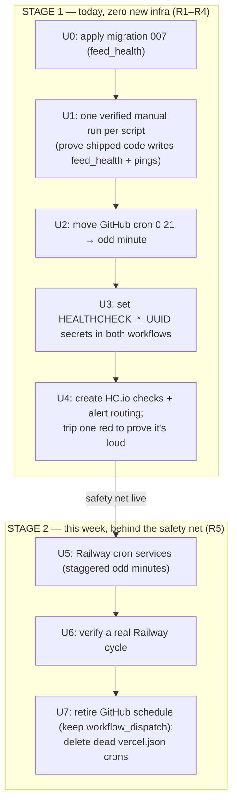
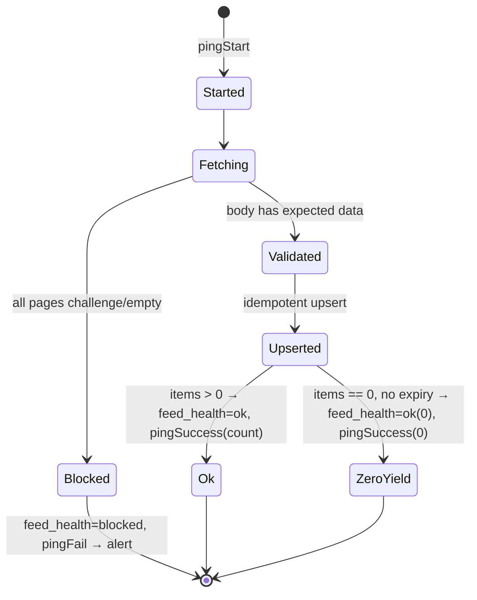

# fix: Make data feeds run reliably + loudly — resequence the stalled re-host

## Summary

The two daily feeds (Domain via Bright Data Web Unlocker, REA via the Apify actor) did not run this morning (2026-06-17), and didn't reliably run the morning before. They are still on GitHub Actions `cron: '0 21 * * *'` — the documented worst slot for GitHub's best-effort scheduler — and there is **no working alert** when a run is dropped.

The prior plan (`2026-06-16-001`) correctly diagnosed this and shipped the right *code* (Healthchecks ping helper, `feed_health` writer, body-validation gate — units U1–U4 of that plan are merged in commit 214586e). But it **sequenced the work backwards and over-built the remedy**:

1. It shipped `feed_health`-writing code **without applying migration 007**, so the table doesn't exist and every run's health write has silently no-op'd (fail-soft by design) — recreating the exact silent-failure class the plan set out to kill.
2. It made the actual fix (flipping the scheduler off flaky GitHub cron) depend on standing up a **brand-new Railway cron service** — the heaviest option — which never happened, so the feeds kept dropping.
3. The heartbeat that was "the single highest-value fix" (its own words) is **mute**: the GitHub workflows never pass `HEALTHCHECK_UUID`, and no Healthchecks.io checks were created.

This plan **resequences and slims** that work. The insight from the planning team: reliability does **not** require new infrastructure. Apply the migration, light up the already-built heartbeat **on the scheduler that already runs**, and move GitHub cron off the top of the hour. That makes tomorrow's run both more likely to fire and **impossible to drop silently** — in under an hour. The Railway re-host (genuinely the best long-term home for a 30-minute job — see research) then becomes a calm optimisation behind a working safety net, not the load-bearing fix that's been blocking everything.

This plan changes **no** scraping backends, sources, or dedup behaviour.

---

## Problem Frame

**Observed (verified 2026-06-17 08:35 AEST):** Newest rows in `property_listings` (`domain-web-unlocker` 06-15T23:27Z, `rea-apify-one-api` 06-15T23:05Z) and `property_sales` (06-15T23:32Z) are all from yesterday morning's run. No GitHub Actions run has fired since 06-15T23:04Z. The `feed_health` table returns `PGRST205: Could not find the table` — it does not exist in the live DB.

**Root causes (confirmed against the repo, not assumed):**

1. **Top-of-hour best-effort cron (primary).** Both `.github/workflows/daily-domain-scrape.yml` and `daily-rea-apify-scrape.yml` still trigger on `cron: '0 21 * * *'`. GitHub docs: scheduled events "can be delayed during periods of high load … the start of every hour" and "some queued jobs may be dropped." This morning's was dropped.
2. **Migration-before-code ordering bug (the headline defect).** `scripts/lib/feed-health.mjs` is wired into both ingest scripts and writes to `feed_health`, but migration `007_feed_health.sql` was never applied. The writer is fail-soft (`feed-health.mjs:55-62` logs and swallows non-2xx), so every run since 214586e has hit a 404 and silently continued. The shipped write code has therefore **never executed a successful write** — it is unverified in production.
3. **Mute heartbeat (force-multiplier).** Neither GitHub workflow passes `HEALTHCHECK_UUID` (confirmed — env blocks list only Supabase/Bright Data/Apify secrets), and no Healthchecks.io checks exist. So `pingStart`/`pingSuccess`/`pingFail` all no-op. A dropped run, a zero-yield run, and a blocked run are all equally invisible.

**Deployment reality (resolves a contradiction):** The app runs on **Railway** (`geaeverypropertyai-production.up.railway.app`). The `vercel.json` `crons` array is **dead config** — the app isn't served from Vercel, and a Vercel function could never run a 30-minute scrape anyway (Hobby caps at 300s; Pro at 800s GA / 1800s beta with no headroom). Supabase Edge Functions cap at 400s — also disqualified. The only schedulers that can run a ~30-min job are GitHub Actions (6h limit, but flaky timing), Railway cron (no duration limit, same platform as the app), Apify's scheduler (for the actor portion only), and durable-execution platforms (overkill for two jobs).

**Why resequence rather than restart:** U1–U4 code is good and merged. The fastest path to reliable+loud feeds is to *activate* what's built on the *existing* scheduler, then optionally migrate hosts. The new-Railway-service rebuild is a legitimate end-state but is an **optimisation, not the prerequisite for reliability** — treating it as the prerequisite is precisely what stalled the fix.

---

## Requirements

- **R1.** A dropped, failed, zero-yield, or blocked run raises a **loud** alert (email/Slack) within a bounded window (≤ ~25h), independent of which host runs the job. *(The host-independent safety net — highest priority.)*
- **R2.** `feed_health` exists in the live DB and the already-shipped writer records `ran → succeeded → got-data (row count) → status` on every run, verified by at least one real successful write.
- **R3.** The daily schedule no longer lands on the GitHub top-of-hour drop slot.
- **R4.** The shipped body-validation + `feed_health` + heartbeat code is proven to work end-to-end against the real table at least once (it has never run successfully).
- **R5.** Long-term: the heavy 30-min jobs run on a scheduler with no duration limit and reliable timing (Railway cron), with GitHub cron retired to manual break-glass.
- **R6.** Preserve all settled behaviour: dedup keys, per-source isolation, zero-yield never expires live listings, REA-sold deferred, scraping backends unchanged.

---

## Key Technical Decisions

**KTD1 — Stop the bleeding on the *existing* scheduler first; don't gate reliability on new infra.**
The prior plan gated the fix (retire GitHub cron, U6) on standing up a new Railway service (U5). Invert this: keep GitHub Actions as the scheduler for Stage 1, just (a) move it off `0 21` to an odd minute and (b) wire in the heartbeat. This delivers R1+R3 today with a one-line YAML change ×2 plus secrets, zero new services. *Rationale:* off-peak measurably reduces GitHub drops, and the heartbeat makes any remaining drop **loud** — so even imperfect GitHub timing is now safe. *(see research: GitHub schedule best-effort docs; off-hour recommended.)*

**KTD2 — Migration 007 is a hard, first prerequisite (U0), not a soft risk note.**
The prior plan buried "verify `feed_health` exists" in Risks; that's why the writer shipped against a missing table. Apply `007_feed_health.sql` to the live DB **before** relying on any `feed_health` read/write. *Rationale:* removes the active silent-failure; unblocks the already-merged writer code.

**KTD3 — Healthchecks.io, with alert routing configured and a deliberately-tripped red as acceptance.**
One check per feed (`sold`, `on-market`, REA `on-market`), ~25h period to absorb jitter, grace ~90 min. The dead-man's-switch is worthless unless email/Slack routing is wired — so "configure routing" and "deliberately let one check go red and confirm the alert arrives" are explicit, verified steps, not assumptions. *Rationale:* Healthchecks.io free tier (20 checks) dwarfs the need, is purpose-built for cron miss-detection, and routes to Slack/email for free. *(see research: Healthchecks.io vs Cronitor/BetterStack — HC cheapest/best fit.)*

**KTD4 — Verify the already-shipped code end-to-end once, with the swallowed-error log checked.**
Because `feed-health.mjs` writes are fail-soft and have never succeeded, the happy path is unexercised. After U0, run each script once manually and confirm: a `feed_health` row actually upserts (not a swallowed 404), `newest_row_at` populates, Healthchecks shows start+success with a row count. Known code smells to confirm during this run: `deriveStatus` (`feed-health.mjs:67-70`) **can never return `'broken'`** — callers must set it explicitly on caught exceptions; the `on_conflict=category` upsert relies on `category` being the PK (it is, per 007); `fetchNewestRowAt` reads `created_at` (both feed tables have it). *Rationale:* the fail-soft design will otherwise hide a broken write and "look fixed" while staying broken.

**KTD5 — Railway cron re-host is Stage 2, behind the safety net.**
Railway cron is the correct long-term home: no execution-duration limit (decisive for the ~30-min Domain run), same platform as the app (shared env/secrets/Supabase), usage-billed pennies. Add cron entries (staggered odd minutes) — prefer attaching to the existing service pattern (`services/scraper/railway.json` is the template) over a brand-new bespoke service unless a clean-exit constraint forces separation. Only after a Railway cycle is verified do we retire GitHub cron (keep `workflow_dispatch`) and delete the dead `vercel.json` crons. *Rationale:* same end-state as the prior plan's U5/U6, but de-risked — the slow 30-min verify loop no longer blocks reliability. *Trade-off:* Railway cron *skips* a run if the prior one is still running, so scripts must exit cleanly (they do). *(see research: Railway cron — no duration limit, skip-if-running caveat.)*

---

## High-Level Technical Design

### Two-stage fix — reliability now, optimal host later

### Per-run state (already coded in U1–U4 of prior plan; this plan verifies it)

Minutes/UUIDs are illustrative; the topology and ordering are authoritative.

---

## Implementation Units

> Units are renumbered for this resequenced plan. Stage 1 (U0–U4) delivers reliable+loud feeds with no new infrastructure and is independently shippable. Stage 2 (U5–U7) is the host optimisation.

### U0. Apply migration 007 to the live database

**Goal:** Create the `feed_health` table in production so the already-shipped writer can succeed.
**Requirements:** R2.
**Dependencies:** none. **This is the first action — everything in U1–U4 that touches `feed_health` depends on it.**
**Files:**
- `src/lib/db/migrations/007_feed_health.sql` (apply, no change) — run in the Supabase SQL editor against the live DB.
**Approach:** Run the migration verbatim. Confirm `category` is `PRIMARY KEY` (the `on_conflict=category` upsert in `feed-health.mjs:44` depends on it) and the table is created with RLS as written. Note migration counter is at 008 with 008 pending separately — applying 007 does not require 008.
**Patterns to follow:** prior migration applications recorded in `DAILY_SYNC_SETUP.md`.
**Test expectation: none** — schema DDL; verified by U1's real write landing a row.
**Verification:** `GET /rest/v1/feed_health?select=*` returns `200` with an (empty) array instead of `PGRST205`.

### U1. One verified manual run per script against the real table

**Goal:** Prove the already-merged `feed_health` writer, `fetchNewestRowAt`, body-validation gate, and Healthchecks pings actually work end-to-end — because they have never executed a successful `feed_health` write.
**Requirements:** R2, R4.
**Dependencies:** U0 (table must exist); ideally after a throwaway Healthchecks UUID is available (can use a temporary check before U4 formalises them).
**Files:**
- `scripts/ingest-domain-webunlocker.mjs` (run, observe) — `node scripts/ingest-domain-webunlocker.mjs sold` then `on-market`.
- `scripts/ingest-rea-apify.mjs` (run, observe) — `node scripts/ingest-rea-apify.mjs on-market`.
- `scripts/lib/feed-health.mjs` (review/fix only if the run reveals a bug).
**Approach:** Run locally (or via a manual `workflow_dispatch`) with real env. Watch stderr for `[feed-health] upsert <status>` errors — a swallowed non-2xx means the write still failed. Confirm a row upserts per category with correct `items`, `newest_row_at`, and `status`. Confirm `status=broken` is set by the caller's catch path on a forced error (since `deriveStatus` cannot produce it). If any of the KTD4 code smells bite, fix in this unit.
**Patterns to follow:** existing `main().catch()` + structured run-summary logging already in the scripts.
**Test scenarios:**
- Happy path: a real run upserts a `feed_health` row with `status=ok`, `items>0`, populated `newest_row_at`; no swallowed `[feed-health]` error in logs.
- Blocked path: temporarily point a fetch at a guaranteed-challenge response (or stub) → category flagged `blocked`, `status=blocked`, **no expiry** of existing `active=true` rows, `pingFail` fired.
- Error path: force a thrown exception → caller sets `status=broken` (confirm callers do this, since `deriveStatus` can't) and `pingFail` fires, process exits non-zero.
- Zero-yield: items==0 without block → `status=ok` with items=0, no expiry, `pingSuccess(0)`.
**Verification:** `feed_health` shows a fresh row per category with accurate counts; Healthchecks dashboard shows start+success with the row count in the body; the swallowed-error log is clean.

### U2. Move GitHub cron off the top of the hour

**Goal:** Eliminate the documented #1 drop slot while GitHub remains the Stage-1 scheduler.
**Requirements:** R3.
**Dependencies:** none (independent of U0/U1, but ship alongside Stage 1).
**Files:**
- `.github/workflows/daily-domain-scrape.yml` (modify) — change `cron: '0 21 * * *'` to an odd off-peak minute (e.g. `cron: '23 21 * * *'`).
- `.github/workflows/daily-rea-apify-scrape.yml` (modify) — change to a different odd minute (e.g. `cron: '37 21 * * *'`) to avoid the two heavy jobs contending on Bright Data/Apify simultaneously.
**Approach:** One-line change per file; keep `workflow_dispatch`. Add a comment noting the minute is deliberately off `:00` per GitHub's own guidance, and that Stage 2 moves this to Railway.
**Test expectation: none** — config; verified by observing the next scheduled fire.
**Verification:** The next day's run fires near the new minute; no run is dropped over a few days of observation (and if one is, U4's alert catches it).

### U3. Wire Healthchecks UUIDs into both GitHub workflows

**Goal:** Make the already-coded pings actually fire from the GitHub-hosted runs.
**Requirements:** R1.
**Dependencies:** U4 (the checks must exist to get UUIDs) — in practice create the HC.io checks (U4) first, then set these secrets. Listed before U4 only because the workflow edit lives here.
**Files:**
- `.github/workflows/daily-domain-scrape.yml` (modify) — add `HEALTHCHECK_UUID: ${{ secrets.HEALTHCHECK_DOMAIN_UUID }}` to the job `env`. (The matrix runs both categories; if separate checks per category are wanted, map by `matrix.category` — otherwise one Domain check covering the job is acceptable for Stage 1.)
- `.github/workflows/daily-rea-apify-scrape.yml` (modify) — add `HEALTHCHECK_UUID: ${{ secrets.HEALTHCHECK_REA_UUID }}`.
- GitHub repo secrets (configure) — `HEALTHCHECK_DOMAIN_UUID`, `HEALTHCHECK_REA_UUID`.
**Approach:** The scripts already read `HEALTHCHECK_UUID` and no-op when absent; this just supplies it. No code change.
**Test expectation: none** — config; verified by U1/U4 pings appearing.
**Verification:** A manual `workflow_dispatch` run shows start+success pings on the corresponding Healthchecks check.

### U4. Create Healthchecks.io checks, configure alert routing, and prove a red alert

**Goal:** Stand up the dead-man's-switch checks and prove the alert is actually loud — the prior plan's biggest unmitigated risk.
**Requirements:** R1.
**Dependencies:** U0 not required; produces the UUIDs that U3 consumes.
**Files:**
- Healthchecks.io account (configure) — one check per feed: Domain (~25h period, ~90 min grace), REA (same). Schedule-match to the new cron minute.
- Alert integrations (configure) — email and/or Slack routing on each check.
- `DAILY_SYNC_SETUP.md` (modify) — record the check names, periods, and which secret maps to which.
**Approach:** Create checks, copy UUIDs into the GitHub secrets (U3). Then **deliberately trip one**: pause a check or skip its ping past the grace window and confirm the email/Slack alert arrives. Document the alert channel.
**Test expectation: none** — external config; verified by the deliberate red.
**Verification:** A check forced past its grace window produces an actual email/Slack alert to a human; a normal run resets it to green.

---

> **Stage 1 complete here.** Feeds run off-peak on GitHub, every run pings a monitored heartbeat, `feed_health` records outcomes, and a missed/failed/blocked run is loud. The following units are the optional host optimisation.

### U5. Stand up Railway cron for the feeds

**Goal:** Move the ~30-min jobs onto a scheduler with no duration limit and reliable timing, co-located with the app.
**Requirements:** R5.
**Dependencies:** U0–U4 (only migrate to Railway once the safety net is proven on GitHub).
**Files:**
- `services/scraper/railway.json` (extend) or a new `services/feeds-cron/railway.json` (new) — add cron entries running `node scripts/ingest-domain-webunlocker.mjs sold|on-market` and `node scripts/ingest-rea-apify.mjs on-market` on staggered odd-minute UTC schedules. **Prefer extending the existing service pattern** over a bespoke new service unless clean-exit/runtime isolation forces separation.
- `DAILY_SYNC_SETUP.md` (modify) — document the Railway cron schedule and per-service env (`BRIGHTDATA_*`, `APIFY_API_TOKEN`, `NEXT_PUBLIC_SUPABASE_URL`, `SUPABASE_SERVICE_ROLE_KEY`, `HEALTHCHECK_UUID`, `REA_RESULT_COUNT`, `REA_PAGES`).
**Approach:** One cron entry per invocation; stagger minutes to avoid self-contention; scripts already exit cleanly (Railway skips a run if the prior is still running, so clean exit matters). Reuse the same Healthchecks UUIDs so the heartbeat follows the job to its new host.
**Patterns to follow:** `services/scraper/railway.json` + its Dockerfile.
**Test expectation: none for the config** — validated by a manual Railway run.
**Verification:** Manually trigger each Railway cron once; Supabase rows upsert, `feed_health` updates, Healthchecks shows start+success; one real scheduled cycle fires within a few minutes of its time.

### U6. Verify a full Railway scheduled cycle

**Goal:** Confirm Railway is trustworthy before retiring GitHub.
**Requirements:** R5.
**Dependencies:** U5.
**Files:** none (observation).
**Approach:** Let Railway run on its real schedule for at least one cycle (both feeds). Confirm fresh `feed_health`, fresh feed rows, green Healthchecks. During this window both GitHub and Railway may fire — idempotent upserts make the double-run harmless.
**Test expectation: none** — verification window.
**Verification:** A Railway-scheduled cycle lands fresh data and green checks without manual intervention.

### U7. Retire GitHub schedule and delete dead Vercel crons

**Goal:** Remove the redundant/flaky scheduler and the misleading dead config.
**Requirements:** R5, R3.
**Dependencies:** U6 (only after Railway is verified).
**Files:**
- `.github/workflows/daily-domain-scrape.yml` (modify) — remove the `schedule:` block; keep `workflow_dispatch` as break-glass with a comment pointing to Railway.
- `.github/workflows/daily-rea-apify-scrape.yml` (modify) — same.
- `vercel.json` (modify) — remove the `crons` array (the app isn't on Vercel and a 30-min job can't run there); if the `feed-freshness` backstop is still wanted, it must move to a host that can actually run it (Railway cron or a Supabase pg_cron HTTP ping), not Vercel.
**Approach:** Delete schedule triggers only; leave jobs runnable manually.
**Test expectation: none** — config; verified by no GitHub scheduled fire the next day and a manual dispatch still working.
**Verification:** No scheduled GitHub run the following day; manual `workflow_dispatch` still upserts; `vercel.json` no longer advertises crons that never ran.

---

## Scope Boundaries

**In scope:** Applying migration 007; verifying the already-shipped instrumentation end-to-end; moving GitHub cron off-peak; lighting up the Healthchecks dead-man's-switch with proven alert routing; (Stage 2) re-hosting onto Railway cron, retiring GitHub schedule, and removing dead Vercel cron config.

**Deferred to Follow-Up Work:**
- Pure Apify-native scheduling of the REA actor (the script's actor-start→poll→ingest already works under cron; only revisit if Railway proves insufficient).
- Re-homing the `feed-freshness` backstop check onto a host that can run it (it currently sits in dead `vercel.json`).
- Durable-execution platforms (Trigger.dev / Inngest / Temporal) — overkill for two jobs; revisit only if job count/interdependence grows.
- Consolidating the duplicated Web-Unlocker/Apify logic (lib client vs `.mjs` scripts) into one shared module.
- Resolving the iCloud duplicate dirs (`services/scraper 2/`, etc.) — unrelated housekeeping.

**Outside this plan's scope:** Changing scraping backends or anti-bot strategy; adding new sources; adding REA-sold (blocked on null `sale_date` dedup); schema changes beyond applying 007.

---

## Risks & Dependencies

- **Alert routing is the load-bearing risk.** A dead-man's-switch with no configured email/Slack channel is mute — exactly the failure that hid this morning's drop. U4 makes "configure + deliberately trip a red" a verified step, not an assumption. Do not consider Stage 1 done until a human has received a test alert.
- **Shipped code is unverified in prod.** `feed_health` writes have never succeeded (table missing). U1 must watch for swallowed `[feed-health]` errors; confirm callers set `status=broken` on exceptions (since `deriveStatus` can't) and that `on_conflict=category` matches 007's PK.
- **Double-run window (Stage 2).** Between U5 (Railway live) and U7 (GitHub retired) both fire; idempotent upserts make this safe — but retire GitHub promptly after U6.
- **Railway skip-if-running.** Railway cron skips a new run if the prior is still going; the ~30-min Domain job must exit cleanly (it does). Keep schedules well apart.
- **GitHub remains best-effort even off-peak.** Stage 1 reduces drops but doesn't eliminate them — which is *why* the heartbeat (R1) ships first and Stage 2 moves to Railway. Off-peak GitHub is acceptable only because the alert now makes any drop loud.

---

## Sources & Research

- GitHub `schedule` best-effort + drop-under-load + avoid top-of-hour: https://docs.github.com/en/actions/writing-workflows/choosing-when-your-workflow-runs/events-that-trigger-workflows#schedule
- Railway cron (no duration limit, skip-if-still-running): https://docs.railway.com/cron-jobs , https://docs.railway.com/guides/cron-workers-queues
- Vercel function duration caps (Hobby 300s / Pro 800s GA / 1800s beta) — disqualifies Vercel for a 30-min job: https://vercel.com/docs/functions/configuring-functions/duration
- Supabase Edge Function 400s wall-clock cap — disqualifies Supabase Edge: https://supabase.com/docs/guides/functions/limits
- Apify Schedules (~1s precision; actor-only): https://docs.apify.com/platform/schedules
- Healthchecks.io (free 20 checks, Slack/email routing) vs Cronitor/BetterStack: https://healthchecks.io/docs/ , https://healthchecks.io/docs/healthchecks_cronitor_comparison/
- Superseded plan: `docs/plans/2026-06-16-001-fix-data-feed-scheduling-reliability-plan.md` (correct diagnosis; this plan resequences its execution).
- Current production state + dedup rules: `DAILY_SYNC_SETUP.md`.
