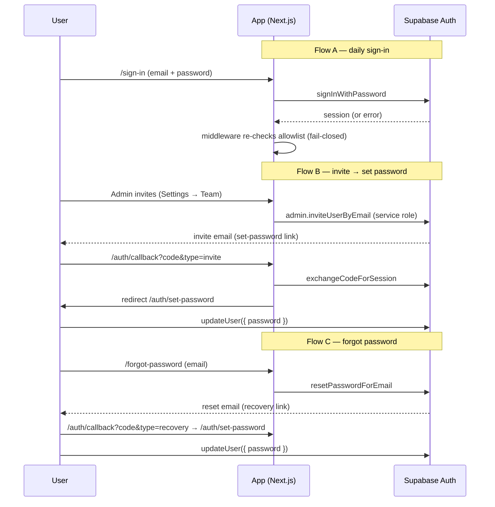

# feat: Switch auth from magic-link to email + password

## Summary

Replace passwordless magic-link sign-in (Supabase `signInWithOtp`) with email + password (`signInWithPassword`), while preserving the existing invite-only access model: a user may sign in only if their email is on the `@grantsea.com.au` domain **and** present in the `allowed_users` allowlist. Invited teammates receive an emailed "set your password" link; a self-serve "forgot password" reset flow is included.

The non-obvious part is **where the invite-only gate is enforced**. Today it re-checks the allowlist at *every* login inside the magic-link callback (`src/app/auth/callback/route.ts`). Password sign-in returns a session client-side without hitting that callback, so enforcement must shift to **account creation** (only allowlisted emails ever get a Supabase auth user) and **revocation** (revoking deletes the auth user), backed by a defence-in-depth allowlist re-check in middleware.

---

## Problem Frame

Magic links are friction for daily users (every login requires an inbox round-trip and the link expires in 10 minutes). The team wants conventional email + password sign-in. The change touches the authentication mechanism only — not *who* may access the app. The invite-only allowlist (domain + `allowed_users`, plus admin-managed invites built in the team-invites feature) stays exactly as-is in intent; only the credential and the enforcement point change.

This is security-sensitive: a careless port can silently drop the invite-only guarantee (e.g., a revoked teammate keeps a valid password) or weaken fail-closed behaviour. The plan treats allowlist parity as a first-class requirement, not an afterthought.

---

## Requirements

- **R1** — Users sign in with email + password (`signInWithPassword`); magic-link sign-in is removed.
- **R2** — Access stays invite-only: only `@grantsea.com.au` emails on `allowed_users` can hold a session. No public sign-up.
- **R3** — Invited teammates receive an emailed link to set their own password (admin never handles plaintext). The Team-invite flow (admin-only, from Settings) keeps working with this new email.
- **R4** — Revoking a teammate immediately and permanently prevents sign-in (parity with today's every-login re-check) — the credential is destroyed, not just the allowlist row.
- **R5** — Self-serve password reset ("forgot password"): request a reset email, set a new password.
- **R6** — The one existing magic-link user (stuart@grantsea.com.au) can obtain a password without losing access (one-time migration).
- **R7** — Fail-closed throughout: any allowlist/credential check that errors denies access.

---

## Key Technical Decisions

- **KTD-1 — Enforce invite-only at account lifecycle, not per-login.** With magic links, `/auth/callback` re-checked `isEmailAllowed` on every login. Password sign-in skips that callback. So: (a) **creation** — only the admin invite path creates Supabase auth users, and only for allowlisted `@grantsea.com.au` emails; public sign-up stays disabled in Supabase. (b) **revocation** — the Team `DELETE` also deletes the Supabase auth user via the admin API, destroying the credential. (c) **defence-in-depth** — middleware (which already runs `getUser()` for protected routes) re-checks the signed-in email against the allowlist and signs out + redirects if it fails. This keeps the fail-closed, immediate-revocation guarantee R4 demands even if an auth user lingers.

- **KTD-2 — Invite uses Supabase admin `inviteUserByEmail`** (service-role) instead of `signInWithOtp`. This creates the auth user *and* emails an invite link that lands the user in a short-lived session to set a password. Redirect target: `/auth/callback` → `/auth/set-password`. Replaces the magic-link send added in the team-invites feature.

- **KTD-3 — One callback, routed by intent.** `src/app/auth/callback/route.ts` keeps exchanging the `?code=` (Supabase invite and recovery links use the same PKCE exchange), but routes invite/recovery sessions to `/auth/set-password` instead of `/my-properties`. Distinguish via the `type` param Supabase appends (`invite` / `recovery`) or an explicit `returnTo`.

- **KTD-4 — Set-password and reset are thin authenticated pages.** After the invite/recovery link puts the user in a session, `/auth/set-password` calls `updateUser({ password })`. `/forgot-password` (unauthenticated) calls `resetPasswordForEmail` with the same allowlist UX pre-check the sign-in form uses.

- **KTD-5 — Keep the allowlist UX pre-check** (`POST /api/auth/check-allowed`) on the sign-in and forgot-password forms so non-invited emails get immediate feedback and we don't email links to strangers. It remains a UX aid, not the security boundary (KTD-1 is).

- **KTD-6 — Supabase project config is part of the change** (operational, not code): disable public email sign-ups, confirm the **Invite user** and **Reset password** email templates are enabled and point at the app origin. Without this, R2/R3/R5 don't hold. Captured as an operational note + verification step, since the live sign-in flow already proves SMTP works.

---

## High-Level Technical Design

Three flows share one callback and one set-password page:

---

## Implementation Units

### U1. Email + password sign-in form

- **Goal:** Replace the magic-link form with email + password sign-in.
- **Requirements:** R1, R7.
- **Dependencies:** none.
- **Files:** `src/app/sign-in/page.tsx`, `src/app/sign-in/__tests__/sign-in.test.tsx` (new).
- **Approach:** Swap `signInWithOtp` for `signInWithPassword({ email, password })`. Add a password field and a "Forgot password?" link to `/forgot-password`. Keep the existing `check-allowed` pre-check for a friendly "not authorised" message before attempting sign-in. On success, redirect to `returnTo` (default `/my-properties`). Map Supabase's generic invalid-credentials error to a clear message without leaking whether the email exists. Preserve the existing `?error=not_invited|auth_failed` URL-error handling and the GEA visual shell.
- **Patterns to follow:** current `src/app/sign-in/page.tsx` structure (Suspense form, status state machine, GEA tokens).
- **Test scenarios:**
  - Happy path: valid allowlisted email + correct password → `signInWithPassword` called, redirect to `returnTo`.
  - Allowlist pre-check fails → shows "not authorised" copy, does **not** call `signInWithPassword`.
  - Wrong password → generic "email or password is incorrect" message; no account-existence leak.
  - Empty/invalid email or empty password → inline validation, no network call.
  - Carries `?error=not_invited` from a middleware redirect into the visible error.
- **Verification:** Signing in with a known account lands on `/my-properties`; bad password is rejected with a non-enumerating message.

### U2. Invite sends a set-password link (admin API)

- **Goal:** Team invites create the auth user and email a set-password link instead of a magic link.
- **Requirements:** R2, R3.
- **Dependencies:** U4 (redirect target page should exist).
- **Files:** `src/app/api/team/route.ts`, `src/app/api/team/__tests__/team.test.ts` (extend if present, else new).
- **Approach:** In `POST`, after the allowlist upsert, replace the `anon.auth.signInWithOtp` call with service-role `admin.inviteUserByEmail(email, { redirectTo: <origin>/auth/callback })`. Keep the admin-only gate, the `@grantsea.com.au` validation, and the `allowed_users` upsert (allowlist remains the access record; the auth user is the credential). Keep the send best-effort (don't fail the invite if email hiccups). Handle the "user already exists" case gracefully (re-invite / no-op).
- **Patterns to follow:** existing `requireAdmin` gate and service-role client usage in `src/app/api/team/route.ts`.
- **Test scenarios:**
  - Admin invites a new allowlisted email → `allowed_users` row upserted **and** `inviteUserByEmail` called with the callback redirect.
  - Non-admin caller → 403, no invite sent.
  - Non-`@grantsea.com.au` email → 400, no invite sent.
  - Invitee already has an auth account → no crash; still returns success.
  - Email send fails → invite still succeeds (allowlist row written), response flags `emailed:false`.
- **Verification:** Inviting a test address creates a Supabase auth user and delivers a set-password email.

### U3. Revocation destroys the credential

- **Goal:** Revoking a teammate deletes their auth user, not just the allowlist row — immediate, permanent lockout (R4 parity).
- **Requirements:** R4, R7.
- **Dependencies:** none.
- **Files:** `src/app/api/team/route.ts`, `src/app/api/team/__tests__/team.test.ts`.
- **Approach:** In `DELETE`, after the existing guards (self-revoke block, last-admin block) and the `allowed_users` delete, look up the Supabase auth user by email and call `admin.deleteUser(id)`. Make the auth-user delete fail-soft-but-reported: the allowlist row removal + middleware re-check (U6) already block access, so a delete error degrades to "still locked out" rather than "silently still allowed". Keep idempotent (deleting an already-gone user is a no-op).
- **Patterns to follow:** existing `DELETE` guards in `src/app/api/team/route.ts`.
- **Test scenarios:**
  - Revoke a normal member → `allowed_users` row deleted **and** `admin.deleteUser` called for that email.
  - Self-revoke attempt → 400, no deletion (existing guard preserved).
  - Last-admin revoke attempt → 400, no deletion (existing guard preserved).
  - Auth-user lookup/delete error → allowlist row still removed; response surfaces the partial failure.
  - Revoke an email with no auth user (invited, never signed in) → no crash, succeeds.
- **Verification:** A revoked user can no longer sign in even with their previous password.

### U4. Set-password page

- **Goal:** A page where an invited or resetting user sets their password from within the link-established session.
- **Requirements:** R3, R5, R7.
- **Dependencies:** none.
- **Files:** `src/app/auth/set-password/page.tsx` (new), `src/app/auth/set-password/__tests__/set-password.test.tsx` (new).
- **Approach:** Client page that confirms an active session exists (the invite/recovery link created one), then takes a new password (+ confirm field), calls `updateUser({ password })`, and on success redirects to `/my-properties`. If no session is present (link expired or visited directly), show a clear "link expired — request a new one" state linking to `/forgot-password`. Enforce a basic password policy (min length; mirror Supabase's configured minimum). Reuse the GEA visual shell.
- **Patterns to follow:** `src/app/sign-in/page.tsx` form/status pattern; GEA tokens.
- **Test scenarios:**
  - Active session + matching passwords meeting policy → `updateUser` called, redirect to `/my-properties`.
  - Password/confirm mismatch → inline error, no call.
  - Below-minimum-length password → inline policy error, no call.
  - No active session (direct visit / expired link) → "link expired" state with a path to reset.
  - `updateUser` error → surfaced without redirect.
- **Verification:** Following an invite email lets a teammate set a password and land signed-in.

### U5. Forgot-password request page

- **Goal:** Unauthenticated users can request a password reset email.
- **Requirements:** R5, R7.
- **Dependencies:** U4 (reset link lands on set-password).
- **Files:** `src/app/forgot-password/page.tsx` (new), `src/app/forgot-password/__tests__/forgot-password.test.tsx` (new).
- **Approach:** Email-only form. Run the `check-allowed` pre-check (don't email non-invited addresses), then `resetPasswordForEmail(email, { redirectTo: <origin>/auth/callback })`. Show a neutral "if that account exists, you'll get an email" confirmation regardless, to avoid account enumeration. Link back to `/sign-in`.
- **Patterns to follow:** `src/app/sign-in/page.tsx` (the pre-check + success-state pattern it already uses).
- **Test scenarios:**
  - Allowlisted email → `resetPasswordForEmail` called with the callback redirect; neutral confirmation shown.
  - Non-allowlisted email → neutral confirmation shown, `resetPasswordForEmail` **not** called (no enumeration, no wasted send).
  - Invalid email format → inline validation, no call.
  - `resetPasswordForEmail` error → neutral confirmation still shown (no leak); error logged.
- **Verification:** Requesting a reset for a real account delivers a recovery email that routes to set-password.

### U6. Callback routing, middleware allowlist re-check, and cleanup

- **Goal:** Route invite/recovery links to set-password, add the defence-in-depth allowlist re-check, and remove dead magic-link code.
- **Requirements:** R1, R2, R4, R7.
- **Dependencies:** U4.
- **Files:** `src/app/auth/callback/route.ts`, `src/middleware.ts`, `src/lib/auth/client.ts`, `src/middleware.test.ts` or `src/app/auth/callback/__tests__/callback.test.ts` (new/extend).
- **Approach:**
  - **Callback:** keep `exchangeCodeForSession`; when the link is an invite or recovery (`type`/`returnTo`), redirect to `/auth/set-password` instead of `/my-properties`. Retain the existing failure redirects.
  - **Middleware:** after `getUser()` on the protected matcher, if a user is present, verify `isEmailAllowed(user.email)`; if not, sign out and redirect to `/sign-in?error=not_invited`. This restores the every-request fail-closed guarantee that the magic-link callback used to provide. Keep the cost in mind (one indexed lookup per protected navigation) and note it.
  - **Cleanup:** remove the now-unused `signInWithMagicLink` helper from `src/lib/auth/client.ts` and any remaining `signInWithOtp` references.
- **Patterns to follow:** existing `src/app/auth/callback/route.ts` gate; `isEmailAllowed` in `src/lib/auth/allowlist.ts`; existing middleware Supabase-SSR setup.
- **Test scenarios:**
  - Invite/recovery callback (`type=invite`/`recovery`) → redirects to `/auth/set-password`.
  - Normal authenticated nav to `/my-properties` with an allowlisted user → passes through.
  - Authenticated user whose `allowed_users` row was removed → middleware signs out + redirects to `/sign-in?error=not_invited`.
  - Allowlist lookup error in middleware → fail-closed (treated as not allowed).
  - No `signInWithOtp`/`signInWithMagicLink` references remain in the codebase.
- **Verification:** A revoked-but-still-cookied user is bounced on their next protected request; invite links reach set-password.

---

## System-Wide Impact

- **End users / teammates:** new daily flow (password instead of inbox round-trip); a one-time set-password step for everyone currently relying on magic links.
- **Admins:** the Settings → Team invite now sends a set-password email; revocation now also deletes the credential.
- **Ops/config:** Supabase project settings (disable sign-ups, enable invite + recovery templates) must be set for the flows to work — a deploy-time checklist item, not just code.

---

## Risks & Dependencies

- **Dropping the invite-only guarantee** — the headline risk. Mitigated by KTD-1 (creation + revocation + middleware re-check) and the explicit revocation test in U3/U6. Treat U6's middleware re-check as non-optional.
- **Account enumeration** — sign-in and forgot-password must not reveal whether an email exists. Covered by U1/U5 neutral messaging and tests.
- **Existing-user lockout during migration (R6)** — sequence the rollout so stuart@grantsea.com.au sets a password (via invite or forgot-password) before magic-link send is removed, or immediately after deploy. Low risk (forgot-password self-serves it).
- **Supabase admin API availability** — invite/delete use the service-role key already present server-side (`SUPABASE_SERVICE_ROLE_KEY`); no new secret.

---

## Scope Boundaries

In scope: email+password sign-in, invite-via-set-password-link, revocation credential deletion, forgot-password reset, set-password page, middleware allowlist re-check, existing-user migration path, Supabase config checklist.

### Deferred to Follow-Up Work

- Password-change UI for an already-signed-in user (distinct from reset-when-locked-out).
- MFA / 2FA, social login, "remember this device".
- Rate-limiting / lockout on repeated failed sign-ins beyond Supabase defaults.
- Session-timeout / forced-reauth policy changes.

### Non-Goals

- Changing *who* may access the app — the allowlist membership rules and admin model are unchanged.
- Migrating off Supabase Auth.

---

## Operational / Rollout Notes

- **Supabase dashboard (pre-deploy):** disable public email sign-ups; enable + verify the **Invite user** and **Reset password** email templates with the app origin as redirect base; confirm the minimum password length you want enforced (mirror it in U4).
- **Migration step:** after deploy, set a password for the existing user (admin re-invite or self-serve forgot-password).
- **Verification after deploy:** invite a test address end-to-end (email → set password → sign in), then revoke it and confirm the old password no longer works.

---

## Sources & Research

Grounded in the current codebase auth surface (no external research needed — Supabase Auth patterns are already established locally):
- `src/app/sign-in/page.tsx` — current magic-link form.
- `src/app/auth/callback/route.ts` — PKCE code exchange + allowlist gate.
- `src/lib/auth/allowlist.ts` — `isEmailAllowed` / `isEmailAdmin` (fail-closed).
- `src/app/api/team/route.ts` — admin-only invite/revoke (built in the team-invites feature; currently sends magic links).
- `src/middleware.ts` — session gate for `/my-properties`.
- `src/lib/auth/client.ts` — auth helpers (contains the magic-link helper to remove).
