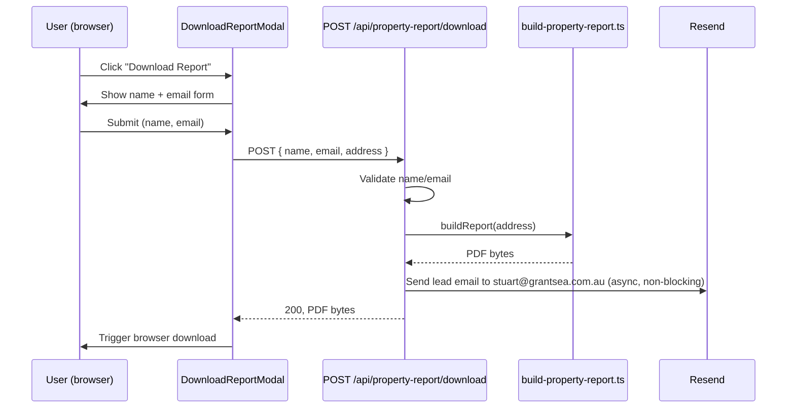

# feat: Gated property report download (name/email capture + lead email)

---

## Summary

Add a "Download Report" button to the property page hero that opens a modal requiring name + email before downloading a PDF report. On submit, the PDF (the existing GEA-branded property-details report) downloads in the browser, and a lead-notification email is sent via Resend to `stuart@grantsea.com.au` with who downloaded, their email, and which property.

## Problem Frame

`GET/POST /api/property-report` already generates the exact report needed (`src/lib/pdf/property-report.tsx` + `src/app/api/property-report/route.ts`) but is Bearer-token gated for server-to-server use (`GEA_ST_SG_assistant`). There is no public, browser-facing path to this PDF, and no lead-capture or notification mechanism. This plan adds a public download path gated by a name/email modal, reusing the existing report renderer, plus a Resend-based notification to Stuart.

## Requirements

- R1: A "Download Report" button is visible on the property page (in `PropertyHero`).
- R2: Clicking it opens a modal requiring name and email (both required) before the download proceeds.
- R3: On submit, the browser downloads the same GEA-branded PDF report currently produced by `/api/property-report` (address, beds/baths, price estimate, sale history — no comparables/commentary), for the property currently being viewed.
- R4: On each successful download, an email is sent via Resend to `stuart@grantsea.com.au` containing the downloader's name, email, the property address, and a timestamp.
- R5: No email verification/OTP step — capture and download happen in one submit, per user decision.
- R6: Basic input validation (non-empty name, valid-looking email format) before allowing download; no other spam/rate-limit protection is in scope for this pass (see Scope Boundaries).

## Key Technical Decisions

**KTD1: New public endpoint, not a change to the existing Bearer-gated route.** Add `POST /api/property-report/download` (public, no Bearer auth) rather than loosening auth on the existing `/api/property-report` route, which serves a different consumer (`GEA_ST_SG_assistant`, server-to-server) with different trust assumptions. Rationale: keeps the existing API contract and its callers untouched; the new route has its own validation (name/email required) instead of Bearer auth.

**KTD2: Extract the shared report-building logic.** `buildReport()` (currently a private function inside `src/app/api/property-report/route.ts`, lines ~71-138) becomes an exported helper in a new file `src/lib/pdf/build-property-report.ts`, taking a raw address string and returning either the PDF bytes or a not-found signal. Both the existing Bearer-gated route and the new public download route call it. Rationale: avoids duplicating the profile-fetch + field-mapping logic; the two routes then differ only in auth and post-generation side effects (the new one also emails Stuart).

**KTD3: Resend for email, added as a new dependency.** No email-sending library exists in this repo today (`resend` is not in `package.json`; Supabase auth emails are a separate, unrelated mechanism). Add the `resend` npm package and a `RESEND_API_KEY` env var. Rationale: user named Resend explicitly; it's a standard, low-setup transactional email API.

**KTD4: Lead notification is fire-and-forget relative to the download.** The download response (PDF bytes) does not block on the Resend call succeeding — if Resend fails, the user still gets their PDF, and the failure is logged server-side. Rationale: a client should never be blocked from downloading a report because of an internal email-delivery hiccup; the notification is a side effect, not the primary contract.

**KTD5: Modal is a new, minimal component — no new UI library.** No dialog/modal component exists in `src/components/ui/` today. Build a small, self-contained `DownloadReportModal` following existing component conventions (Tailwind classes, steel-accent palette per `src/components/ui/Button.tsx` and `DESIGN.md`), not a new dependency (e.g. Radix Dialog). Rationale: this is a two-field form in a simple overlay; a full dialog primitive library is disproportionate for the current UI surface (no other modals exist yet to justify shared infrastructure).

## High-Level Technical Design

## Implementation Units

### U1. Extract shared report-building helper

**Goal:** Make the existing report generation logic reusable by both the Bearer-gated route and the new public route.

**Requirements:** R3 (foundation for it)

**Dependencies:** none

**Files:**
- `src/lib/pdf/build-property-report.ts` (create — moved logic)
- `src/app/api/property-report/route.ts` (modify — import and call the extracted helper instead of the local `buildReport`)
- `src/lib/pdf/__tests__/build-property-report.test.ts` (create)

**Approach:**
- Move `pick`, `asNumber`, `fetchPhotos`, and `buildReport` (route.ts lines ~39-138) into the new file, exporting a function with a signature like `buildPropertyReportPdf(rawAddress: string): Promise<{ pdf: Buffer; address: string } | { notFound: true }>` — returning structured data instead of a `NextResponse`, so callers (both routes) decide their own response shape.
- Update `src/app/api/property-report/route.ts`'s `GET`/`POST` handlers to call the extracted helper and wrap the result in the existing PDF `NextResponse` (unchanged behavior/headers for this route).

**Patterns to follow:** existing structure of `src/app/api/property-report/route.ts` itself — same address parsing (`parseAddress`), same `fetchAndCacheProfile` call with `{ skipIfCached: true }`.

**Test scenarios:**
- Happy path: valid resolvable address returns PDF bytes and a normalized `address` string.
- Edge case: address with no `streetName`/`suburb` after parsing returns `{ notFound: true }`.
- Error path: `fetchAndCacheProfile` throws → returns `{ notFound: true }` (matches current route's catch-and-404 behavior), not an unhandled rejection.
- Regression: existing `/api/property-report` route tests (if any exist under `src/app/api/__tests__/`) still pass unchanged — behavior/response shape for that route must not change.

**Verification:** `GET /api/property-report?address=...` with a valid Bearer token still returns an identical PDF to before the refactor; `tsc --noEmit` and existing tests pass.

---

### U2. Public download endpoint with lead-email notification

**Goal:** A public, unauthenticated endpoint that validates name/email, returns the PDF, and notifies Stuart via Resend.

**Requirements:** R3, R4, R5, R6

**Dependencies:** U1

**Files:**
- `src/app/api/property-report/download/route.ts` (create)
- `src/lib/email/send-report-lead-notification.ts` (create)
- `src/app/api/property-report/download/__tests__/route.test.ts` (create)
- `package.json` (modify — add `resend` dependency)

**Approach:**
- `POST /api/property-report/download` accepts `{ name: string, email: string, address: string }`. Validate: `name` non-empty after trim; `email` matches a basic email-shape regex (mirroring any existing email validation in the repo if one exists — check `src/app/settings/` or `src/app/sign-in/` for a pattern first; otherwise a standard `^[^\s@]+@[^\s@]+\.[^\s@]+$` check is sufficient per R6's scope).
- On valid input, call `buildPropertyReportPdf(address)` (U1). On `notFound`, return 404. On success, kick off `sendReportLeadNotification({ name, email, address })` without `await`-blocking the response (KTD4) — call it, attach a `.catch()` that logs, and proceed to build the PDF response immediately.
- `sendReportLeadNotification` wraps the Resend client: `to: 'stuart@grantsea.com.au'`, subject naming the property address, body with downloader name, email, address, and an AEDT timestamp. Reads `RESEND_API_KEY` from env; if unset, log a warning and no-op rather than throwing (so local/dev environments without the key don't break downloads).
- Return the PDF with `Content-Disposition: attachment; filename="<slugified-address>-report.pdf"` (note: `attachment`, not `inline` like the existing route, since this is a direct user-facing download).

**Execution note:** Start with a failing test asserting the 400 response for missing/invalid name or email, before wiring the happy path — this is the endpoint's main behavioral contract beyond what U1 already covers.

**Patterns to follow:** `src/app/api/comparable-sales/route.ts` for CORS/OPTIONS handling conventions if this endpoint needs to be called cross-origin (it likely doesn't, since it's same-origin from the property page — confirm during implementation whether CORS headers are needed).

**Test scenarios:**
- Happy path: valid name, email, and resolvable address → 200, PDF bytes returned, `Content-Disposition: attachment`.
- Edge case: name is empty/whitespace-only → 400, no PDF, no email sent.
- Edge case: email fails the format check (e.g. `"not-an-email"`) → 400, no PDF, no email sent.
- Error path: address does not resolve (mirrors U1's `notFound`) → 404.
- Integration: successful download triggers `sendReportLeadNotification` with the correct payload (assert the Resend client is called with `to: stuart@grantsea.com.au` and the submitted name/email/address) — mock the Resend client, don't hit the real API in tests.
- Integration: Resend call failing (mocked rejection) does not prevent the PDF response from returning 200 — proves KTD4's non-blocking behavior.
- Edge case: `RESEND_API_KEY` unset → download still succeeds; notification is skipped/logged, not thrown.

**Verification:** `curl -X POST /api/property-report/download` with valid JSON body returns a downloadable PDF; a test double confirms the Resend call fires with correct lead details.

---

### U3. Download button + name/email modal on the property page

**Goal:** User-facing entry point — button opens a modal, submitting it downloads the PDF.

**Requirements:** R1, R2, R5

**Dependencies:** U2

**Files:**
- `src/components/property/DownloadReportModal.tsx` (create)
- `src/components/property/PropertyHero.tsx` (modify — add the trigger button)
- `src/components/property/__tests__/DownloadReportModal.test.tsx` (create)

**Approach:**
- `DownloadReportModal` is a self-contained client component: an overlay + centered panel (fixed positioning, backdrop click and Escape-to-close, focus trap not required for this simple two-field form but focus should move to the first input on open), with `name` and `email` text inputs and a submit button. Mirror `PropertyHero`'s existing lightbox overlay pattern (`fixed inset-0 z-50 ... bg-black/9x`, Escape-key handling via `useEffect`/`keydown` listener) for consistency rather than inventing new overlay mechanics — `src/components/property/PropertyHero.tsx` lines ~300-363 (the lightbox `AnimatePresence` block) is the closest existing pattern in this file.
- On submit: client-side validate non-empty name and email-shape (same regex as U2, so the user gets instant feedback before the network round-trip); call `POST /api/property-report/download` with `{ name, email, address: displayAddress }`; on success, trigger a browser download from the response blob (`URL.createObjectURL` + a temporary anchor click, or equivalent); on failure, show an inline error state in the modal rather than closing it.
- `PropertyHero` renders a "Download Report" button (steel-accent style per `src/components/ui/Button.tsx`) near the existing photo/stats area, and owns the modal's open/closed state.
- Loading state: disable the submit button and show a spinner/label change while the request is in flight (report generation can take a few seconds per the existing route's `maxDuration = 120`).

**Patterns to follow:** `PropertyHero.tsx`'s lightbox `AnimatePresence`/overlay pattern for the modal shell; `src/components/ui/Button.tsx` for button styling; `TrackPropertyButton.tsx` for an example of a property-page component that does its own `fetch` + loading/error state.

**Test scenarios:**
- Happy path: fill name + email, submit → download triggered (assert the fetch call and the download-trigger side effect, e.g. via a mocked `URL.createObjectURL`).
- Edge case: submit with empty name → inline validation error, no fetch call made.
- Edge case: submit with malformed email → inline validation error, no fetch call made.
- Error path: API returns non-200 (e.g. 404 property not found, or 500) → inline error message shown, modal stays open, user can retry.
- Interaction: Escape key and backdrop click both close the modal without submitting.
- Interaction: opening the modal moves focus to the name input (basic accessibility check).

**Verification:** Manually load a property page, click "Download Report", submit valid details, confirm a PDF downloads and (via the U2 test double / a real Resend test send) that a lead-notification email is dispatched.

## Scope Boundaries

### In scope
- Public download endpoint, modal UI, and Resend lead-notification email as described above.

### Deferred to Follow-Up Work
- Rate limiting / spam protection on the public download endpoint (R6 explicitly limits this pass to basic format validation only).
- Email verification (OTP/confirmation link) before download — explicitly rejected per user's scoping decision (R5).
- Persisting captured leads to the database (this plan only emails Stuart; it does not create a `leads` table or similar). If lead history/CRM tracking is wanted later, that's a separate plan.
- Expanding the report content beyond the existing minimal template (Market Position, Comparable Sales, etc.) — user confirmed reusing the existing report as-is.

## Open Questions

- Exact Resend "from" address/domain (needs a verified sending domain in Resend) — deferred to implementation; use a sensible default (e.g. `reports@grantsea.com.au` or Resend's sandbox sender if no domain is verified yet) and flag it clearly in the PR/commit for Stuart to confirm the sending domain is set up in Resend's dashboard.

## Definition of Done

- `RESEND_API_KEY` env var documented (e.g. in `.env.local.example` if one exists) and read by `send-report-lead-notification.ts`.
- Property page shows a working "Download Report" button; submitting valid name/email downloads the existing GEA-branded PDF report for that property.
- Every successful download sends an email to `stuart@grantsea.com.au` with the downloader's name, email, property address, and timestamp — verified via mocked Resend client in tests, and confirmed manually with a real Resend send before considering this done.
- A failed Resend send never blocks or fails the PDF download (KTD4).
- All new test files pass; `tsc --noEmit` passes; existing `/api/property-report` behavior is unchanged (U1 regression check).
