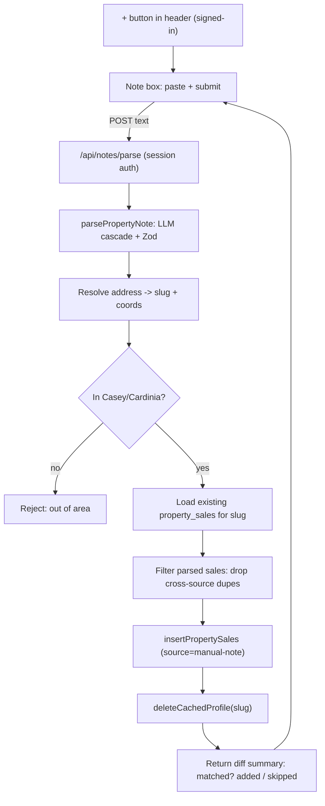

# feat: Paste-and-parse property notes from the header

## Summary

Add a "+" button in the app header next to the profile menu. It opens a note box where a signed-in user pastes free-text property details (address, attributes, previous sales, history). The text is parsed by the existing LLM cascade into structured records, address-resolved to a slug, checked for duplicates against `property_sales`, and then either **gap-fills an existing property** or **creates a new one** — writing sales/history rows into `property_sales` with `source='manual-note'`. The user sees a summary of what was added versus skipped as duplicates.

---

## Problem Frame

Agents often have property details (especially older sale history not in the scraped feeds) sitting in emails, CRM notes, or their own head. Today there's no way to get that into everypropertyAI — data only arrives via the automated portal scrapers. This gives them a paste-box that turns unstructured notes into structured, deduplicated feed rows that immediately improve CMAs and comparables.

---

## Requirements

- **R1** — A "+" affordance sits in the header next to the profile menu, visible only when signed in. Activating it opens a note box (modal or drawer).
- **R2** — The note box takes free-text paste (capped at a server-enforced max length, ~10,000 chars), submits it to a new authenticated endpoint, and shows loading / success / error states.
- **R3** — The endpoint parses the text via the existing LLM cascade into a structured shape: one subject address + attributes, plus a bounded number of sale-history entries (price, date, and any attributes stated).
- **R4** — The parsed subject address is resolved to an exact property and validated against the Casey/Cardinia service-area guard; out-of-area input is rejected with a clear message, nothing written. "Confident resolution" is defined (R4a): the parsed text must contain street number + street + suburb, and the resolver must return an exact structured match — otherwise reject and write nothing (a vague match that lands on the wrong in-area property is not caught by the area guard, so this gate is the only protection).
- **R5** — Duplicate detection is **source-agnostic and scoped to the exact resolved property** (never the whole street): a parsed sale is a duplicate when an existing `property_sales` row for that same property has a matching `sale_price` (within a rounding tolerance) at the same date precision as the pasted value (see R5a). Only genuinely new rows are written. `raw_address` is **not** part of the identity — a manual note and a scraped row for the same sale carry different address strings.
- **R5a** — Date-precision matching: pasted dates are often partial ("sold 2019", "March 2021"). Parse to the coarsest available precision and dedup at that precision — a year-only pasted sale matches an existing dated row in the same year at the same price. A day-precise pasted date matches on the full date.
- **R6** — Merge is **gap-fill only**: new sale rows are inserted with `source='manual-note'` and a `created_by` (submitting user's email) audit value; existing scraped values are never overwritten. When the property already exists, new rows attach to it; when it doesn't, the rows create it.
- **R7** — The response returns a diff summary — property matched (existing vs new), rows added (with their inserted row ids), rows skipped as duplicates, and any out-of-area / parse-failure reason — and the UI renders it. The summary is after-the-fact reporting, not a pre-write gate (see the LLM-mis-parse risk); returning row ids keeps a follow-up undo cheap.

---

## Key Technical Decisions

- **KTD1 — Reuse the LLM cascade; export a note-parsing entry point.** `callLLM` in `src/lib/extraction/extractor.ts` is currently private. Add a new exported `parsePropertyNote(text)` in the extraction layer that calls the cascade (MiniMax → OpenRouter → Anthropic) with a purpose-built system/user prompt and a Zod schema for `{ address, attributes, sales[] }`. Rationale: the extraction cascade, JSON-parsing, and fallback handling already exist ([[extraction-llm-cascade]]); a paste box is just a new input source, not a new LLM integration. Do not export `callLLM` raw — wrap it so the note prompt + schema live with the other extraction prompts (`prompts.ts`, `schemas.ts`).
- **KTD2 — Write to `property_sales`, `source='manual-note'`** (user-confirmed). Manually-added history flows straight into the same table the estimator and comparables read, so it improves CMAs immediately. `insertPropertySales` already upserts on `raw_address,sale_date,sale_price,source` with `ignoreDuplicates: true` — but see KTD3, because that conflict key alone does not satisfy R5.
- **KTD3 — Dedup across sources, scoped to the exact property.** The existing upsert conflict key includes `source`, so a manual row would NOT be seen as a duplicate of the same sale already present from `domain-web-unlocker`. R5 requires cross-source dedup done in app code before insert. **Load existing sales with `getSalesForStreet` (street-scoped, up to 500 rows) then narrow to the exact resolved `raw_address` before building identities** — matching street-wide would collide two different houses that sold the same day for the same price (common at estate releases) and silently drop a genuine sale. Build `(date-at-parsed-precision, rounded sale_price)` identities from the narrowed set (R5a) and drop parsed sales already present under any source. This filter — not the DB conflict key — is the load-bearing dedup. (If exact-address narrowing over street results proves unreliable because scraped `raw_address` formatting varies, add a slug-scoped sales query; `raw_data`/`address_slug` population on scraped rows is an implementation-time check — see Open Questions.)
- **KTD4 — Address resolution reuses the existing resolver.** Parsed address text goes through the same path the property page uses (`toSlug` in `src/lib/utils/address.ts` + the `/api/address-suggest` resolver + `geocodeAddress` Mapbox for coords). Apply the R4a confidence gate: reject unless the parse yields street number + street + suburb and the resolver returns an exact structured match. Coordinates are needed so radius-based comparables pick the row up.
- **KTD5 — Auth is in-app session + allowlist, not admin, not bearer.** This is a signed-in teammate action, so the endpoint reuses the **session-extraction** helper from `/api/team` (`getSessionEmail`) but gates with **`isEmailAllowed` from `src/lib/auth/allowlist.ts`** — NOT `requireAdmin`/`isEmailAdmin` (the `/api/team` handlers are admin-only; mirroring them verbatim would wrongly lock the note box to admins). Not the `EVERYPROPERTY_API_KEYS` bearer pattern (that's for server-to-server routes like `/api/proposal`).
- **KTD6 — Cache invalidation (subject only).** After writing new rows for an existing slug, delete the cached merged profile (`deleteCachedProfile(slug)`) so the property page re-derives with the new history. Note the limitation: only the **subject** profile is invalidated — neighbouring properties' cached CMAs refresh on their normal 24h TTL, so a new manual sale propagates to nearby comparables within a day, not instantly. Radius-wide invalidation is deferred (Scope).
- **KTD7 — Input bounds.** The route rejects pasted text over ~10,000 chars with a 400 before calling the LLM (R2), and `propertyNoteSchema` caps the `sales` array length — both guard LLM cost/latency and bound the per-request dedup + insert work on an endpoint with no rate limiting.

---

## High-Level Technical Design

---

## Implementation Units

### U1. Note-parsing extraction entry point

**Goal:** A pure-ish server function that turns pasted text into a validated `{ address, attributes, sales[] }` object via the LLM cascade.
**Requirements:** R3
**Dependencies:** none
**Files:** `src/lib/extraction/prompts.ts` (add note-parse system + user prompt), `src/lib/extraction/schemas.ts` (add `propertyNoteSchema`), `src/lib/extraction/extractor.ts` (add exported `parsePropertyNote`), `src/lib/extraction/__tests__/parse-note.test.ts`
**Approach:** Mirror `extractPropertyData`'s cascade/parse/fallback structure. Prompt instructs the model to pull the subject address, physical attributes, and an array of prior sales from arbitrary pasted text, returning strict JSON. Each sale carries a price and a date **with an explicit precision marker** (`year` | `month` | `day`) so downstream dedup (R5a) can match at the coarsest available precision — the prompt must instruct the model to report whatever precision the text states, not fabricate a full date. `propertyNoteSchema` caps the `sales` array length (KTD7). Validate with Zod; on parse failure return a typed `{ ok: false, reason }` rather than throwing.
**Patterns to follow:** `extractPropertyData` and `PROPERTY_EXTRACTION_SYSTEM_PROMPT` in `src/lib/extraction/extractor.ts` / `prompts.ts`; existing Zod schemas in `schemas.ts`.
**Test scenarios:**
- Paste with address + two dated sales → parsed object has both sales with correct price/date and `precision: 'day'`.
- Paste with a year-only sale ("sold 2019 for $450k") → sale carries `precision: 'year'`, price `450000`.
- Paste with address only, no sales → `sales: []`, attributes populated where stated.
- Model returns non-JSON / junk → returns `{ ok: false }`, does not throw (mock the cascade).
- Paste with a price like "$1.2m" or "1,200,000" → normalised to `1200000`.
- Paste with more sales than the array cap → schema rejects (or truncates per the documented cap), does not silently accept unbounded rows.

### U2. Dedup + merge service

**Goal:** Given a parsed note, resolve the slug, enforce the area guard, filter cross-source duplicate sales, insert new rows, invalidate cache, and return a diff summary.
**Requirements:** R4, R4a, R5, R5a, R6, R7
**Dependencies:** U1
**Files:** `src/lib/notes/merge-note.ts` (new), `src/lib/notes/__tests__/merge-note.test.ts`
**Approach:** Resolve address → exact property + coords (KTD4); reject unless the R4a confidence gate passes (street number + street + suburb, exact structured match) and the suburb passes `isServiceAreaSuburb` (R4). Load existing sales via `getSalesForStreet` then **narrow to the exact resolved `raw_address`** (KTD3) — do not dedup against the whole street. Build `(date-at-parsed-precision, rounded sale_price)` identities from the narrowed set (R5a) and drop parsed sales already present under any source. Map survivors to `PropertySaleRecord` with `source='manual-note'`, `created_by=<submitting email>`, slug, coords; call `insertPropertySales`. Call `deleteCachedProfile(slug)` when rows were added. Return `{ matched: 'existing'|'new', added: [{id,...}], skipped, rejectedReason? }` — "existing" = at least one prior narrowed row for the exact address.
**Execution note:** Add characterization coverage of the dedup identity before wiring the insert — the cross-source, exact-address, and partial-date cases are the whole point and are each easy to get wrong.
**Patterns to follow:** `insertPropertySales`, `getSalesForStreet`, `deleteCachedProfile` in `src/lib/db/queries.ts`; `isServiceAreaSuburb` in `src/lib/utils/service-area.ts`; `geocodeAddress` in `src/lib/enrichment/geocoding.ts`.
**Test scenarios:**
- New address, two parsed sales → `matched:'new'`, 2 added, 0 skipped; both rows carry `source='manual-note'` and `created_by`.
- Existing address where one parsed sale matches an existing `domain-web-unlocker` row by date+price → skipped cross-source, the other added; `matched:'existing'`.
- Two different houses on the same street sold the same day for the same price; pasting one of them → the pasted sale is still written (dedup is exact-address, not street-wide).
- Year-only pasted sale ("2019, $450k") matching an existing 2019-dated row at $450k → skipped as duplicate (R5a coarsest-precision match).
- Out-of-area suburb, or address missing street number → `rejectedReason` set, `insertPropertySales` never called.
- Rows added → `deleteCachedProfile` called with the slug; zero rows added → not called.
- Price within rounding tolerance of an existing row (e.g. 723000 vs 723001) → treated as duplicate.

### U3. API route

**Goal:** Authenticated endpoint wiring the note box to the merge service.
**Requirements:** R2, R4, R7
**Dependencies:** U1, U2
**Files:** `src/app/api/notes/parse/route.ts` (new), `src/app/api/__tests__/notes-parse.test.ts`
**Approach:** POST handler: extract session email via `getSessionEmail` (from `/api/team`) and gate with `isEmailAllowed` (KTD5) — allow-listed teammates, not admin-only. Read `{ text }`; reject >~10,000 chars with 400 before any LLM call (KTD7); call `parsePropertyNote` then `mergeNote`; return the diff summary as JSON. 401 when not signed in / not allow-listed, 400 on empty text, over-length, or parse failure, 200 with summary otherwise. `maxDuration` bump for the LLM call (mirror other LLM routes).
**Patterns to follow:** `getSessionEmail` session extraction from `src/app/api/team/route.ts` paired with `isEmailAllowed` from `src/lib/auth/allowlist.ts` (NOT `requireAdmin`); LLM-route `maxDuration` from `src/app/api/estimate/route.ts`.
**Test scenarios:**
- Signed-out request → 401, no parse/merge called.
- Signed-in but not allow-listed → 401.
- Empty/whitespace text → 400.
- Text over the length cap → 400, `parsePropertyNote` never called.
- Valid text, in-area → 200 with `{ matched, added, skipped }`.
- Parse failure from U1 → 400 with reason, nothing written.

### U4. Header "+" button and note box

**Goal:** The user-facing affordance and note box, wired to the endpoint.
**Requirements:** R1, R2, R7
**Dependencies:** U3
**Files:** `src/components/notes/AddNoteButton.tsx` (new), `src/components/notes/__tests__/AddNoteButton.test.tsx`, and the header instances below.
**Header placement (two groups — not every header renders `AuthButton`):**
- `src/app/page.tsx` and `src/app/property/page.tsx` **do** render `<AuthButton />` — place the "+" immediately beside it in the same nav cluster.
- `src/app/my-properties/page.tsx` and `src/app/settings/page.tsx` have their own `<header>` but **no** `AuthButton` — place the "+" at the end of each header's right-hand cluster (state the exact element), since there is no AuthButton anchor there.
**Approach:** Client component: a "+" icon button (rendered only when a Supabase session exists, matching `AuthButton`'s signed-in gate) that opens a **modal** (not a drawer — commit to the modal to match the existing overlay idiom) with a `<textarea>`, submit, and result panel. On submit POST to `/api/notes/parse`, render loading, then the diff summary (matched existing/new, N added, M skipped) or the error/out-of-area reason; keep the box open on error for retry. Follow DESIGN.md tokens.
**Execution note:** UI unit — prefer a component render/interaction test plus a manual browser check over deep coverage.
**Patterns to follow:** `src/components/property/DownloadReportModal.tsx` for the accessible overlay (`role="dialog"`, `aria-modal`, `aria-label`, Escape-to-close, initial focus) — this is the pattern to mirror for the note box; `src/components/auth/AuthButton.tsx` **only** for the signed-in gating check; DESIGN.md for tokens.
**Test scenarios:**
- Renders the "+" only when signed in (mock session present vs absent).
- Modal traps focus, closes on Escape, and exposes `role="dialog"` (mirror DownloadReportModal's coverage).
- Submitting posts the textarea text and renders the returned summary.
- Error response renders the message; the box stays open for a retry.
- Empty textarea → submit disabled or no-ops (no request).

---

## Scope Boundaries

**In scope:** header affordance, note box, parse endpoint, dedup + gap-fill merge into `property_sales`, service-area guard, diff summary.

### Deferred to Follow-Up Work
- Editing/confirming parsed rows before commit (a review step between parse and write).
- Bulk paste of multiple properties in one note.
- An MCP tool exposing note-ingest to agents (parallels the [[agents-listings-public-endpoint]] surface).
- Photos or documents in the note box (text only for now).

**Non-goals:** overwriting scraped values (merge is gap-fill only, R6); ingesting out-of-area properties; parsing rentals (sales/history only).

---

## Risks & Dependencies

- **LLM mis-parse** — a wrong price/date silently enters the feed. Mitigation: strict Zod validation (U1), the diff summary surfaces exactly what was added (R7), and `source='manual-note'` makes manual rows filterable/auditable. The deferred review step is the fuller fix.
- **Address resolution ambiguity** — a vague pasted address could resolve to the wrong slug. Mitigation: reuse the same resolver as search so behaviour is consistent; reject when no confident resolution.
- **Dedup key** — the DB conflict key includes `source`, so cross-source dedup must happen in app code before insert (KTD3), or manual rows will duplicate existing scraped sales in CMAs. This is the highest-value test.

---

## Verification Contract

- `npx vitest run` green including the four new/extended test files.
- `npx tsc --noEmit` clean.
- Manual: signed in, click "+", paste a Berwick address with a prior sale not in the feed → success summary shows "new" or "existing" with 1 added; reload the property page and confirm the sale appears in history and the estimate refreshes. Paste an out-of-area address → rejected, nothing written. Paste the same note twice → second time shows all rows skipped as duplicates.

## Definition of Done

All four units landed, verification contract passes, the "+" appears next to the profile across header instances, and a pasted in-area note with prior sales lands as `manual-note` rows that show on the property page and feed the CMA — with duplicates skipped and scraped values untouched.
